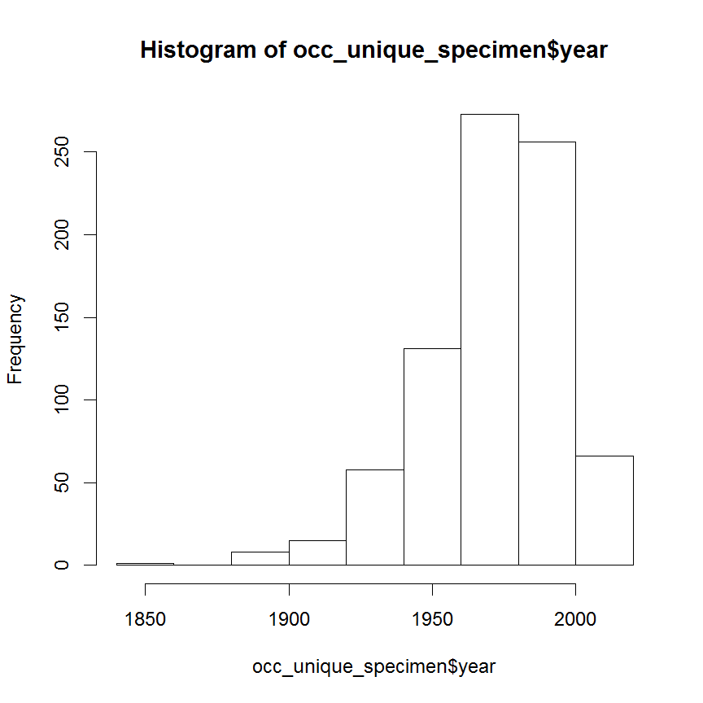
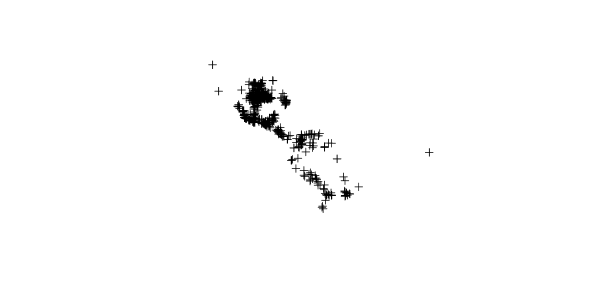
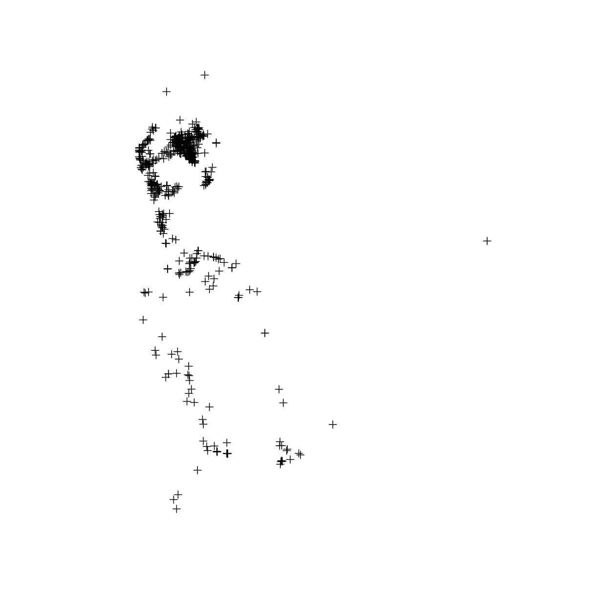
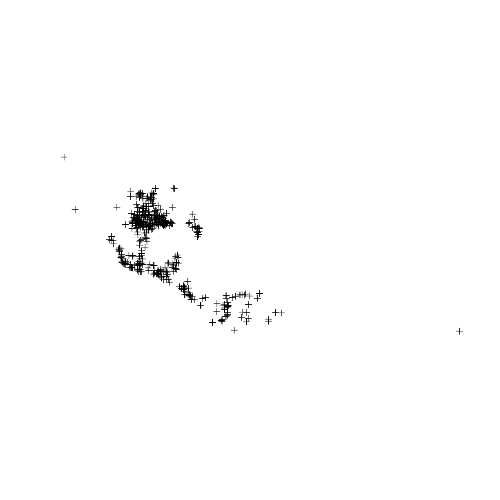
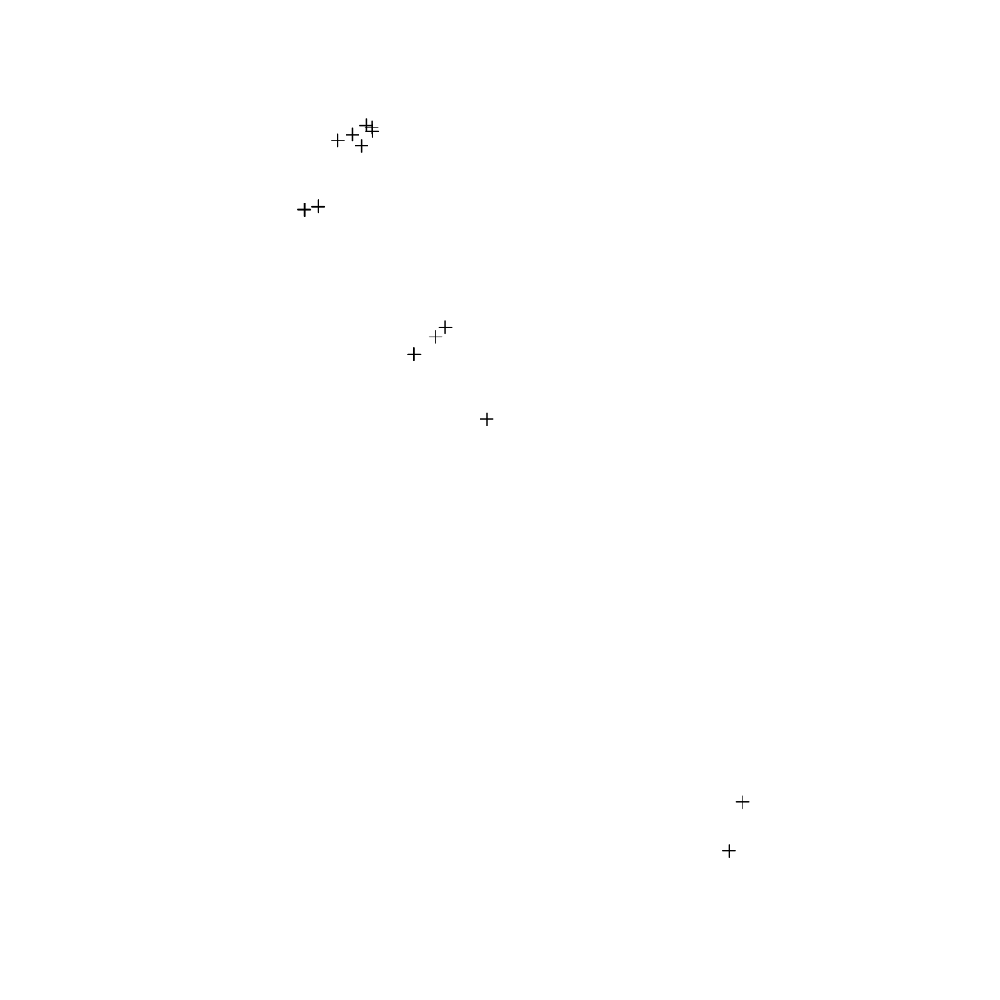

---
# Please do not edit this file directly; it is auto generated.
# Instead, please edit 01-occurrence-data.md in _episodes_rmd/
source: Rmd
title: "Occurrence data"
teaching: 10
exercises: 5
questions:
- "11111111111"
objectives:
- "Download occurrence data through API."
- "Filter occurrance data."
keypoints:
- "111111"
- "22222"
---

## 2 Occurrence data  
#### 2.1 Download occurrence data  

(fix me) add a decription about biodiversity databases; a figure about GBIF; a list of databases; what is api;  

`gbif()` is a function in `dismo` package, which can directly download occurrences through GBIF api; here we query the number of records of the nine-banded armadillo, **without downloading**  

~~~
gbif(genus="Dasypus",species="novemcinctus",download=FALSE)
~~~
{: .language-r}

~~~
[1] 7508
~~~
{: .output}

by setting `download=TRUE`, we can download all records  

~~~
occ_raw <- gbif(genus="Dasypus",species="novemcinctus",download=TRUE) 

# to view the first few records the occurrence dataset use:
#head( occ_raw )
~~~
{: .language-r}

#### 2.2 List of biodiversity databases and their R package.  

Table 1. List of biodiversity databases and their R package. 

|Database  | R package |  
|---  | --- |  
| BIEN | [BIEN](https://cran.r-project.org/web/packages/BIEN/vignettes/BIEN_tutorial.html)|  
 BISON | [rbison](https://github.com/ropensci/rbison)
 eBird | [rebird](http://ebird.org/content/ebird/)
 GBIF | [rgbif](https://github.com/ropensci/rgbif)
 iNaturalist | [rinat](https://github.com/ropensci/rinat)
 VertNet | [rvertnet](https://github.com/ropensci/rvertnet)
 iDigBio  | [ridigbio](https://www.idigbio.org/)  
   
The great thing is, you could query many databases at one time using [spocc](https://github.com/ropensci/spocc) package, developed by [*rOpenSci*](https://ropensci.org/packages/)

#### 2.3 occurrence data in Darwin Core  
Take a look at the columns of the GBIF occurrences.

~~~
names(occ_raw)
~~~
{: .language-r}

~~~
  [1] "acceptedNameUsage"                                                   
  [2] "acceptedScientificName"                                              
  [3] "acceptedTaxonKey"                                                    
  [4] "accessRights"                                                        
  [5] "adm1"                                                                
  [6] "adm2"                                                                
  [7] "associatedReferences"                                                
  [8] "basisOfRecord"                                                       
  [9] "behavior"                                                            
 [10] "bibliographicCitation"                                               
 [11] "catalogNumber"                                                       
 [12] "class"                                                               
 [13] "classKey"                                                            
 [14] "cloc"                                                                
 [15] "collectionCode"                                                      
 [16] "collectionID"                                                        
 [17] "continent"                                                           
 [18] "coordinatePrecision"                                                 
 [19] "coordinateUncertaintyInMeters"                                       
 [20] "country"                                                             
 [21] "crawlId"                                                             
 [22] "dataGeneralizations"                                                 
 [23] "datasetID"                                                           
 [24] "datasetKey"                                                          
 [25] "datasetName"                                                         
 [26] "dateIdentified"                                                      
 [27] "day"                                                                 
 [28] "depth"                                                               
 [29] "depthAccuracy"                                                       
 [30] "disposition"                                                         
 [31] "dynamicProperties"                                                   
 [32] "earliestAgeOrLowestStage"                                            
 [33] "earliestEonOrLowestEonothem"                                         
 [34] "earliestEpochOrLowestSeries"                                         
 [35] "earliestEraOrLowestErathem"                                          
 [36] "earliestPeriodOrLowestSystem"                                        
 [37] "elevation"                                                           
 [38] "elevationAccuracy"                                                   
 [39] "endDayOfYear"                                                        
 [40] "establishmentMeans"                                                  
 [41] "eventDate"                                                           
 [42] "eventID"                                                             
 [43] "eventRemarks"                                                        
 [44] "eventTime"                                                           
 [45] "family"                                                              
 [46] "familyKey"                                                           
 [47] "fieldNotes"                                                          
 [48] "fieldNumber"                                                         
 [49] "formation"                                                           
 [50] "fullCountry"                                                         
 [51] "gbifID"                                                              
 [52] "genericName"                                                         
 [53] "genus"                                                               
 [54] "genusKey"                                                            
 [55] "geodeticDatum"                                                       
 [56] "geologicalContextID"                                                 
 [57] "georeferencedBy"                                                     
 [58] "georeferencedDate"                                                   
 [59] "georeferenceProtocol"                                                
 [60] "georeferenceRemarks"                                                 
 [61] "georeferenceSources"                                                 
 [62] "georeferenceVerificationStatus"                                      
 [63] "habitat"                                                             
 [64] "higherClassification"                                                
 [65] "higherGeography"                                                     
 [66] "higherGeographyID"                                                   
 [67] "highestBiostratigraphicZone"                                         
 [68] "http://unknown.org/http_//rs.gbif.org/terms/1.0/Identifier"          
 [69] "http://unknown.org/http_//rs.gbif.org/terms/1.0/Multimedia"          
 [70] "http://unknown.org/http_//rs.tdwg.org/dwc/terms/Identification"      
 [71] "http://unknown.org/http_//rs.tdwg.org/dwc/terms/MeasurementOrFact"   
 [72] "http://unknown.org/http_//rs.tdwg.org/dwc/terms/ResourceRelationship"
 [73] "http://unknown.org/occurrenceDetails"                                
 [74] "identificationID"                                                    
 [75] "identificationQualifier"                                             
 [76] "identificationReferences"                                            
 [77] "identificationRemarks"                                               
 [78] "identificationVerificationStatus"                                    
 [79] "identifiedBy"                                                        
 [80] "identifier"                                                          
 [81] "individualCount"                                                     
 [82] "informationWithheld"                                                 
 [83] "infraspecificEpithet"                                                
 [84] "installationKey"                                                     
 [85] "institutionCode"                                                     
 [86] "institutionID"                                                       
 [87] "island"                                                              
 [88] "islandGroup"                                                         
 [89] "ISO2"                                                                
 [90] "key"                                                                 
 [91] "kingdom"                                                             
 [92] "kingdomKey"                                                          
 [93] "language"                                                            
 [94] "lastCrawled"                                                         
 [95] "lastInterpreted"                                                     
 [96] "lastParsed"                                                          
 [97] "lat"                                                                 
 [98] "latestEonOrHighestEonothem"                                          
 [99] "latestEpochOrHighestSeries"                                          
[100] "latestEraOrHighestErathem"                                           
[101] "latestPeriodOrHighestSystem"                                         
[102] "license"                                                             
[103] "lifeStage"                                                           
[104] "lithostratigraphicTerms"                                             
[105] "locality"                                                            
[106] "locationAccordingTo"                                                 
[107] "locationID"                                                          
[108] "locationRemarks"                                                     
[109] "lon"                                                                 
[110] "lowestBiostratigraphicZone"                                          
[111] "member"                                                              
[112] "modified"                                                            
[113] "month"                                                               
[114] "municipality"                                                        
[115] "nameAccordingTo"                                                     
[116] "namePublishedIn"                                                     
[117] "namePublishedInYear"                                                 
[118] "nomenclaturalCode"                                                   
[119] "occurrenceID"                                                        
[120] "occurrenceRemarks"                                                   
[121] "occurrenceStatus"                                                    
[122] "order"                                                               
[123] "orderKey"                                                            
[124] "organismID"                                                          
[125] "organismQuantity"                                                    
[126] "organismQuantityType"                                                
[127] "organismRemarks"                                                     
[128] "originalNameUsage"                                                   
[129] "otherCatalogNumbers"                                                 
[130] "ownerInstitutionCode"                                                
[131] "parentEventID"                                                       
[132] "parentNameUsage"                                                     
[133] "phylum"                                                              
[134] "phylumKey"                                                           
[135] "preparations"                                                        
[136] "previousIdentifications"                                             
[137] "protocol"                                                            
[138] "publishingCountry"                                                   
[139] "publishingOrgKey"                                                    
[140] "recordedBy"                                                          
[141] "recordNumber"                                                        
[142] "references"                                                          
[143] "reproductiveCondition"                                               
[144] "rights"                                                              
[145] "rightsHolder"                                                        
[146] "samplingEffort"                                                      
[147] "samplingProtocol"                                                    
[148] "scientificName"                                                      
[149] "scientificNameID"                                                    
[150] "sex"                                                                 
[151] "species"                                                             
[152] "speciesKey"                                                          
[153] "specificEpithet"                                                     
[154] "startDayOfYear"                                                      
[155] "taxonConceptID"                                                      
[156] "taxonID"                                                             
[157] "taxonKey"                                                            
[158] "taxonomicStatus"                                                     
[159] "taxonRank"                                                           
[160] "taxonRemarks"                                                        
[161] "type"                                                                
[162] "typeStatus"                                                          
[163] "typifiedName"                                                        
[164] "verbatimCoordinateSystem"                                            
[165] "verbatimElevation"                                                   
[166] "verbatimEventDate"                                                   
[167] "verbatimLocality"                                                    
[168] "verbatimSRS"                                                         
[169] "verbatimTaxonRank"                                                   
[170] "vernacularName"                                                      
[171] "waterBody"                                                           
[172] "year"                                                                
[173] "downloadDate"                                                        
~~~
{: .output}
The meaning of those columns/terms are defined by Darwin Core. Refer to [Darwin Core quick reference guide](https://dwc.tdwg.org/terms/) for more information.  

A few columns to highlight:  
* `basisOfRecord`  
  * The specific nature of the data record.  
  * PreservedSpecimen, FossilSpecimen, LivingSpecimen, MaterialSample, Event, HumanObservation, MachineObservation, Taxon, Occurrence  
  
* `year`  
  * The four-digit year in which the Event occurred, according to the Common Era Calendar.

* `lat` and `lon` (or `decimalLongitude`,`decimalLatitude` in Darwin Core)  
  *The geographic longitude/latitude of the geographic center of a Location. Positive values are  east of the Greenwich Meridian/north of the Equator, negative values are west/south of it. Legal values lie between [-180 180] / [-90 90], inclusive.

#### 2.4 Clean occurrence data
Since some of our records do not have appropriate coordinates and some have missing locational data, we need to remove them from our dataset. To do this, we created a new dataset named “occ_clean”, which is a subset of the “occ_raw” dataset where records with missing latitude and/or longitude are removed.  

~~~
# here we remove erroneous coordinates, where either the latitude or longitude is missing
occ_clean <- subset(occ_raw,(!is.na(lat))&(!is.na(lon))) 
#  "!" means the opposite logic value

#Show the number of records that are removed from the dataset.  
cat(nrow(occ_raw)-nrow(occ_clean), "records are removed")
~~~
{: .language-r}

~~~
2432 records are removed
~~~
{: .output}

Remove duplicated data based on latitude and longitude  

~~~
dups <- duplicated( occ_clean[c("lat","lon")]  )
occ_unique <- occ_clean[!dups,]
cat(nrow(occ_clean)-nrow(occ_unique), "records are removed")
~~~
{: .language-r}

~~~
1459 records are removed
~~~
{: .output}
  

show the frequency table of "basisOfRecord"

~~~
table(occ_unique$basisOfRecord)
~~~
{: .language-r}

~~~

    FOSSIL_SPECIMEN   HUMAN_OBSERVATION     LIVING_SPECIMEN 
                 13                2433                   1 
MACHINE_OBSERVATION         OBSERVATION  PRESERVED_SPECIMEN 
                 33                  27                 901 
            UNKNOWN 
                209 
~~~
{: .output}
  

only keep record that are associted with a specimen

~~~
occ_unique_specimen <- subset(occ_unique, basisOfRecord=="PRESERVED_SPECIMEN")
cat(nrow(occ_unique_specimen), "out of ", nrow(occ_unique), "records are specimen")
~~~
{: .language-r}

~~~
901 out of  3617 records are specimen
~~~
{: .output}

show the histogram of "year"

~~~
hist(occ_unique_specimen$year)
~~~
{: .language-r}

~~~
#ggplot2()
~~~
{: .language-r}

to filter the species records by year, in this example 1950 to 2000:

~~~
occ_final <- subset(occ_unique_specimen, year>=1950 & year <=2000)
~~~
{: .language-r}

show a quick summary of years in the data

~~~
summary(occ_final$year)
~~~
{: .language-r}

~~~
   Min. 1st Qu.  Median    Mean 3rd Qu.    Max. 
   1950    1965    1976    1977    1989    2000 
~~~
{: .output}

> ## Challenge: Download occurrences from GBIF and filter data
> select your favorite species  
> only keep `specimen` records  
> only keep records that are collected between `2000 & 2018`  
> only keep records that have `valid longitude & latitude`  
> > ## Solution
> > 
> > ~~~
> > # download 
> > myocc <- gbif(genus="Dasypus",species="novemcinctus",download=TRUE) 
> >  
> > # filter 
> > myocc_final <- subset(myocc,basisOfRecord=="PRESERVED_SPECIMEN" &
> >                             year >= 2000 & year <= 2018 &
> >                             !is.na(lat) & !is.na(lon)    )
> > 
> > # show number of records that are removed 
> > nrow(myocc) - nrow(myocc_final)                          
> > ~~~
> > {: .language-r}
> {: .solution}
{: .challenge}

#### 2.5 make occurrence data **spatial**
make occ spatial, assign coordinate reference system to *spatial points*

~~~
occ_final_COPY <- occ_final
coordinates(occ_final) <- ~ lon + lat
~~~
{: .language-r}

Note that, after make the dataframe spatial, the dataframe object is transformed into a spatial object

~~~
cat("the previous object is: ", class(occ_final_COPY),"\n")  
~~~
{: .language-r}

~~~
the previous object is:  data.frame 
~~~
{: .output}

~~~
cat("the new object is: ",class(occ_final),"\n" )
~~~
{: .language-r}

~~~
the new object is:  SpatialPointsDataFrame 
~~~
{: .output}

we could view the coordinates and the data that are associated with the spatial object

~~~
head(occ_final@coords)
~~~
{: .language-r}

~~~
            lon      lat
3439 -100.51001 31.30495
3440 -104.51337 19.13245
3444 -103.90280 19.16453
3446  -94.82222 16.43611
3448  -90.88333 16.15000
3454 -100.55574 31.52139
~~~
{: .output}

~~~
head(occ_final@data)
~~~
{: .language-r}

~~~
        acceptedNameUsage              acceptedScientificName
3439                 <NA> Dasypus novemcinctus Linnaeus, 1758
3440                 <NA> Dasypus novemcinctus Linnaeus, 1758
3444                 <NA> Dasypus novemcinctus Linnaeus, 1758
3446 Dasypus novemcinctus Dasypus novemcinctus Linnaeus, 1758
3448 Dasypus novemcinctus Dasypus novemcinctus Linnaeus, 1758
3454                 <NA> Dasypus novemcinctus Linnaeus, 1758
     acceptedTaxonKey accessRights    adm1
3439          2440779         <NA>   Texas
3440          2440779         <NA>  Colima
3444          2440779         <NA>  Colima
3446          2440779        CC-BY  Oaxaca
3448          2440779 Libre acceso Chiapas
3454          2440779         <NA>   Texas
                                       adm2 associatedReferences
3439                              Tom Green                 <NA>
3440                             Manzanillo                 <NA>
3444                            Coquimatlan                 <NA>
3446 HEROICA CIUDAD DE JUCHITAN DE ZARAGOZA                 <NA>
3448                               OCOSINGO                 <NA>
3454                              Tom Green                 <NA>
          basisOfRecord behavior
3439 PRESERVED_SPECIMEN     <NA>
3440 PRESERVED_SPECIMEN     <NA>
3444 PRESERVED_SPECIMEN     <NA>
3446 PRESERVED_SPECIMEN     <NA>
3448 PRESERVED_SPECIMEN     <NA>
3454 PRESERVED_SPECIMEN     <NA>
                                                                                                                                                                                                                                                                                 bibliographicCitation
3439                                                                                                                                                                                                                                                                                              <NA>
3440                                                                                                                                                                                                                                                                                              <NA>
3444                                                                                                                                                                                                                                                                                              <NA>
3446         Lorenzo M., C., B. Prado y C. Pozo. 2017. Fortalecimiento de las colecciones de ECOSUR. Primera fase. El Colegio de la Frontera Sur. Base de datos_Colección de Mamíferos SC SNIB-CONABIO. Proyectos No. ME006, BJ002_mamíferos, AA003, B114_mamíferos y P028_mamíferos. Ciudad de México
3448 Muñoz Alonso, L. A. y I. J. March Mifsut. 2003. Actualización y enriquecimiento de las bases de datos del proyecto de evaluación y análisis geográfico de la diversidad faunística de Chiapas. El Colegio de la Frontera Sur. Bases de datos SNIB-CONABIO proyectos No. U014 y P132. México, D.F.
3454                                                                                                                                                                                                                                                                                              <NA>
     catalogNumber    class classKey
3439         11322 Mammalia      359
3440         27960 Mammalia      359
3444         27958 Mammalia      359
3446          0980 Mammalia      359
3448          1072 Mammalia      359
3454         12861 Mammalia      359
                                                                                                   cloc
3439 8.4 mi S, 5 mi W San Angelo, Twin Buttes Reservoir, Texas, Tom Green, United States, NORTH_AMERICA
3440                                            Playa de Oro, Colima, Manzanillo, Mexico, NORTH_AMERICA
3444                                 2.5 km E Pueblo Juarez, Colima, Coquimatlan, Mexico, NORTH_AMERICA
3446                     1 Km Chicapa de Castro, Oaxaca, HEROICA CIUDAD DE JUCHITAN DE ZARAGOZA, Mexico
3448                                               Ejido Palyón de La Gloria, Chiapas, OCOSINGO, Mexico
3454 4 mi N, 7.2 mi W San Angelo, San Angelo State Park, Texas, Tom Green, United States, NORTH_AMERICA
     collectionCode collectionID     continent coordinatePrecision
3439        Mammals         <NA> NORTH_AMERICA                  NA
3440        Mammals         <NA> NORTH_AMERICA                  NA
3444        Mammals         <NA> NORTH_AMERICA                  NA
3446       ECO-SC-M           26          <NA>                  NA
3448       ECO-SC-M           26          <NA>                  NA
3454        Mammals         <NA> NORTH_AMERICA                  NA
     coordinateUncertaintyInMeters       country crawlId
3439                            NA United States      49
3440                            NA        Mexico     257
3444                            NA        Mexico     257
3446                            NA        Mexico       1
3448                            NA        Mexico      37
3454                            NA United States      49
     dataGeneralizations                        datasetID
3439                <NA>                             <NA>
3440                <NA>                             <NA>
3444                <NA>                             <NA>
3446                <NA> c1fdd37363763c13d53f3ce94488d5f9
3448                <NA> a67489ca3d179948f1795bb671d2e1f5
3454                <NA>                             <NA>
                               datasetKey
3439 f9772d3a-db34-4a33-baa0-7a016a970358
3440 84aefc7e-f762-11e1-a439-00145eb45e9a
3444 84aefc7e-f762-11e1-a439-00145eb45e9a
3446 cb1a521c-29f7-4751-8661-898d16d0caa6
3448 805bbcde-f762-11e1-a439-00145eb45e9a
3454 f9772d3a-db34-4a33-baa0-7a016a970358
                                                                                                                                       datasetName
3439                                                                                                                                          <NA>
3440                                                                                                                                          <NA>
3444                                                                                                                                          <NA>
3446                                                                                    Fortalecimiento de las colecciones de ECOSUR. Primera fase
3448 Actualización y enriquecimiento de las bases de datos del proyecto de evaluación y análisis geográfico de la diversidad faunística de Chiapas
3454                                                                                                                                          <NA>
     dateIdentified day depth depthAccuracy   disposition
3439           <NA>  12    NA            NA          <NA>
3440           <NA>  12    NA            NA In collection
3444           <NA>   2    NA            NA In collection
3446           <NA>  30     0             0          <NA>
3448           <NA>   1     0             0          <NA>
3454           <NA>  17    NA            NA          <NA>
     dynamicProperties earliestAgeOrLowestStage
3439              <NA>                     <NA>
3440              <NA>                     <NA>
3444              <NA>                     <NA>
3446              <NA>                     <NA>
3448              <NA>                     <NA>
3454              <NA>                     <NA>
     earliestEonOrLowestEonothem earliestEpochOrLowestSeries
3439                        <NA>                        <NA>
3440                        <NA>                        <NA>
3444                        <NA>                        <NA>
3446                        <NA>                        <NA>
3448                        <NA>                        <NA>
3454                        <NA>                        <NA>
     earliestEraOrLowestErathem earliestPeriodOrLowestSystem elevation
3439                       <NA>                         <NA>        NA
3440                       <NA>                         <NA>        NA
3444                       <NA>                         <NA>        NA
3446                       <NA>                         <NA>         0
3448                       <NA>                         <NA>       100
3454                       <NA>                         <NA>        NA
     elevationAccuracy endDayOfYear establishmentMeans
3439                NA         <NA>               <NA>
3440                NA         <NA>               <NA>
3444                NA         <NA>               <NA>
3446                 0         <NA>               <NA>
3448               100         <NA>               <NA>
3454                NA         <NA>               <NA>
                        eventDate eventID eventRemarks           eventTime
3439 2000-01-12T00:00:00.000+0000    <NA>         <NA>                <NA>
3440 2000-01-12T00:00:00.000+0000    <NA>         <NA>                <NA>
3444 2000-01-02T00:00:00.000+0000    <NA>         <NA>                <NA>
3446 2000-03-30T00:00:00.000+0000    <NA>         <NA>                <NA>
3448 2000-03-01T00:00:00.000+0000    <NA>         <NA> 0000-00-00 00:00:00
3454 2000-03-17T00:00:00.000+0000    <NA>         <NA>                <NA>
          family familyKey fieldNotes   fieldNumber formation
3439 Dasypodidae      9369       <NA>          <NA>      <NA>
3440 Dasypodidae      9369        Yes          <NA>      <NA>
3444 Dasypodidae      9369        Yes          <NA>      <NA>
3446 Dasypodidae      9369       <NA> C Lorenzo 411      <NA>
3448 Dasypodidae      9369       <NA>           126      <NA>
3454 Dasypodidae      9369       <NA>          <NA>      <NA>
                  fullCountry     gbifID genericName   genus genusKey
3439 United States of America 1061286259     Dasypus Dasypus  2440775
3440                   Mexico  202063282     Dasypus Dasypus  2440775
3444                   Mexico  202063280     Dasypus Dasypus  2440775
3446                   Mexico 1898052297     Dasypus Dasypus  2440775
3448                   Mexico 1423217328     Dasypus Dasypus  2440775
3454 United States of America 1061287798     Dasypus Dasypus  2440775
     geodeticDatum geologicalContextID georeferencedBy georeferencedDate
3439         WGS84                <NA>            <NA>              <NA>
3440         WGS84                <NA>            <NA>              <NA>
3444         WGS84                <NA>            <NA>              <NA>
3446         WGS84                <NA>            <NA>              <NA>
3448         WGS84                <NA>            <NA>              <NA>
3454         WGS84                <NA>            <NA>              <NA>
     georeferenceProtocol georeferenceRemarks   georeferenceSources
3439            GEOLocate                <NA>                  <NA>
3440           Conversion                <NA>                  <NA>
3444           Conversion                <NA>                  <NA>
3446                 <NA>                <NA>                  <NA>
3448                 <NA>                <NA> Mapa, INEGI, 1:50 000
3454            GEOLocate                <NA>                  <NA>
     georeferenceVerificationStatus  habitat
3439                           <NA>     <NA>
3440        Verified by contributor     <NA>
3444        Verified by contributor     <NA>
3446                           <NA> Matorral
3448                           <NA>     <NA>
3454                           <NA>     <NA>
                                              higherClassification
3439                                                          <NA>
3440                                                          <NA>
3444                                                          <NA>
3446 Animalia; Chordata; Mammalia; Cingulata; Dasypodidae; Dasypus
3448 Animalia; Craniata; Mammalia; Cingulata; Dasypodidae; Dasypus
3454                                                          <NA>
     higherGeography higherGeographyID highestBiostratigraphicZone
3439            <NA>              <NA>                        <NA>
3440            <NA>              <NA>                        <NA>
3444            <NA>              <NA>                        <NA>
3446            <NA>              <NA>                        <NA>
3448            <NA>              <NA>                        <NA>
3454            <NA>              <NA>                        <NA>
     http://unknown.org/http_//rs.gbif.org/terms/1.0/Identifier
3439                                                       <NA>
3440                                                       <NA>
3444                                                       <NA>
3446                                                       <NA>
3448                                                       <NA>
3454                                                       <NA>
     http://unknown.org/http_//rs.gbif.org/terms/1.0/Multimedia
3439                                                       <NA>
3440                                                       <NA>
3444                                                       <NA>
3446                                                       <NA>
3448                                                       <NA>
3454                                                       <NA>
     http://unknown.org/http_//rs.tdwg.org/dwc/terms/Identification
3439                                                           <NA>
3440                                                           <NA>
3444                                                           <NA>
3446                                                           <NA>
3448                                                           <NA>
3454                                                           <NA>
     http://unknown.org/http_//rs.tdwg.org/dwc/terms/MeasurementOrFact
3439                                                              <NA>
3440                                                              <NA>
3444                                                              <NA>
3446                                                              <NA>
3448                                                              <NA>
3454                                                              <NA>
                   http://unknown.org/http_//rs.tdwg.org/dwc/terms/ResourceRelationship
3439                                                                               <NA>
3440 [ {\n  "http://rs.tdwg.org/dwc/terms/scientificName" : "Dasypus novemcinctus"\n} ]
3444 [ {\n  "http://rs.tdwg.org/dwc/terms/scientificName" : "Dasypus novemcinctus"\n} ]
3446                                                                               <NA>
3448                                                                               <NA>
3454                                                                               <NA>
     http://unknown.org/occurrenceDetails identificationID
3439                                 <NA>             <NA>
3440                                 <NA>             <NA>
3444                                 <NA>             <NA>
3446                                 <NA>             1138
3448                                 <NA>            84207
3454                                 <NA>             <NA>
     identificationQualifier identificationReferences
3439                    <NA>                     <NA>
3440                    <NA>                     <NA>
3444                    <NA>                     <NA>
3446                    <NA>                     <NA>
3448                    <NA>                     <NA>
3454                    <NA>                     <NA>
     identificationRemarks identificationVerificationStatus
3439                  <NA>                             <NA>
3440                  <NA>                             <NA>
3444                  <NA>                             <NA>
3446                  <NA>                             <NA>
3448                  <NA>                             <NA>
3454                  <NA>                             <NA>
        identifiedBy
3439            <NA>
3440            <NA>
3444            <NA>
3446 C. L. M.; J. B.
3448   NO DISPONIBLE
3454            <NA>
                                                            identifier
3439                                                              <NA>
3440                                    urn:catalog:OMNH:Mammals:27960
3444                                    urn:catalog:OMNH:Mammals:27958
3446 urn:catalog:ECOSUR:ECO-SC-M:0980:c1fdd37363763c13d53f3ce94488d5f9
3448                                  urn:catalog:ECOSUR:ECO-SC-M:1072
3454                                                              <NA>
     individualCount informationWithheld infraspecificEpithet
3439              NA                <NA>                 <NA>
3440              NA                <NA>                 <NA>
3444              NA                <NA>                 <NA>
3446               1                <NA>                 <NA>
3448               1                <NA>                 <NA>
3454              NA                <NA>                 <NA>
                          installationKey institutionCode institutionID
3439 afafe88e-4b8e-4e62-8f38-3eaa24f71532           ASNHC          <NA>
3440 9ec56080-ef8d-488a-af71-1e2de5ed7bbc            OMNH          <NA>
3444 9ec56080-ef8d-488a-af71-1e2de5ed7bbc            OMNH          <NA>
3446 e081c7d7-2dab-42fd-94c4-9f275767fe7d          ECOSUR            15
3448 e081c7d7-2dab-42fd-94c4-9f275767fe7d          ECOSUR            15
3454 afafe88e-4b8e-4e62-8f38-3eaa24f71532           ASNHC          <NA>
     island islandGroup ISO2        key  kingdom kingdomKey language
3439   <NA>        <NA>   US 1061286259 Animalia          1     <NA>
3440   <NA>        <NA>   MX  202063282 Animalia          1  English
3444   <NA>        <NA>   MX  202063280 Animalia          1  English
3446   <NA>        <NA>   MX 1898052297 Animalia          1       es
3448   <NA>        <NA>   MX 1423217328 Animalia          1       es
3454   <NA>        <NA>   US 1061287798 Animalia          1     <NA>
                      lastCrawled              lastInterpreted
3439 2017-10-08T07:12:50.013+0000 2018-07-07T20:50:33.027+0000
3440 2018-11-26T15:48:11.657+0000 2018-07-07T18:51:29.468+0000
3444 2018-11-26T15:48:11.651+0000 2018-07-07T18:51:29.382+0000
3446 2018-08-24T00:11:46.693+0000 2018-08-24T00:11:46.758+0000
3448 2018-04-04T14:39:17.527+0000 2018-07-07T16:22:43.760+0000
3454 2017-10-08T07:12:50.542+0000 2018-07-07T20:50:33.032+0000
                       lastParsed latestEonOrHighestEonothem
3439 2015-03-03T13:48:22.076+0000                       <NA>
3440 2018-01-22T15:22:34.463+0000                       <NA>
3444 2018-01-22T15:22:34.433+0000                       <NA>
3446 2018-08-24T00:11:46.747+0000                       <NA>
3448 2017-01-04T18:36:08.904+0000                       <NA>
3454 2015-03-03T13:48:25.379+0000                       <NA>
     latestEpochOrHighestSeries latestEraOrHighestErathem
3439                       <NA>                      <NA>
3440                       <NA>                      <NA>
3444                       <NA>                      <NA>
3446                       <NA>                      <NA>
3448                       <NA>                      <NA>
3454                       <NA>                      <NA>
     latestPeriodOrHighestSystem
3439                        <NA>
3440                        <NA>
3444                        <NA>
3446                        <NA>
3448                        <NA>
3454                        <NA>
                                                        license lifeStage
3439       http://creativecommons.org/licenses/by/4.0/legalcode      <NA>
3440 http://creativecommons.org/publicdomain/zero/1.0/legalcode      <NA>
3444 http://creativecommons.org/publicdomain/zero/1.0/legalcode      <NA>
3446       http://creativecommons.org/licenses/by/4.0/legalcode      <NA>
3448    http://creativecommons.org/licenses/by-nc/4.0/legalcode      <NA>
3454       http://creativecommons.org/licenses/by/4.0/legalcode      <NA>
     lithostratigraphicTerms
3439                    <NA>
3440                    <NA>
3444                    <NA>
3446                    <NA>
3448                    <NA>
3454                    <NA>
                                               locality
3439 8.4 mi S, 5 mi W San Angelo, Twin Buttes Reservoir
3440                                       Playa de Oro
3444                             2.5 km E Pueblo Juarez
3446                             1 Km Chicapa de Castro
3448                          Ejido Palyón de La Gloria
3454 4 mi N, 7.2 mi W San Angelo, San Angelo State Park
     locationAccordingTo locationID locationRemarks
3439                <NA>       <NA>            <NA>
3440                <NA>       <NA>            <NA>
3444                <NA>       <NA>            <NA>
3446                <NA>        267            <NA>
3448                <NA>       1779            <NA>
3454                <NA>       <NA>            <NA>
     lowestBiostratigraphicZone member                     modified month
3439                       <NA>   <NA>                         <NA>     1
3440                       <NA>   <NA> 2018-01-18T00:00:00.000+0000     1
3444                       <NA>   <NA> 2018-01-18T00:00:00.000+0000     1
3446                       <NA>   <NA> 2017-12-13T00:00:00.000+0000     3
3448                       <NA>   <NA> 2015-12-03T00:00:00.000+0000     3
3454                       <NA>   <NA>                         <NA>     3
     municipality
3439         <NA>
3440         <NA>
3444         <NA>
3446         <NA>
3448         <NA>
3454         <NA>
                                                    nameAccordingTo
3439                                                           <NA>
3440                                                           <NA>
3444                                                           <NA>
3446 Ramírez-Pulido, González-Ruiz, Gardner & Arroyo-Cabrales, 2014
3448 Ramírez-Pulido, González-Ruiz, Gardner & Arroyo-Cabrales, 2014
3454                                                           <NA>
                      namePublishedIn namePublishedInYear
3439                             <NA>                <NA>
3440                             <NA>                <NA>
3444                             <NA>                <NA>
3446 Syst. Nat., 10th ed. 1: 51. 1758                1758
3448                             <NA>                1758
3454                             <NA>                <NA>
     nomenclaturalCode
3439              <NA>
3440              <NA>
3444              <NA>
3446              <NA>
3448              <NA>
3454              <NA>
                                                          occurrenceID
3439                              7d2594d8-42f8-4a96-8006-0166633ba2f2
3440                                    urn:catalog:OMNH:Mammals:27960
3444                                    urn:catalog:OMNH:Mammals:27958
3446 urn:catalog:ECOSUR:ECO-SC-M:0980:c1fdd37363763c13d53f3ce94488d5f9
3448                                  urn:catalog:ECOSUR:ECO-SC-M:1072
3454                              e4e60ce5-fd3b-49d0-a066-2d2d40d5da8b
     occurrenceRemarks occurrenceStatus     order orderKey organismID
3439              <NA>             <NA> Cingulata      735       <NA>
3440              <NA>             <NA> Cingulata      735       <NA>
3444              <NA>             <NA> Cingulata      735       <NA>
3446              <NA>             <NA> Cingulata      735       <NA>
3448              <NA>             <NA> Cingulata      735       <NA>
3454              <NA>             <NA> Cingulata      735       <NA>
     organismQuantity organismQuantityType organismRemarks
3439             <NA>                 <NA>            <NA>
3440             <NA>                 <NA>            <NA>
3444             <NA>                 <NA>            <NA>
3446             <NA>                 <NA>            <NA>
3448             <NA>                 <NA>            <NA>
3454             <NA>                 <NA>            <NA>
     originalNameUsage otherCatalogNumbers
3439              <NA>                <NA>
3440              <NA>                <NA>
3444              <NA>                <NA>
3446              <NA>                <NA>
3448              <NA>                <NA>
3454              <NA>                <NA>
                                                 ownerInstitutionCode
3439                                                             <NA>
3440                                                             <NA>
3444                                                             <NA>
3446 El Colegio de la Frontera Sur, Unidad San Cristóbal de las Casas
3448 El Colegio de la Frontera Sur, Unidad San Cristóbal de las Casas
3454                                                             <NA>
     parentEventID parentNameUsage   phylum phylumKey    preparations
3439          <NA>            <NA> Chordata        44           skull
3440          <NA>            <NA> Chordata        44 carapace, skull
3444          <NA>            <NA> Chordata        44        carapace
3446          <NA>         Dasypus Chordata        44   Piel y cráneo
3448          <NA>         Dasypus Chordata        44          Cráneo
3454          <NA>            <NA> Chordata        44     brain;skull
                                                                     previousIdentifications
3439                                                                                    <NA>
3440 Order Xenarthra Changed By Revelez, M. A.  on June 2006 based on Wilson and Reeder 2005
3444 Order Xenarthra Changed By Revelez, M. A.  on June 2006 based on Wilson and Reeder 2005
3446                                                                                    <NA>
3448                                                                                    <NA>
3454                                                                                    <NA>
        protocol publishingCountry                     publishingOrgKey
3439 DWC_ARCHIVE                US 9c0a8aa8-4ce7-49ba-aac7-21a97234f886
3440 DWC_ARCHIVE                US 609765e0-4ce8-11db-b80e-b8a03c50a862
3444 DWC_ARCHIVE                US 609765e0-4ce8-11db-b80e-b8a03c50a862
3446 DWC_ARCHIVE                MX ff90b050-c256-11db-b71b-b8a03c50a862
3448 DWC_ARCHIVE                MX ff90b050-c256-11db-b71b-b8a03c50a862
3454 DWC_ARCHIVE                US 9c0a8aa8-4ce7-49ba-aac7-21a97234f886
                       recordedBy recordNumber references
3439           Maxwell, Rebecca A         <NA>       <NA>
3440 Colima Field Expedition 2000   MLK , 4368       <NA>
3444 Colima Field Expedition 2000     ACZ , 45       <NA>
3446                     C. L. M.         <NA>       <NA>
3448                Guerra, R. M.         <NA>       <NA>
3454             Dowler, Robert C         <NA>       <NA>
     reproductiveCondition rights
3439                  <NA>   <NA>
3440                  <NA>   <NA>
3444                  <NA>   <NA>
3446                  <NA>   <NA>
3448                  <NA>   <NA>
3454                  <NA>   <NA>
                                                                   rightsHolder
3439                                                                       <NA>
3440                               Sam Noble Oklahoma Museum of Natural History
3444                               Sam Noble Oklahoma Museum of Natural History
3446 Comisión Nacional para el Conocimiento y Uso de la Biodiversidad (CONABIO)
3448 Comisión Nacional para el Conocimiento y Uso de la Biodiversidad (CONABIO)
3454                                                                       <NA>
     samplingEffort samplingProtocol                      scientificName
3439           <NA>             <NA> Dasypus novemcinctus Linnaeus, 1758
3440           <NA>             <NA> Dasypus novemcinctus Linnaeus, 1758
3444           <NA>             <NA> Dasypus novemcinctus Linnaeus, 1758
3446           <NA>             <NA> Dasypus novemcinctus Linnaeus, 1758
3448           <NA>             <NA> Dasypus novemcinctus Linnaeus, 1758
3454           <NA>             <NA> Dasypus novemcinctus Linnaeus, 1758
     scientificNameID    sex              species speciesKey
3439             <NA>   <NA> Dasypus novemcinctus    2440779
3440             <NA>   <NA> Dasypus novemcinctus    2440779
3444             <NA> FEMALE Dasypus novemcinctus    2440779
3446            12082   <NA> Dasypus novemcinctus    2440779
3448            58912   <NA> Dasypus novemcinctus    2440779
3454             <NA>   <NA> Dasypus novemcinctus    2440779
     specificEpithet startDayOfYear taxonConceptID
3439    novemcinctus           <NA>           <NA>
3440    novemcinctus           <NA>           <NA>
3444    novemcinctus           <NA>           <NA>
3446    novemcinctus             90           <NA>
3448    novemcinctus             61           <NA>
3454    novemcinctus           <NA>           <NA>
                              taxonID taxonKey taxonomicStatus taxonRank
3439                             <NA>  2440779        ACCEPTED   SPECIES
3440                             <NA>  2440779        ACCEPTED   SPECIES
3444                             <NA>  2440779        ACCEPTED   SPECIES
3446 b60770616a97aab7b2b82d46dc351136  2440779        ACCEPTED   SPECIES
3448 298264034e0f2fe31226570d8f092f53  2440779        ACCEPTED   SPECIES
3454                             <NA>  2440779        ACCEPTED   SPECIES
     taxonRemarks  type typeStatus typifiedName verbatimCoordinateSystem
3439         <NA>  <NA>       <NA>         <NA>                     <NA>
3440         <NA>  <NA>       <NA>         <NA>  Degrees decimal minutes
3444         <NA>  <NA>       <NA>         <NA>  Degrees decimal minutes
3446         <NA> Event       <NA>         <NA>  grados minutos segundos
3448         <NA> Event       <NA>         <NA>  grados minutos segundos
3454         <NA>  <NA>       <NA>         <NA>                     <NA>
     verbatimElevation verbatimEventDate
3439              <NA>   12 January 2000
3440               3 m              <NA>
3444             230 m              <NA>
3446              <NA>              <NA>
3448              <NA>              <NA>
3454              <NA>     17 March 2000
                                           verbatimLocality verbatimSRS
3439 8.4 mi S, 5.0 mi W, San Angelo (Twin Buttes Reservoir)        <NA>
3440                                                   <NA>        <NA>
3444                                                   <NA>        <NA>
3446                                                   <NA>        <NA>
3448                                                   <NA>        <NA>
3454     San Angelo State Park, 4 mi N, 7.2 mi W San Angelo        <NA>
     verbatimTaxonRank            vernacularName waterBody year
3439              <NA>     Nine-banded Armadillo      <NA> 2000
3440              <NA>     Nine-banded Armadillo      <NA> 2000
3444              <NA>     Nine-banded Armadillo      <NA> 2000
3446              <NA>                    válido      <NA> 2000
3448              <NA> armadillo de nueve bandas      <NA> 2000
3454              <NA>     Nine-banded Armadillo      <NA> 2000
     downloadDate
3439   2018-12-02
3440   2018-12-02
3444   2018-12-02
3446   2018-12-02
3448   2018-12-02
3454   2018-12-02
~~~
{: .output}

read the CRS of the spatial object; it is `NA` because it has not been defined.

~~~
crs(occ_final)
~~~
{: .language-r}

~~~
CRS arguments: NA 
~~~
{: .output}

now we define a CRS object

~~~
# Define the coordinate system that will be used. Here we show several examples:
myCRS1 <- CRS("+init=epsg:4326") # WGS 84
myCRS2 <- CRS("+init=epsg:4269") # NAD 83
myCRS3 <- CRS("+init=epsg:3857") # Mercator
myCRS3 <- CRS("+init=epsg:3413") # WGS 84 / NSIDC Sea Ice Polar Stereographic North
~~~
{: .language-r}
You can full reference list from [spatialreference.org website](http://spatialreference.org/ref/).  
.  
 
assign the Coordinate Reference System (CRS) to our occ spatial object 

~~~
crs(occ_final) <- myCRS1
crs(occ_final)
~~~
{: .language-r}

~~~
CRS arguments:
 +init=epsg:4326 +proj=longlat +datum=WGS84 +no_defs +ellps=WGS84
+towgs84=0,0,0 
~~~
{: .output}

after defineing the CRS, we can do CRS projecitons

~~~
occ_final_projected <- spTransform(occ_final, myCRS3)
plot(occ_final)
~~~
{: .language-r}

~~~
plot(occ_final_projected)
~~~
{: .language-r}

after we transform a dataframe into a spatial object, we can still subset it by column; for example, here we only keep occurrences north of the Equator  

~~~
occ_north <- subset(occ_final, occ_final@coords[,2] >=0)
plot(occ_north)
~~~
{: .language-r}

or we can subset by year

~~~
occ_1990 <- subset(occ_final, year ==1990)
plot(occ_1990)
~~~
{: .language-r}


