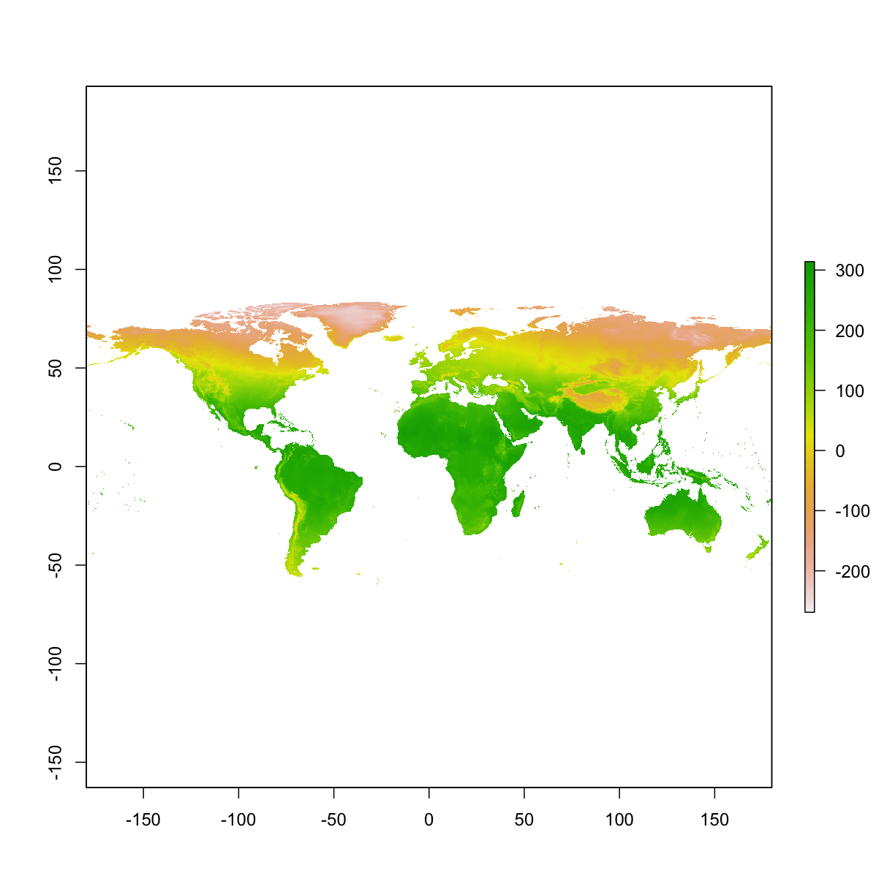
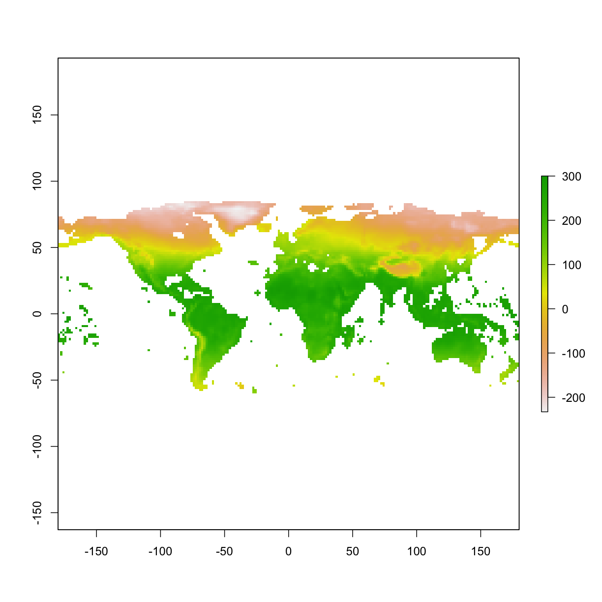
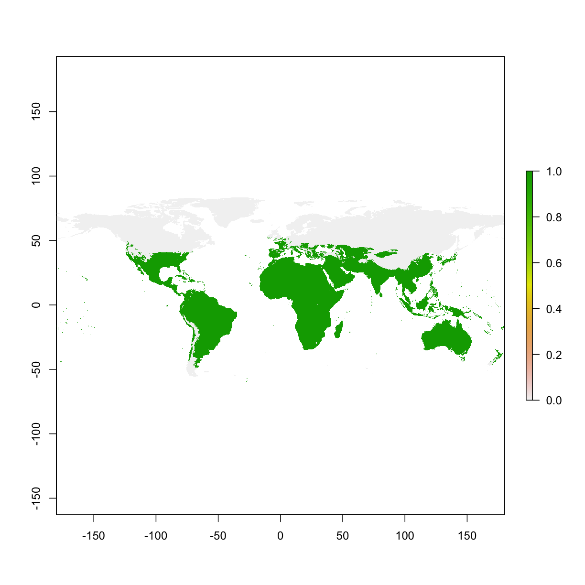
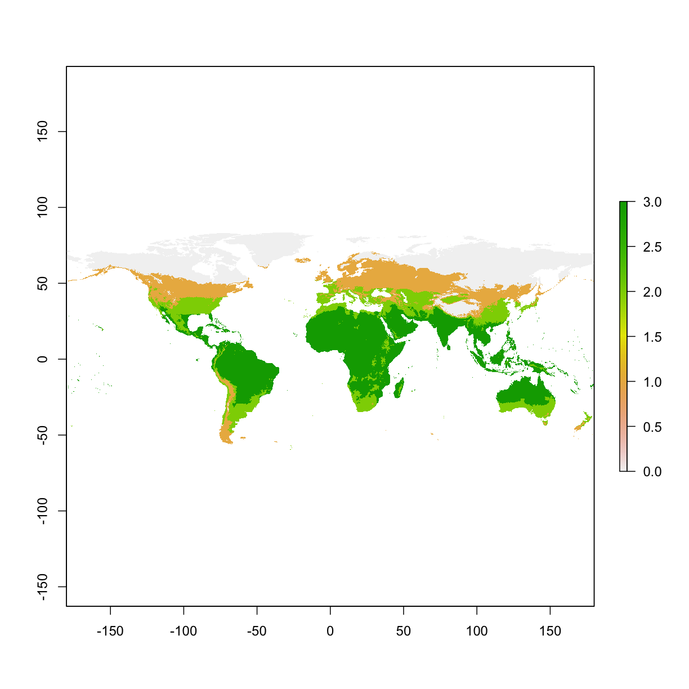
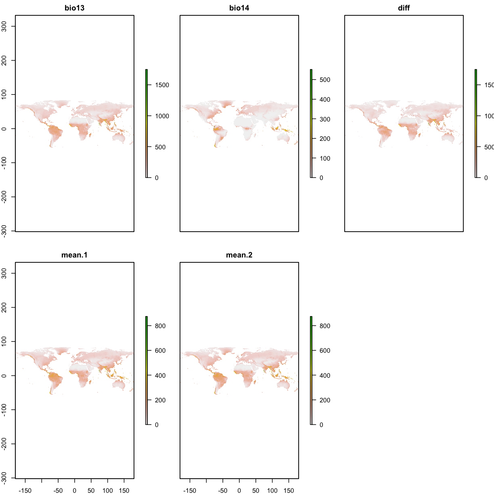
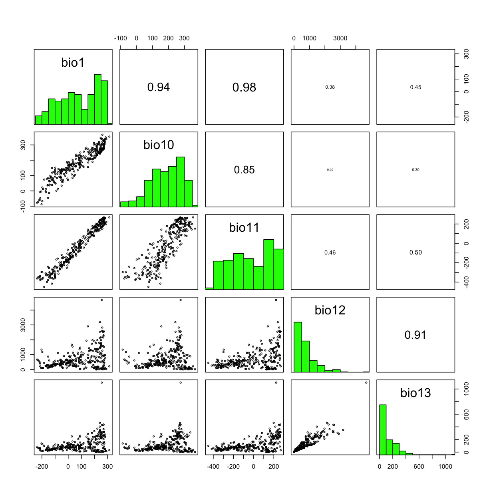

---
# Please do not edit this file directly; it is auto generated.
# Instead, please edit 03-raster-data.md in _episodes_rmd/
source: Rmd
title: "Raster data"
teaching: 10
exercises: 10
questions:
- "load raster in R"
objectives:
- "read/write raster data"
- "raster metadata"
- "raster resample"
- "raster reclassification"
- "raster calculation"
- "raster correlation"

keypoints:
- "111111"
- "22222"
---

## 3.1 Load libraries and set up folders 

~~~
library("raster")
require(utils)
if(!file.exists("data")) dir.create("data")
if(!file.exists("data/bioclim")) dir.create("data/bioclim")
if(!file.exists("data/studyarea")) dir.create("data/studyarea")
if(!file.exists("output")) dir.create("output")
~~~
{: .language-r}

## 3.2 Download data   
In our example, we use bioclimatic variables (downloaded from worldclim.org) as input environmental layers. We stack our environmental layers so that they can be processed simultaneously.  

We use `download.file()` to directly download worldclim data, and used `unzip()` to unzip the zipped file

~~~
# download climate data from worldclim.org
if( !file.exists( paste0("data/bioclim/bio_10m_bil.zip")   )){
  utils::download.file(url="http://biogeo.ucdavis.edu/data/climate/worldclim/1_4/grid/cur/bio_10m_bil.zip",
                       destfile="data/bioclim/bio_10m_bil.zip"   ) 
  utils::unzip("data/bioclim/bio_10m_bil.zip",exdir="data/bioclim") 
}
~~~
{: .language-r}

## 3.3 Read/Write raster files  
read one raster file at one time  

~~~
test1 <- raster("data/bioclim/bio1.bil")
dir.create("temp")
writeRaster(test1,"temp/bio1.bil",overwrite=TRUE)
writeRaster(test1,"temp/bio1.tiff",overwrite=TRUE)
~~~
{: .language-r}

read 19 layers at one time  

~~~
# search files with .bil file extension
clim_list <- list.files("data/bioclim/",pattern=".bil$",full.names = T)

# stacking the bioclim variables to process them at one go 
clim <- raster::stack(clim_list) 
~~~
{: .language-r}

You can write many different type of rasters:  
. 

## 3.4 Basic information of a raster  

~~~
bio1 <- raster("data/bioclim/bio1.bil")
bio1
~~~
{: .language-r}

~~~
class       : RasterLayer 
dimensions  : 900, 2160, 1944000  (nrow, ncol, ncell)
resolution  : 0.1666667, 0.1666667  (x, y)
extent      : -180, 180, -60, 90  (xmin, xmax, ymin, ymax)
coord. ref. : +proj=longlat +datum=WGS84 +no_defs +ellps=WGS84 +towgs84=0,0,0 
data source : /Users/lablap/lesson_mac/_episodes_rmd/data/bioclim/bio1.bil 
names       : bio1 
values      : -269, 314  (min, max)
~~~
{: .output}

read number of rows  

~~~
nrow(bio1)
~~~
{: .language-r}

~~~
[1] 900
~~~
{: .output}

read number of columns  

~~~
ncol(bio1)
~~~
{: .language-r}

~~~
[1] 2160
~~~
{: .output}

read extent

~~~
extent(bio1)
~~~
{: .language-r}

~~~
class       : Extent 
xmin        : -180 
xmax        : 180 
ymin        : -60 
ymax        : 90 
~~~
{: .output}

read CRS (coordinate reference system)  

~~~
crs(bio1)
~~~
{: .language-r}

~~~
CRS arguments:
 +proj=longlat +datum=WGS84 +no_defs +ellps=WGS84 +towgs84=0,0,0 
~~~
{: .output}

read resolution

~~~
res(bio1)
~~~
{: .language-r}

~~~
[1] 0.1666667 0.1666667
~~~
{: .output}

## 3.5 Resample raster   
We want the new layer to be 10 times coarser at each axis (i.e., 100 times coarser). In essence, we are resampling the resolution from 10 min to 100 min.

~~~
bio1 <- raster("data/bioclim/bio1.bil")

# define new resolution
newRaster <- raster( nrow= nrow(bio1)/10 , ncol= ncol(bio1)/10 )

# define the extent of the new coarser resolution raster
extent(newRaster) <- extent(bio1)

# fill the new layer with new values
newRaster <- resample(x=bio1,y=newRaster,method='bilinear')

# when viewing the new layer, we see that it appears coarser
plot(bio1)
~~~
{: .language-r}

~~~
plot(newRaster) 
~~~
{: .language-r}

## 3.6 Reclassify raster layer     
Reclassify as a binary layer: areas that are higher than 100 va. areas that are lower than 100

~~~
myLayer<- raster("data/bioclim/bio1.bil")

binaryMap <-   myLayer>= 100

plot(binaryMap)
~~~
{: .language-r}

Use multiple threholds to reclassify

~~~
# values smaller than 0 becomes 0; 
# values between 0 and 100 becomes 1; 
# values between 100 and 200 becomes 2;
# values larger than 200 becomes 3;

myMethod <- c(-Inf,  0, 0, # from, to, new value
              0,   100, 1,
              100, 200, 2,
              200, Inf, 3)
myLayer_classified <- reclassify(myLayer,rcl= myMethod)
plot(myLayer_classified)
~~~
{: .language-r}

## 3.7 Raster calculation    

~~~
wet <- raster("data/bioclim/bio13.bil") # precipitation of wettest month
dry <- raster("data/bioclim/bio14.bil") # precipitation of driest month

# To calculate difference between these two rasters
diff <- wet - dry
names(diff) <- "diff"

# To calculate the mean between the dry and wet rasters
twoLayers <- stack(wet,dry)
meanPPT1 <- calc(twoLayers,fun=mean)
names(meanPPT1) <- "mean"

# the following code gives the same results
meanPPT2 <-  (wet + dry)/2
names(meanPPT2) <- "mean"

layers_to_plot <- stack(wet, dry, diff, meanPPT1,meanPPT2)
plot(layers_to_plot)
~~~
{: .language-r}

## 3.8  Correlations between layers   

~~~
# search files with *.bil* file extension
clim_list <- list.files("data/bioclim/",pattern=".bil$",full.names = T)

# stacking the bioclim variables to process them at one go 
clim <- raster::stack(clim_list) 

# select the first 5 layers
clim_subset <- clim[[1:5]]

# to run correlations between different layers
raster::pairs(clim_subset,maxpixels=1000) # the default is maxpixels=100000
~~~
{: .language-r}

> ## Challenge: download and process worldclim data  
> --download worldclim_V1.4 10m resolution bioclimatic layers   
> --read BIO5 (Max Temperature of Warmest Month) & BIO6 (Min Temperature of Coldest Month)   
> --calculate the `difference` between the two layers  
> --save the `difference` as `difference.tiff` in folder `temp`  
> > ## Solution
> > 
> > ~~~
> > dir.create("data")
> > dir.create("data/bioclim")
> > 
> > # download 
> > utils::download.file(url="http://biogeo.ucdavis.edu/data/climate/worldclim/1_4/grid/cur/bio_10m_bil.zip",
> >                       destfile="data/bioclim/bio_10m_bil.zip"   ) 
> > utils::unzip("data/bioclim/bio_10m_bil.zip",exdir="data/bioclim") 
> > 
> > # load rasters 
> > library(raster)
> > bio5 <- raster("data/bioclim/bio5.bil")
> > bio6 <- raster("data/bioclim/bio6.bil")
> > 
> > # calculate the differences
> > difference <- bio5 - bio6
> > 
> > # save the raster file
> > dir.create("temp")
> > writeRaster(difference,"temp/difference.tiff")
> > ~~~
> > {: .language-r}
> {: .solution}
{: .challenge}

