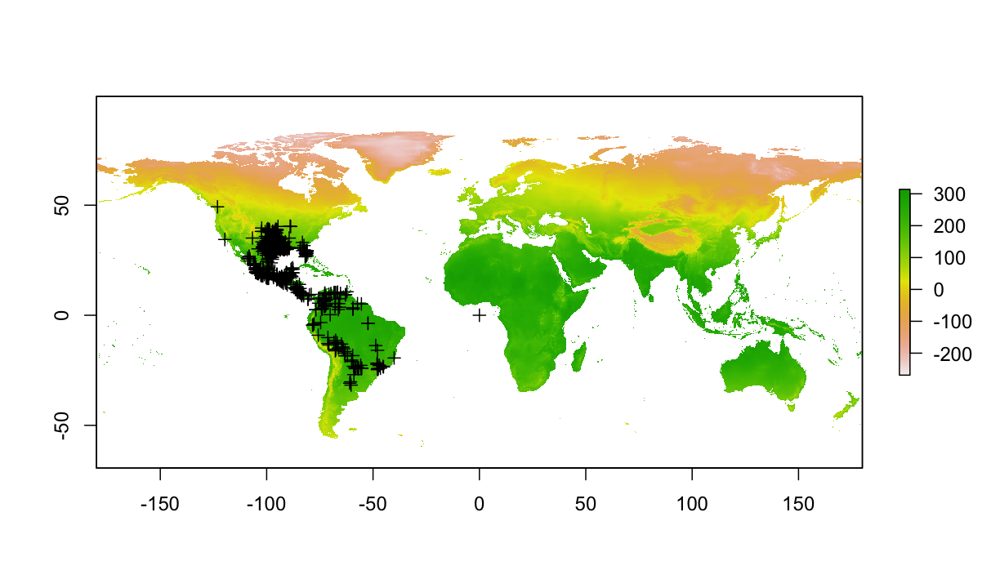
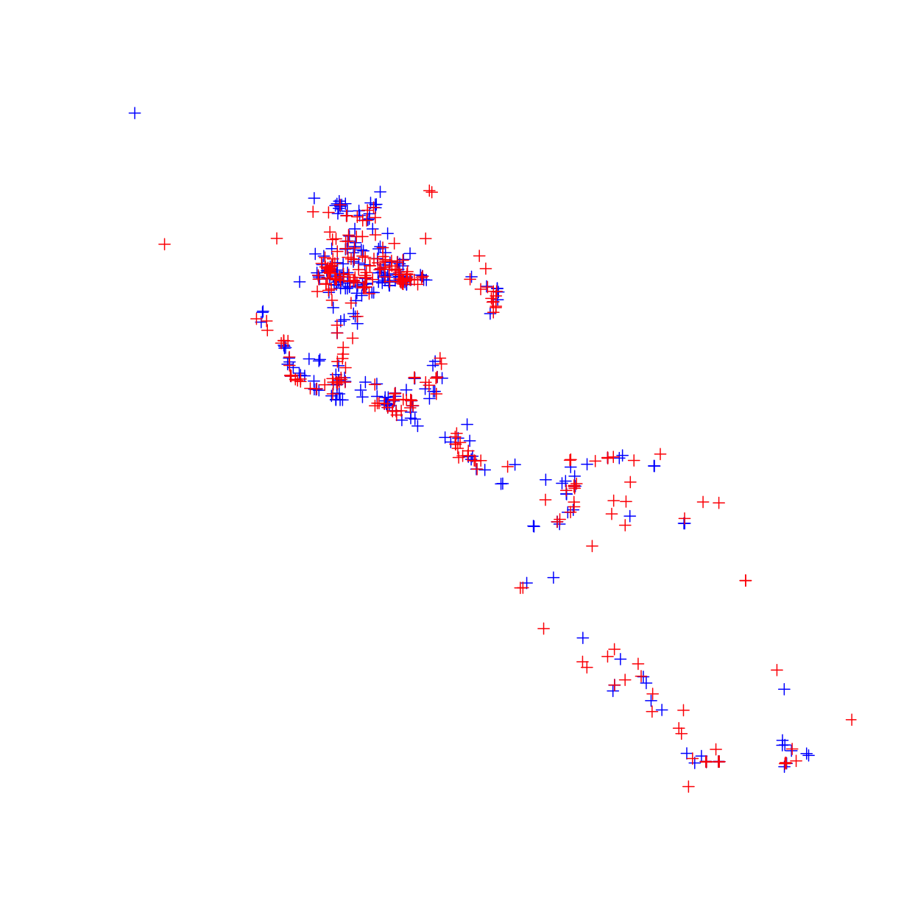
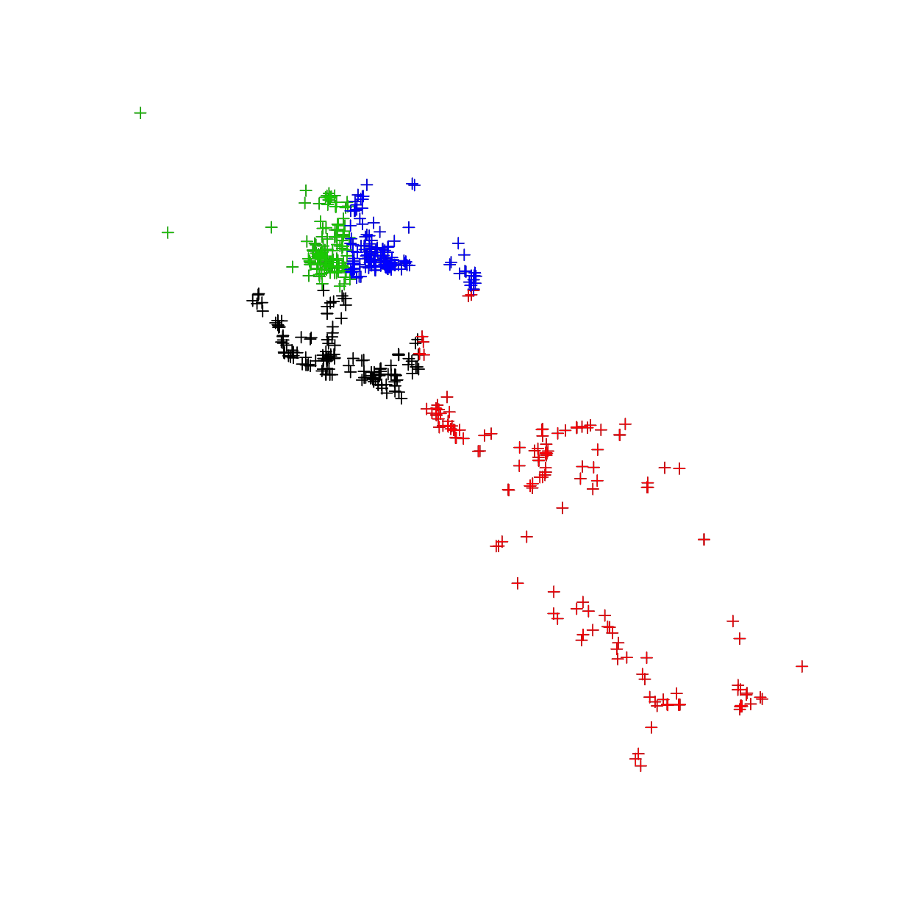

---
# Please do not edit this file directly; it is auto generated.
# Instead, please edit 04-occ-raster.md in _episodes_rmd/
source: Rmd
title: "Spatial analysis"
teaching: 15
exercises: 10
questions:
- "play with spatial points & rasters in R"
objectives:
- "plot occ & raster together"
- "extract environmental conditions of occ raster layers"
- "crop raster layers"
- "draw background samples"
- "randomly separate samples"

keypoints:
- "111111"
- "22222"
---

## 4.0 Prepare occ & raster 

~~~
library("raster")

if(!file.exists("data/occ_raw.rdata")){
  occ_raw <- gbif(genus="Dasypus",species="novemcinctus",download=TRUE) 
  save(occ_raw,file = "data/occ_raw.rdata")
}else{
  load("data/occ_raw.rdata")
}
occ_clean <- subset(occ_raw,(!is.na(lat))&(!is.na(lon))) 
occ_unique <- occ_clean[!duplicated( occ_clean[c("lat","lon")]  ),]
occ_unique_specimen <- subset(occ_unique, basisOfRecord=="PRESERVED_SPECIMEN")
occ_final <- subset(occ_unique_specimen, year>=1950 & year <=2000)
coordinates(occ_final) <- ~ lon + lat
myCRS1 <- CRS("+init=epsg:4326") # WGS 84
crs(occ_final) <- myCRS1

if( !file.exists( paste0("data/bioclim/bio_10m_bil.zip")   )){
  utils::download.file(url="http://biogeo.ucdavis.edu/data/climate/worldclim/1_4/grid/cur/bio_10m_bil.zip",
                       destfile="data/bioclim/bio_10m_bil.zip"   ) 
  utils::unzip("data/bioclim/bio_10m_bil.zip",exdir="data/bioclim") 
}

bio1 <- raster("data/bioclim/bio1.bil")
~~~
{: .language-r}

## 4.1 Plot occ & raster together  

~~~
plot(bio1)
plot(occ_final,add=T)
~~~
{: .language-r}

## 4.2 Extract environmental conditions of occ raster layers    
use `extract()` function to extract environmental conditions of occurrences  

~~~
# load bioclimatic layers
clim_list <- list.files("data/bioclim/",pattern=".bil$",full.names = T)
clim <- raster::stack(clim_list) 

conditions_occ <- extract(clim,occ_final)
head(conditions_occ)
~~~
{: .language-r}

~~~
     bio1 bio10 bio11 bio12 bio13 bio14 bio15 bio16 bio17 bio18 bio19 bio2
[1,]  251   261   242  3170   428    67    51  1221   240   382   946   95
[2,]  262   280   242   944   263     2   112   647    13   479    35  115
[3,]  184   274    87   537    82    19    45   197    70   156    70  148
[4,]  258   276   236   866   218     2   108   592     8   485    28  133
[5,]  257   273   235  3058   517    61    67  1402   205   677   321  112
[6,]  269   286   248   993   262     1   112   594     7   305     7  102
     bio3 bio4 bio5 bio6 bio7 bio8 bio9
[1,]   76  723  318  194  124  247  258
[2,]   72 1554  330  171  159  279  243
[3,]   42 7262  351    1  350  235   96
[4,]   72 1592  339  155  184  272  242
[5,]   70 1458  337  177  160  264  257
[6,]   64 1533  348  191  157  279  255
~~~
{: .output}
remove occurrences that have NA conditions  

~~~
bad_records <- is.na( conditions_occ[,1] ) 
table(bad_records)
~~~
{: .language-r}

~~~
bad_records
FALSE  TRUE 
  607     3 
~~~
{: .output}
look at the bad records, and remove them  

~~~
conditions_occ[bad_records,]
~~~
{: .language-r}

~~~
     bio1 bio10 bio11 bio12 bio13 bio14 bio15 bio16 bio17 bio18 bio19 bio2
[1,]   NA    NA    NA    NA    NA    NA    NA    NA    NA    NA    NA   NA
[2,]   NA    NA    NA    NA    NA    NA    NA    NA    NA    NA    NA   NA
[3,]   NA    NA    NA    NA    NA    NA    NA    NA    NA    NA    NA   NA
     bio3 bio4 bio5 bio6 bio7 bio8 bio9
[1,]   NA   NA   NA   NA   NA   NA   NA
[2,]   NA   NA   NA   NA   NA   NA   NA
[3,]   NA   NA   NA   NA   NA   NA   NA
~~~
{: .output}

~~~
occ_final <- occ_final[!bad_records,]
~~~
{: .language-r}

## 4.3 Crop raster layers  
use `crop()` function to crop a raster layer   

~~~
bio1 <- raster("data/bioclim/bio1.bil")

mybox <- extent(-130,   -70,     0,    60)
              #min x, max x, min y, max y
bio1_crop <- crop(bio1, mybox)

plot(bio1_crop)
~~~
{: .language-r}

use `mask()` function to cut a raster with fine boundry   

~~~
bio1 <- raster("data/bioclim/bio1.bil")

occ_buffer <- buffer(occ_final,width=5*10^5) #unit is meter
~~~
{: .language-r}

~~~
Loading required namespace: rgeos
~~~
{: .output}

~~~
bio1_mask <- mask(bio1, occ_buffer)

plot(bio1_mask)
plot(occ_buffer,add=T)
plot(occ_final,add=T,col="blue")
~~~
{: .language-r}

this can also be applied to multiple rasters 

~~~
# load bioclimatic layers
clim_list <- list.files("data/bioclim/",pattern=".bil$",full.names = T)
clim <- raster::stack(clim_list) 

occ_buffer <- buffer(occ_final,width=5*10^5) #unit is meter
clim_mask <- mask(clim, occ_buffer)
~~~
{: .language-r}

## 4.4 Draw background samples  
use `sampleRandom()` function to select background points from the new buffered study area; the number provided in the `size`.  
use `set.seed()` before random sampling to guarantee the same random sample	  	

~~~
set.seed(1) 
bg <- sampleRandom(x=clim_mask,
                   size=10000,
                   na.rm=T, #removes the 'Not Applicable' points  
                   sp=T) # return spatial points 

head(bg)
~~~
{: .language-r}

~~~
  bio1 bio10 bio11 bio12 bio13 bio14 bio15 bio16 bio17 bio18 bio19 bio2
1  262   270   248  1427   244    11    69   672    52   333    87  122
2  257   277   226  1118   187    25    58   495    82   476   115  113
3  249   252   245  2048   332    15    68   946    57   468    57  129
4  241   280   197  1198   147    28    39   423   126   401   134  125
5  104   106    99  1006   124    39    31   338   147   332   147  103
6  210   229   184  1415   319     7    87   793    26   575    44  120
  bio3 bio4 bio5 bio6 bio7 bio8 bio9
1   70  906  347  175  172  266  251
2   66 2155  336  166  170  277  228
3   77  314  332  165  167  247  245
4   58 3291  348  133  215  274  208
5   90  281  161   47  114  105   99
6   65 1787  291  109  182  225  189
~~~
{: .output}

~~~
plot(clim_mask[[1]])
# add the background points to the plotted raster
plot(bg,add=T,col="black") 
# add the occurrence data to the plotted raster
plot(occ_final,add=T,col="red")
~~~
{: .language-r}

## 4.5 Split occurrence data into training & testing
We randomly selected **50%** of the occurrence data for model training and used the remaining **50%** for model testing. To make our experiment reproducible (i.e., select the same set of points), we used a static seed via the `set.seed()` function.  

~~~
# get the same random sample for training and testing
set.seed(1) 

# randomly select 50% for training
selected <- sample(  1:nrow(occ_final),  nrow(occ_final)*0.5)

occ_train <- occ_final[selected,] # this is the selection to be used for model training
occ_test <- occ_final[-selected,] # this is the opposite of the selection which will be used for model testing
plot(occ_train,col="blue")
plot(occ_test,col="red",add=T)
~~~
{: .language-r}

an alternative method, **block cut**, distributes the training and testing more equally across the study exent. This function is part of the `ENMeval` package.  

~~~
library(ENMeval)
cut_block <- ENMeval::get.block(occ=as.data.frame(occ_final@coords), 
                       bg.coords=as.data.frame(bg@coords))
occ_final@data$cut_block <- cut_block$occ.grp
bg@data$cut_block <- cut_block$bg.grp

plot(occ_final)
plot(subset(occ_final,cut_block==1),col=1,add=T)
plot(subset(occ_final,cut_block==2),col=2,add=T)
plot(subset(occ_final,cut_block==3),col=3,add=T)
plot(subset(occ_final,cut_block==4),col=4,add=T)
~~~
{: .language-r}

> ## Challenge: use your occurrences to cut raster layers 
> --load occurrences & raster layers   
> --build a `600,000 meter` buffer around occurrences    
> --`mask` raster by the buffer of occurrences  
> --plot the masked raster  
> > ## Solution
> > 
> > ~~~
> > library(dismo)
> > library(raster)
> > 
> > dir.create("data")
> > dir.create("data/bioclim")
> > 
> > if(!file.exists("data/occ_raw.rdata")){
> >   occ_raw <- gbif(genus="Dasypus",species="novemcinctus",download=TRUE) 
> >   save(occ_raw,file = "data/occ_raw.rdata")
> > }else{
> >   load("data/occ_raw.rdata")
> > }
> > occ_clean <- subset(occ_raw,(!is.na(lat))&(!is.na(lon))) 
> > occ_unique <- occ_clean[!duplicated( occ_clean[c("lat","lon")]  ),]
> > occ_unique_specimen <- subset(occ_unique, basisOfRecord=="PRESERVED_SPECIMEN")
> > occ_final <- subset(occ_unique_specimen, year>=1950 & year <=2000)
> > coordinates(occ_final) <- ~ lon + lat
> > myCRS1 <- CRS("+init=epsg:4326") # WGS 84
> > crs(occ_final) <- myCRS1
> > 
> > if( !file.exists( paste0("data/bioclim/bio_10m_bil.zip")   )){
> >   utils::download.file(url="http://biogeo.ucdavis.edu/data/climate/worldclim/1_4/grid/cur/bio_10m_bil.zip",
> >                        destfile="data/bioclim/bio_10m_bil.zip"   ) 
> >   utils::unzip("data/bioclim/bio_10m_bil.zip",exdir="data/bioclim") 
> > }
> > 
> > bio1 <- raster("data/bioclim/bio1.bil")
> > 
> > occ_buffer <- buffer(occ_final,width=6*10^5) #unit is meter
> > bio1_mask <- mask(bio1, occ_buffer)
> > 
> > plot(bio1_mask)
> > plot(occ_buffer,add=T)
> > plot(occ_final,add=T,col="blue")
> > ~~~
> > {: .language-r}
> {: .solution}
{: .challenge}

