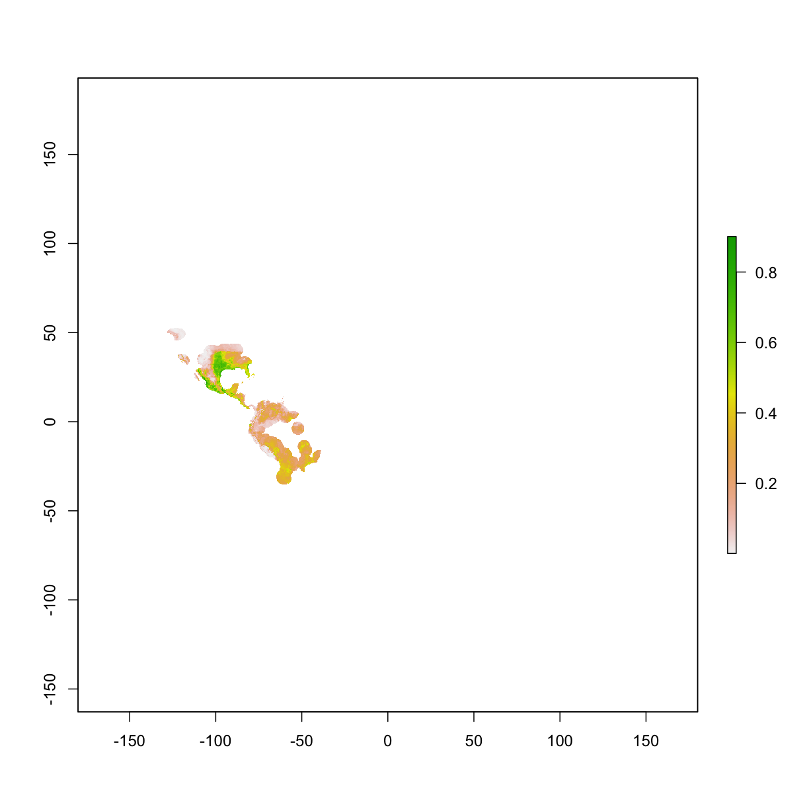
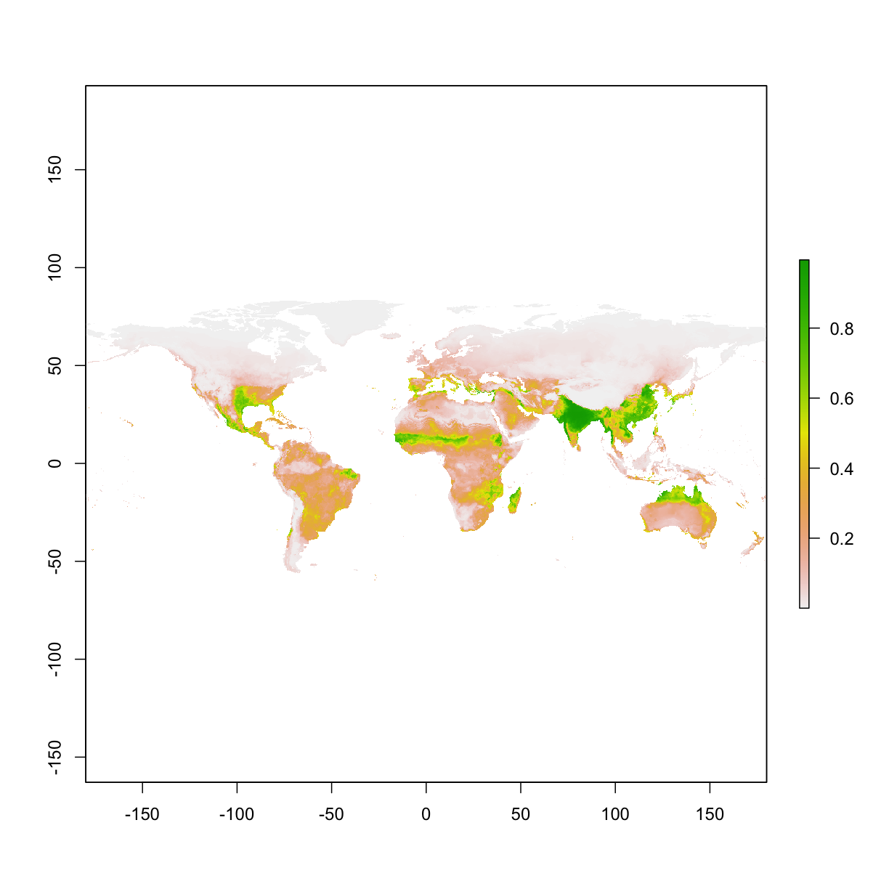
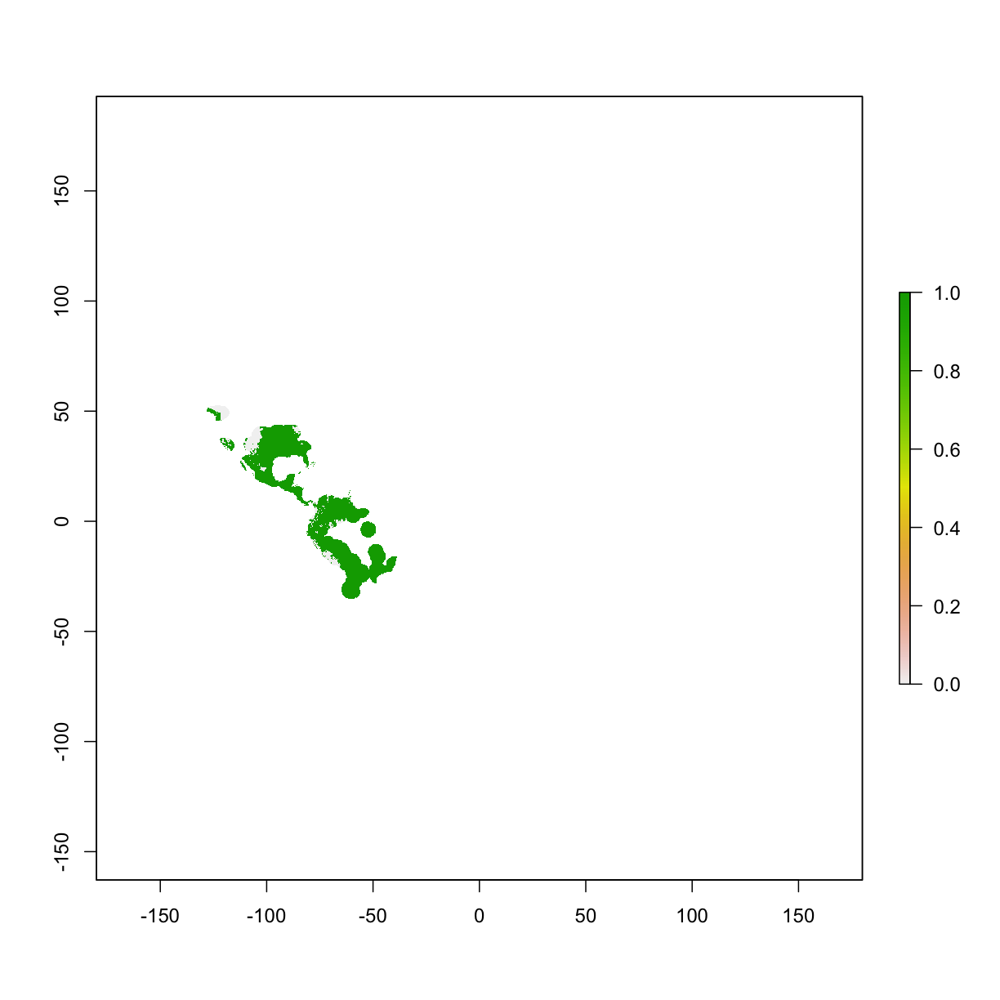

---
# Please do not edit this file directly; it is auto generated.
# Instead, please edit 05-maxent-simple.md in _episodes_rmd/
source: Rmd
title: "Maxent model - test run"
teaching: 10
exercises: 5
questions:
- "How to re-format data for Maxent"
objectives:
- "format data input for Maxent"
- "simple run"
keypoints:
- "111111"
- "22222"
---

## 5 Maxent model - test run  

#### 5.0 prepare occ & raster 

~~~
library("raster")
library("dismo")

if(!file.exists("data/occ_raw.rdata")){
  occ_raw <- gbif(genus="Dasypus",species="novemcinctus",download=TRUE) 
  save(occ_raw,file = "data/occ_raw.rdata")
}else{
  load("data/occ_raw.rdata")
}
occ_clean <- subset(occ_raw,(!is.na(lat))&(!is.na(lon))) 
occ_unique <- occ_clean[!duplicated( occ_clean[c("lat","lon")]  ),]
occ_unique_specimen <- subset(occ_unique, basisOfRecord=="PRESERVED_SPECIMEN")
occ_final <- subset(occ_unique_specimen, year>=1950 & year <=2000)
coordinates(occ_final) <- ~ lon + lat
myCRS1 <- CRS("+init=epsg:4326") # WGS 84
crs(occ_final) <- myCRS1

if( !file.exists( paste0("data/bioclim/bio_10m_bil.zip")   )){
  utils::download.file(url="http://biogeo.ucdavis.edu/data/climate/worldclim/1_4/grid/cur/bio_10m_bil.zip",
                       destfile="data/bioclim/bio_10m_bil.zip"   ) 
  utils::unzip("data/bioclim/bio_10m_bil.zip",exdir="data/bioclim") 
}

clim_list <- list.files("data/bioclim/",pattern=".bil$",full.names = T)
clim <- raster::stack(clim_list) 

occ_buffer <- buffer(occ_final,width=4*10^5) #unit is meter
clim_mask <- mask(clim, occ_buffer)
~~~
{: .language-r}

#### 5.1 re-format data input for Maxent
The data input can either be **spatial (i.e. spatial points + rasters)** or ***tabular (data frame)**.   
Here is an example of using spatial data:

~~~
cat(class(clim_mask),"  ",  class(occ_final))
~~~
{: .language-r}

~~~
RasterBrick    SpatialPointsDataFrame
~~~
{: .output}

~~~
m0 <- maxent(x=clim_mask,p=occ_final)
~~~
{: .language-r}

~~~
Warning in .local(x, p, ...): 2 (0.4%) of the presence points have NA
predictor values
~~~
{: .error}

However, using spatial data input will make the model less under control. So if you want more control of the modeling process, it is recommended to prepare data in a tabular format. The ideal format is as following:  
. 

Here, we extract environmental conditions for occurrences (training, and testing) and background points, and merge them by row.

~~~
set.seed(1) 
bg <- sampleRandom(x=clim_mask,
                   size=10000,
                   na.rm=T, #removes the 'Not Applicable' points  
                   sp=T) # return spatial points 

set.seed(1) 

# randomly select 50% for training
selected <- sample(  1:nrow(occ_final),  nrow(occ_final)*0.5)

occ_train <- occ_final[selected,] # this is the selection to be used for model training
occ_test <- occ_final[-selected,] # this is the opposite of the selection which will be used for model testing

# extracting env conditions for training occ from the raster stack;
# a data frame is returned (i.e multiple columns)
env_occ_train <- extract(clim,occ_train)

# env conditions for testing occ
env_occ_test <- extract(clim,occ_test)

# extracting env conditions for background
env_bg <- extract(clim,bg)  

#combine the conditions by row
myPredictors <- rbind(env_occ_train,env_bg)

# change matrix to dataframe
myPredictors <- as.data.frame(myPredictors)
head(myPredictors)
~~~
{: .language-r}

~~~
  bio1 bio10 bio11 bio12 bio13 bio14 bio15 bio16 bio17 bio18 bio19 bio2
1  174   277    63   831   120    35    36   288   124   202   124  137
2  194   270   109  1516   156    86    13   426   314   426   406  119
3  180   270    86  1232   129    68    15   350   244   263   324  127
4  211   242   181  2697   362    95    41  1016   311  1016   311   78
5  121   248    -8   593    90    11    56   262    42   249    42  148
6  240   243   236  4149   633    97    50  1690   372   665  1690  106
  bio3 bio4 bio5 bio6 bio7 bio8 bio9
1   36 8260  357  -19  376  218   63
2   41 6304  328   40  288  270  201
3   39 7168  340   15  325  220  265
4   53 2350  282  135  147  242  181
5   34 9906  339  -93  432  222   -8
6   87  304  301  180  121  236  238
~~~
{: .output}

Maxent reads a **1** as **presence** and **0** as **background**. Thus, we need to assign a **1** to the training environmental conditions and a **0** for the background.We create a set of rows with the same number as the training and testing data, and put the value of "1" for each cell and a "0" for background. We combine the "1"s and "0"s into a vector.

~~~
# repeat the number 1 as many times as the number of rows in p, 
# and repeat 0 for the rows of background points
myResponse <- c(rep(1,nrow(env_occ_train)),
                rep(0,nrow(env_bg))) 

# (rep(1,nrow(p)) creating the number of rows as the p data set to 
# have the number '1' as the indicator for presence; rep(0,nrow(a)) 
# creating the number of rows as the a data set to have the number
# '0' as the indicator for absence; the c combines these ones and 
# zeros into a new vector that can be added to the Maxent table data
# frame with the environmental attributes of the presence and absence locations

mod <- maxent(x=myPredictors,p=myResponse)
~~~
{: .language-r}

#### 5.2 view the model

~~~
mod@lambdas
~~~
{: .language-r}

~~~
  [1] "bio1, 0.0, -17.0, 288.0"                             
  [2] "bio10, 0.0, 28.0, 323.0"                             
  [3] "bio11, 0.0, -115.0, 279.0"                           
  [4] "bio12, 0.0, 0.0, 7507.0"                             
  [5] "bio13, 0.0, 0.0, 789.0"                              
  [6] "bio14, 0.0, 0.0, 471.0"                              
  [7] "bio15, 0.0, 0.0, 179.0"                              
  [8] "bio16, 0.0, 0.0, 2220.0"                             
  [9] "bio17, 0.0, 0.0, 1446.0"                             
 [10] "bio18, 0.0, 0.0, 1862.0"                             
 [11] "bio19, 0.0, 0.0, 1833.0"                             
 [12] "bio2, 0.0, 49.0, 197.0"                              
 [13] "bio3, 0.0, 24.0, 92.0"                               
 [14] "bio4, 0.0, 153.0, 11700.0"                           
 [15] "bio5, 0.0, 91.0, 420.0"                              
 [16] "bio6, 0.0, -218.0, 238.0"                            
 [17] "bio7, 0.0, 67.0, 458.0"                              
 [18] "bio8, 0.0, -109.0, 318.0"                            
 [19] "bio9, 0.0, -93.0, 290.0"                             
 [20] "bio6^2, -2.2255095541959884, 0.0, 56644.0"           
 [21] "bio1*bio4, 0.5293231279144979, -133807.0, 1744554.0" 
 [22] "bio10*bio4, 1.5750550527929477, 25020.0, 2573018.0"  
 [23] "bio10*bio7, 0.21276874042131477, 5012.0, 123063.0"   
 [24] "bio11*bio6, -0.13417605514607972, -3264.0, 63800.0"  
 [25] "bio12*bio15, 0.6308701595087747, 0.0, 293293.0"      
 [26] "bio13*bio15, 0.9225852101378703, 0.0, 56808.0"       
 [27] "bio14*bio15, 0.9912236608477529, 0.0, 8100.0"        
 [28] "bio15*bio16, 0.39321115653339517, 0.0, 139293.0"     
 [29] "bio15*bio17, 0.9033867541666357, 0.0, 25200.0"       
 [30] "bio18*bio2, -0.5896190110496125, 0.0, 180614.0"      
 [31] "bio18*bio4, -0.050721439426977155, 0.0, 3810459.0"   
 [32] "bio18*bio7, -0.9286094031293597, 0.0, 247450.0"      
 [33] "bio19*bio4, -1.5359678122273221, 0.0, 5057568.0"     
 [34] "bio2*bio9, -0.19892004145792416, -12410.0, 45153.0"  
 [35] "bio3*bio4, -0.4711535364003401, 13464.0, 376200.0"   
 [36] "bio3*bio7, -0.7328410958564153, 4896.0, 19604.0"     
 [37] "bio4*bio8, 0.07552966312205958, -857939.0, 2533188.0"
 [38] "(329.5<bio5), 0.12678952125724835, 0.0, 1.0"         
 [39] "(264.5<bio10), 0.31956678392906956, 0.0, 1.0"        
 [40] "(116.5<bio1), 1.0299509349304112, 0.0, 1.0"          
 [41] "(43.5<bio3), -0.3306305991528393, 0.0, 1.0"          
 [42] "(391.5<bio12), 0.5172223161482307, 0.0, 1.0"         
 [43] "(120.5<bio7), 0.31071525342819684, 0.0, 1.0"         
 [44] "(94.5<bio15), 0.2543963333244104, 0.0, 1.0"          
 [45] "(102.5<bio1), 0.28736433128110334, 0.0, 1.0"         
 [46] "(597.0<bio4), 0.2238771306511698, 0.0, 1.0"          
 [47] "(463.5<bio12), 0.04793613085886457, 0.0, 1.0"        
 [48] "(87.5<bio15), 0.22680275633324382, 0.0, 1.0"         
 [49] "(267.5<bio10), 0.039797661539600376, 0.0, 1.0"       
 [50] "(110.5<bio7), 0.7935062506323903, 0.0, 1.0"          
 [51] "(88.5<bio8), 0.3791063456137675, 0.0, 1.0"           
 [52] "(66.5<bio11), 0.13400851649236623, 0.0, 1.0"         
 [53] "(613.5<bio18), 0.26051256995377, 0.0, 1.0"           
 [54] "(68.5<bio11), 0.006803934816005889, 0.0, 1.0"        
 [55] "(378.0<bio17), -0.3936972705537091, 0.0, 1.0"        
 [56] "(120.5<bio2), -0.24491620539998118, 0.0, 1.0"        
 [57] "(258.5<bio8), -0.019242098972994556, 0.0, 1.0"       
 [58] "(-15.5<bio11), 0.46050478631117187, 0.0, 1.0"        
 [59] "(23.5<bio19), 0.07407629192415857, 0.0, 1.0"         
 [60] "(201.5<bio10), -0.22423528430494963, 0.0, 1.0"       
 [61] "(96.5<bio8), 0.09320835753044539, 0.0, 1.0"          
 [62] "(116.5<bio2), -0.01073164644296725, 0.0, 1.0"        
 [63] "(1174.0<bio19), -0.6228202902624683, 0.0, 1.0"       
 [64] "(169.5<bio2), -0.2200019831754192, 0.0, 1.0"         
 [65] "(1017.5<bio18), -0.45327496240883836, 0.0, 1.0"      
 [66] "'bio7, 0.9838476136843713, 388.5, 458.0"             
 [67] "'bio11, 0.8539430769617347, 268.5, 279.0"            
 [68] "`bio19, -0.4845689528740517, 0.0, 27.5"              
 [69] "(78.0<bio11), 0.12427440791079254, 0.0, 1.0"         
 [70] "(229.5<bio9), 0.06700848173926442, 0.0, 1.0"         
 [71] "'bio7, 0.6173732556738931, 373.5, 458.0"             
 [72] "(168.5<bio1), 0.06345204465571584, 0.0, 1.0"         
 [73] "'bio3, -0.3656193837624463, 84.5, 92.0"              
 [74] "(351.5<bio5), -0.1921567454636457, 0.0, 1.0"         
 [75] "`bio12, -2.4882927565401878, 0.0, 547.5"             
 [76] "'bio6, -1.4846190793892886, 206.5, 238.0"            
 [77] "'bio15, 2.8833855802293464, 75.5, 179.0"             
 [78] "'bio2, -0.24640939162983125, 156.5, 197.0"           
 [79] "(236.5<bio9), 7.79348948971692E-4, 0.0, 1.0"         
 [80] "(299.5<bio17), 0.13335933555044427, 0.0, 1.0"        
 [81] "(199.5<bio10), -0.1361402742480931, 0.0, 1.0"        
 [82] "`bio18, -0.20542802679741629, 0.0, 61.5"             
 [83] "(432.5<bio7), -0.10638149344149274, 0.0, 1.0"        
 [84] "`bio17, -0.7751859939997583, 0.0, 11.5"              
 [85] "(269.5<bio8), 0.041864311075712014, 0.0, 1.0"        
 [86] "'bio2, -0.9200865847307305, 157.5, 197.0"            
 [87] "'bio12, 0.7863899316849023, 2095.5, 7507.0"          
 [88] "(371.0<bio5), 0.05989390599579418, 0.0, 1.0"         
 [89] "'bio9, 0.4381660225672563, 215.5, 290.0"             
 [90] "(354.5<bio5), -0.09671844603472701, 0.0, 1.0"        
 [91] "(266.5<bio17), 0.08089149305122352, 0.0, 1.0"        
 [92] "(345.0<bio17), -0.11433950180164038, 0.0, 1.0"       
 [93] "`bio15, 0.8645574017541445, 0.0, 19.5"               
 [94] "`bio1, -0.9942155274206406, -17.0, 176.5"            
 [95] "(70.5<bio3), 0.03319192376085023, 0.0, 1.0"          
 [96] "'bio18, -0.6077219757948379, 726.5, 1862.0"          
 [97] "'bio1, 0.18142119098943713, 263.5, 288.0"            
 [98] "(77.5<bio3), -0.032410689735450735, 0.0, 1.0"        
 [99] "`bio1, -0.1912489386106569, -17.0, 177.5"            
[100] "`bio3, -0.43127683891257534, 24.0, 38.5"             
[101] "(302.0<bio4), 0.10749505088673914, 0.0, 1.0"         
[102] "'bio10, 0.24024960353399727, 240.5, 323.0"           
[103] "(330.0<bio17), -0.020813268796138627, 0.0, 1.0"      
[104] "`bio18, 0.3872467053414549, 0.0, 173.5"              
[105] "(287.5<bio10), -0.01699791357515275, 0.0, 1.0"       
[106] "(409.5<bio18), 0.026003151734552, 0.0, 1.0"          
[107] "linearPredictorNormalizer, 5.963342691345768"        
[108] "densityNormalizer, 205.75183030460377"               
[109] "numBackgroundPoints, 1418"                           
[110] "entropy, 6.790528951620979"                          
~~~
{: .output}

#### 5.3 Predict function
Running Maxent in R will not automatically make a projection to the data layers, unless you specify this using the parameter *projectionlayers*. However, we could make projections (to dataframes or raster layers) post hoc using the `predict()` function.

project model on raster layers (training layers)  

~~~
# example 1, project to study area [raster]
ped1 <- predict(mod,clim_mask) # studyArea is the clipped rasters 
plot(ped1) # plot the continuous prediction
~~~
{: .language-r}

project model on raster layers (whole world maps)

~~~
# example 2, project to the world
ped2 <- predict(mod,clim)
plot(ped2)
~~~
{: .language-r}

example 3, project to a dataframe (training occurrences). This returns the predicion value assocaited with a set of condions. In this example, we use the training condition to extract a prediction for each point.

~~~
ped3 <- predict(mod,env_occ_train)
head(ped3)
~~~
{: .language-r}

~~~
[1] 0.6136506 0.6118955 0.6738129 0.4518061 0.6068836 0.3766124
~~~
{: .output}

#### 5.4 Model evaluation
To evaluate models, we use the `evaluate()` function from the `dismo` package. Evaluation indices include AUC, TSS, Sensitivity, Specificity, etc.

Model evaluation, where `p` & `a` are **dataframes** (environmental conditions for presences and background points)  

Evaluate model with training data  

~~~
mod_eval_train <- dismo::evaluate(p=env_occ_train,
                                  a=env_bg,
                                  model=mod) 
print(mod_eval_train)
~~~
{: .language-r}

~~~
class          : ModelEvaluation 
n presences    : 300 
n absences     : 1122 
AUC            : 0.8898277 
cor            : 0.5920948 
max TPR+TNR at : 0.3978259 
~~~
{: .output}

Evaluate model with testing data  

~~~
mod_eval_test <- dismo::evaluate(p=env_occ_test,
                                 a=env_bg,
                                 model=mod)  
print(mod_eval_test) 
~~~
{: .language-r}

~~~
class          : ModelEvaluation 
n presences    : 301 
n absences     : 1122 
AUC            : 0.8306817 
cor            : 0.5105955 
max TPR+TNR at : 0.3647463 
~~~
{: .output}

compare training & testing AUC

~~~
cat( "the training AUC is: ",mod_eval_train@auc ,"\n" )
~~~
{: .language-r}

~~~
the training AUC is:  0.8898277 
~~~
{: .output}

~~~
cat( "the testing AUC is: ", mod_eval_test@auc  ,"\n" )
~~~
{: .language-r}

~~~
the testing AUC is:  0.8306817 
~~~
{: .output}

#### 5.5 thresholds   
To threshold our continuous predictions of suitability into binary predictions we use the threshold function of the "dismo" package. To plot the binary prediction, we plot the predictions that are larger than the threshold.  

Here we use `threshold()` function to obtain particular thresholds based on evaluation results from the previous step.

~~~
thd1 <- threshold(mod_eval_train,stat="no_omission") # 0% omission rate 
thd2 <- threshold(mod_eval_train,stat="spec_sens") # highest TSS
thd3 <- threshold(mod_eval_train,stat="sensitivity",sensitivity=0.9) # 10% omission rate, i.e. sensitivity=0.9
thd4 <- threshold(mod_eval_train,stat="sensitivity",sensitivity=0.95) # 10% omission rate, i.e. sensitivity=0.9

# plotting points that are higher than the previously calculated thresholded value
plot(ped1>=thd1) 
~~~
{: .language-r}

> ## Challenge: train a Maxent model with dataframe as input, calculate the AUC  
> load occurrences & raster layers   
> build a `xxx meter` buffer around occurrences    
> `mask` raster by the buffer of occurrences   
> generate random samples from the masked raster using `sampleRandom()`  
> `extract()` environmental conditions from raster by points  
> re-format the environmental conditions as input for maxent  
> train a `maxent` model  
> `evaluate()` the model with testing environmental conditions  
> > ## Solution
> > 
> > ~~~
> > library("raster")
> > library("dismo")
> > 
> > # prepare spatial occ data
> > if(!file.exists("data/occ_raw.rdata")){
> >   occ_raw <- gbif(genus="Dasypus",species="novemcinctus",download=TRUE) 
> >   save(occ_raw,file = "data/occ_raw.rdata")
> > }else{
> >   load("data/occ_raw.rdata")
> > }
> > occ_clean <- subset(occ_raw,(!is.na(lat))&(!is.na(lon))) 
> > occ_unique <- occ_clean[!duplicated( occ_clean[c("lat","lon")]  ),]
> > occ_unique_specimen <- subset(occ_unique, basisOfRecord=="PRESERVED_SPECIMEN")
> > occ_final <- subset(occ_unique_specimen, year>=1950 & year <=2000)
> > coordinates(occ_final) <- ~ lon + lat
> > myCRS1 <- CRS("+init=epsg:4326") # WGS 84
> > crs(occ_final) <- myCRS1
> > 
> > # prepare raster data
> > if( !file.exists( paste0("data/bioclim/bio_10m_bil.zip")   )){
> >   utils::download.file(url="http://biogeo.ucdavis.edu/data/climate/worldclim/1_4/grid/cur/bio_10m_bil.zip",
> >                        destfile="data/bioclim/bio_10m_bil.zip"   ) 
> >   utils::unzip("data/bioclim/bio_10m_bil.zip",exdir="data/bioclim") 
> > }
> > 
> > # load rasters
> > clim_list <- list.files("data/bioclim/",pattern=".bil$",full.names = T)
> > clim <- raster::stack(clim_list) 
> > 
> > occ_buffer <- buffer(occ_final,width=4*10^5) #unit is meter
> > clim_mask <- mask(clim, occ_buffer)
> > 
> > # extract environmental conditions
> > set.seed(1) 
> > bg <- sampleRandom(x=clim_mask,
> >                    size=10000,
> >                    na.rm=T, #removes the 'Not Applicable' points  
> >                    sp=T) # return spatial points 
> > 
> > set.seed(1) 
> > 
> > # randomly select 50% for training
> > selected <- sample(  1:nrow(occ_final),  nrow(occ_final)*0.5)
> > 
> > occ_train <- occ_final[selected,] # this is the selection to be used for model training
> > occ_test <- occ_final[-selected,] # this is the opposite of the selection which will be used for model testing
> > 
> > # extracting env conditions
> > env_occ_train <- extract(clim,occ_train)
> > env_occ_test <- extract(clim,occ_test)
> > 
> > # extracting env conditions for background
> > env_bg <- extract(clim,bg)  
> > 
> > #combine the conditions by row
> > myPredictors <- rbind(env_occ_train,env_bg)
> > 
> > # change matrix to dataframe
> > myPredictors <- as.data.frame(myPredictors)
> > 
> > # repeat the number 1 as many times as the number of rows in p, and repeat 0 for the rows of background points
> > myResponse <- c(rep(1,nrow(env_occ_train)),
> >                 rep(0,nrow(env_bg))) 
> > 
> > # training a maxent model with dataframes
> > mod <- dismo::maxent(x=myPredictors, ## env conditions
> >                      p=myResponse)   ## 1:presence or 0:absence
> > 
> > # evaluate model based on testing data
> > mod_eval_test <- dismo::evaluate(p=env_occ_test,
> >                                  a=env_bg,
> >                                  model=mod) 
> > mod_eval_test@auc
> > ~~~
> > {: .language-r}
> {: .solution}
{: .challenge}

