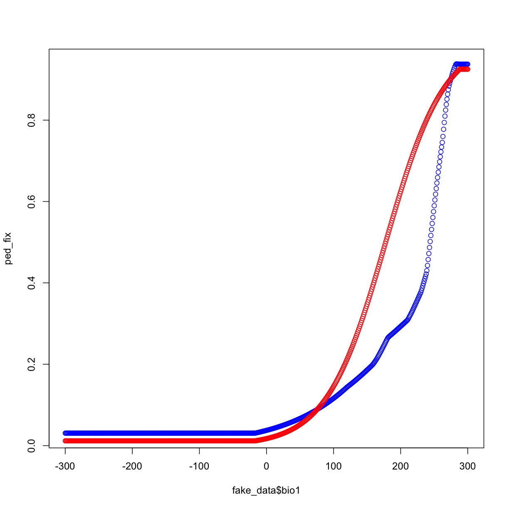
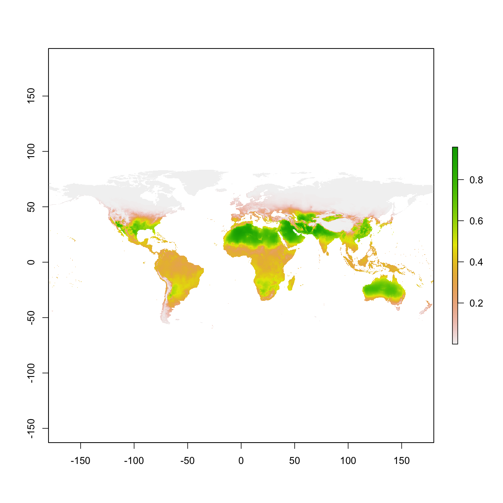
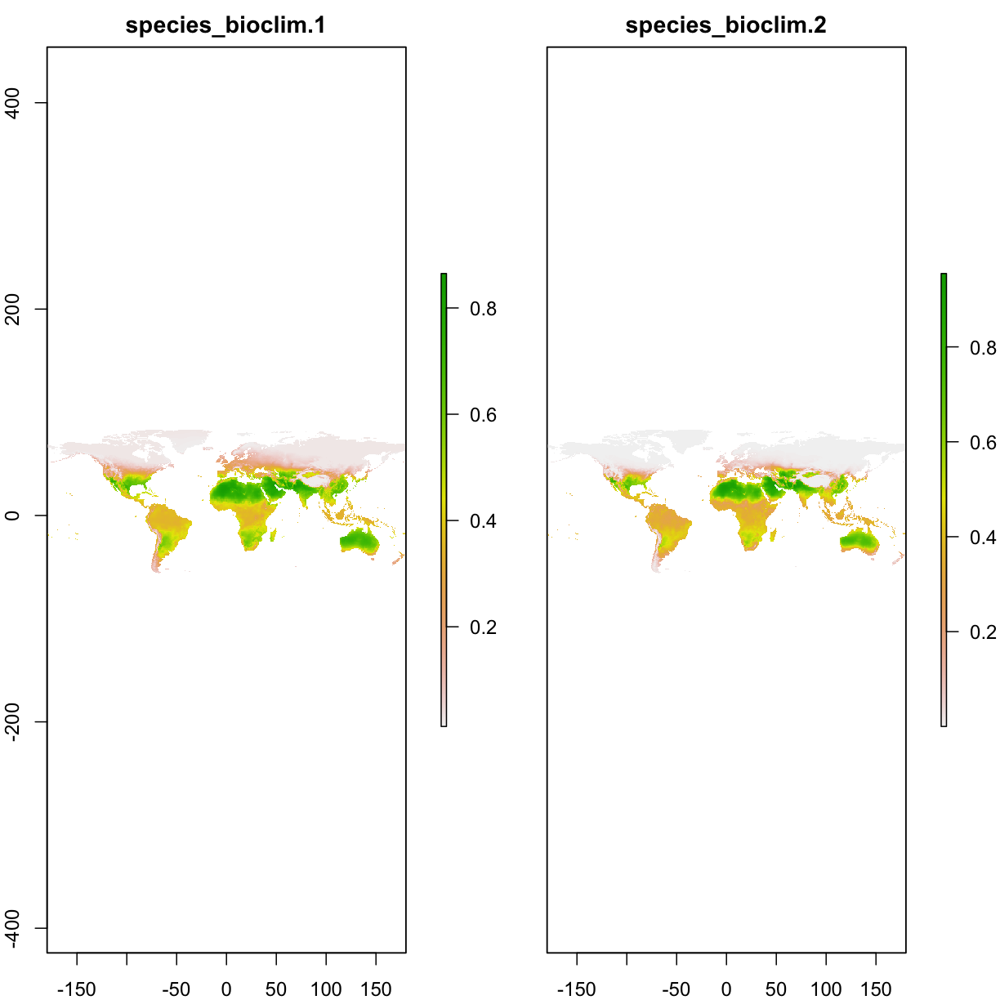
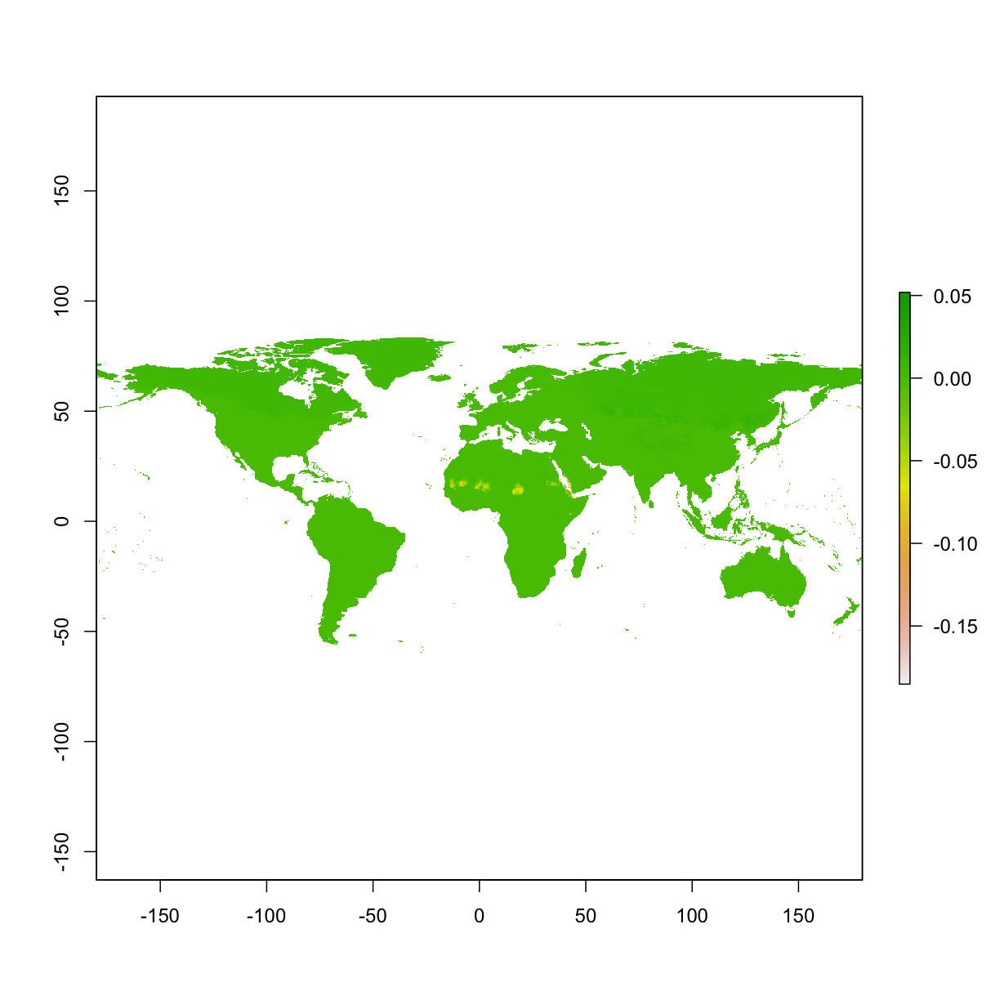
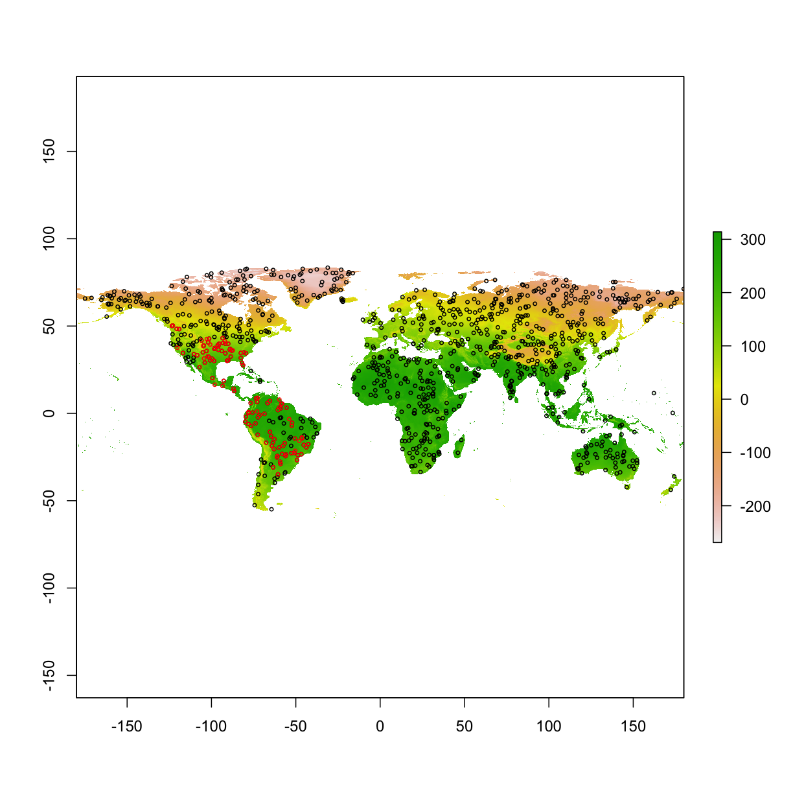

---
# Please do not edit this file directly; it is auto generated.
# Instead, please edit 06-maxent-manipulation.md in _episodes_rmd/
source: Rmd
title: "Maxent model - manipulations"
teaching: 10
exercises: 5
questions:
- "How to change parameters for Maxent?"
objectives:
- "format data input for Maxent"
- "simple run"
keypoints:
- "111111"
- "22222"
---

##  6 Maxent model - manipulations   

#### 6.0 prepare occ & raster, re-format the data for maxent  

~~~
library("raster")
library("dismo")

# prepare spatial occ data
if(!file.exists("data/occ_raw.rdata")){
  occ_raw <- gbif(genus="Dasypus",species="novemcinctus",download=TRUE) 
  save(occ_raw,file = "data/occ_raw.rdata")
}else{
  load("data/occ_raw.rdata")
}
occ_clean <- subset(occ_raw,(!is.na(lat))&(!is.na(lon))) 
occ_unique <- occ_clean[!duplicated( occ_clean[c("lat","lon")]  ),]
occ_unique_specimen <- subset(occ_unique, basisOfRecord=="PRESERVED_SPECIMEN")
occ_final <- subset(occ_unique_specimen, year>=1950 & year <=2000)
coordinates(occ_final) <- ~ lon + lat
myCRS1 <- CRS("+init=epsg:4326") # WGS 84
crs(occ_final) <- myCRS1

# prepare raster data
if( !file.exists( paste0("data/bioclim/bio_10m_bil.zip")   )){
  utils::download.file(url="http://biogeo.ucdavis.edu/data/climate/worldclim/1_4/grid/cur/bio_10m_bil.zip",
                       destfile="data/bioclim/bio_10m_bil.zip"   ) 
  utils::unzip("data/bioclim/bio_10m_bil.zip",exdir="data/bioclim") 
}

# load rasters
clim_list <- list.files("data/bioclim/",pattern=".bil$",full.names = T)
clim <- raster::stack(clim_list) 

occ_buffer <- buffer(occ_final,width=4*10^5) #unit is meter
clim_mask <- mask(clim, occ_buffer)

# extract environmental conditions
set.seed(1) 
bg <- sampleRandom(x=clim_mask,
                   size=10000,
                   na.rm=T, #removes the 'Not Applicable' points  
                   sp=T) # return spatial points 

set.seed(1) 

# randomly select 50% for training
selected <- sample(  1:nrow(occ_final),  nrow(occ_final)*0.5)

occ_train <- occ_final[selected,] # this is the selection to be used for model training
occ_test <- occ_final[-selected,] # this is the opposite of the selection which will be used for model testing

# extracting env conditions
env_occ_train <- extract(clim,occ_train)
env_occ_test <- extract(clim,occ_test)

# extracting env conditions for background
env_bg <- extract(clim,bg)  

#combine the conditions by row
myPredictors <- rbind(env_occ_train,env_bg)

# change matrix to dataframe
myPredictors <- as.data.frame(myPredictors)

# repeat the number 1 as many times as the number of rows in p, and repeat 0 for the rows of background points
myResponse <- c(rep(1,nrow(env_occ_train)),
                rep(0,nrow(env_bg))) 

# training a maxent model with dataframes
#mod <- dismo::maxent(x=myPredictors, ## env conditions
#                     p=myResponse)   ## 1:presence or 0:absence
~~~
{: .language-r}

#### 6.1 set output path  

~~~
dir.create("output")
dir.create("output/maxent_output")

# to train Maxent with tabular data
mod <- dismo::maxent(x=myPredictors, ## env conditions
                    p=myResponse,   ## 1:presence or 0:absence
                    path=paste0(getwd(),"/output/maxent_outputs")
              )
# the maxent function runs a model in the default settings. To change these parameters,
# you have to tell it what you want...i.e. response curves or the type of features

# to view the model output
list.files( paste0(getwd(),"/output/maxent_outputs" )  )
~~~
{: .language-r}

~~~
 [1] "absence"                       "maxent.html"                  
 [3] "maxent.log"                    "maxentResults.csv"            
 [5] "plots"                         "presence"                     
 [7] "species_omission.csv"          "species_sampleAverages.csv"   
 [9] "species_samplePredictions.csv" "species.csv"                  
[11] "species.html"                  "species.lambdas"              
~~~
{: .output}

#### 6.2 change default settings   

To run the model without using the default setting, we must define Maxent parameters. To do this we will load a function that will facilitate us to change model parameters.   

Here, we first load a function called `prepPara()`from Github, using `source_url()` function from `devtools` package.  

~~~
# load the function that prepares parameters for maxent
devtools::source_url("https://raw.githubusercontent.com/shandongfx/nimbios_enm/master/Appendix2_prepPara.R")

# get a list of default settings
myparameters <- prepPara(userfeatures=NULL) 
print(myparameters)
~~~
{: .language-r}

~~~
 [1] "autofeature"           "responsecurves"       
 [3] "jackknife"             "outputformat=logistic"
 [5] "outputfiletype=asc"    "norandomseed"         
 [7] "removeduplicates"      "writeplotdata"        
 [9] "extrapolate"           "doclamp"              
~~~
{: .output}

The defalut setting for features in Maxent is autofeature:  

~~~
# training a maxent model with dataframes
mod <- dismo::maxent(x=myPredictors, ## env conditions
                     p=myResponse,   ## 1:presence or 0:absence
                     args=myparameters  )
~~~
{: .language-r}

#### 6.2 Select features  
We can also select different features other than **auto feature**. Options are `L-linear, Q-Quadratic, H-Hinge, P-Product, T-Threshold`.  
For example, here we select Linear and Quadratic.  
`prepPara(userfeatures="LQ")`
              

~~~
myparameters1 <- prepPara(userfeatures="LQ")
mod1_lq <- maxent(x=myPredictors[c("bio1","bio4","bio11")],
                  p=myResponse,
                  path=paste0(getwd(),"/output/maxent_outputs1_lq"),
                  args=myparameters1 )
~~~
{: .language-r}

#### 6.3 Change beta-multiplier  

The beta-multiplier can be used to restrict or constrain the data to prevent model over-fitting; the default setting in Maxent is 1. `Smaller` values will `constrain` the model more, whereas `larger` numbers will `relax` the model, making it "smoother".  

For example, here we select Linear, Quadratic, and Hinge features, and beta-multiplier as 0.1  
`prepPara(userfeatures="LQH",  
          betamultiplier=0.1)`  

~~~
myparameters2 <- prepPara(userfeatures="LQH",  
                          betamultiplier=0.1)
# change beta-multiplier for all features to 0.5, the default beta-multiplier is 1
mod2_fix <- maxent(x=myPredictors[c("bio1","bio4","bio11")],
                   p=myResponse,
                   path=paste0(getwd(),"/output/maxent_outputs2_0.1"), 
                   args=myparameters2  ) 

myparameters3 <- prepPara(userfeatures="LQH",  
                          betamultiplier=10)
mod2_relax <- maxent(x=myPredictors[c("bio1","bio4","bio11")],
                     p=myResponse,
                     path=paste0(getwd(),"/output/maxent_outputs2_10"), 
                     args=myparameters3  ) 

# Show response curves
# first, silumate some data, build a gradient of conditions for one variable, and keep others constant
fake_data <- data.frame(bio1=seq(-300,300,1),  
                        bio4=100,
                        bio11=100)
head(fake_data)
~~~
{: .language-r}

~~~
  bio1 bio4 bio11
1 -300  100   100
2 -299  100   100
3 -298  100   100
4 -297  100   100
5 -296  100   100
6 -295  100   100
~~~
{: .output}

~~~
ped_fix <- predict(mod2_fix,fake_data)
ped_relax <- predict(mod2_relax,fake_data)
plot(fake_data$bio1,ped_fix,col="blue")
points(fake_data$bio1,ped_relax,col="red")
~~~
{: .language-r}

We can also set different beta-multiplers for different features.   
`  beta_threshold= 1  
   beta_categorical=1  
   beta_lqp=1  
   beta_hinge=1`  

~~~
myparameters4 <- prepPara(userfeatures="LQH",## include L, Q, H features
                          beta_lqp=1.5,      ## use different beta-multiplier for different features
                          beta_hinge=0.5 )

mod2_complex <- maxent(x=myPredictors[c("bio1","bio4","bio11")],
                       p=myResponse,
                       path=paste0(getwd(),"/output/maxent_outputs2_complex"), 
                       args=myparameters4) 
# you can also change others
~~~
{: .language-r}

#### 6.3 Specify projection layers  
Earlier we created a model, and then created a prediction from that model, but here we want to train the model and create a prediction simultaneously (like what happens in Maxent user interface).  

~~~
myparameters5 <- prepPara(userfeatures="LQ",
                          betamultiplier=1,
                          projectionlayers=paste0(getwd(),"/data/bioclim")
                         )

# note: 
# (1) the projection layers must exist in the hard disk (as relative to computer RAM); 
# (2) the names of the layers (excluding the name extension) must match the names of the predictor variables. 

# Create Model
mod3 <- maxent(x=myPredictors[c("bio1","bio4","bio11")],
               p=myResponse,
               path=paste0(getwd(),"/output/maxent_outputs3_prj1"), 
               args=myparameters5 ) 

# load the projected map
ped <- raster(paste0(getwd(),"/output/maxent_outputs3_prj1/species_bioclim.asc"))
plot(ped)
~~~
{: .language-r}

small experiment:  
use different betamultiplier to get distributions  

~~~
myparameters_relax <- prepPara(userfeatures="LQ",
                               betamultiplier=10,
                               projectionlayers=paste0(getwd(),"/data/bioclim")
                               )
myparameters5_default <- prepPara(userfeatures="LQ",
                                  betamultiplier=1,
                                  projectionlayers=paste0(getwd(),"/data/bioclim")
                                  )

mod_relax <- maxent(x=myPredictors[c("bio1","bio4","bio11")],
                     p=myResponse,
                     path=paste0(getwd(),"/output/maxent_outputs3_prj_default"), 
                     args=myparameters_relax ) 

mod_default <- maxent(x=myPredictors[c("bio1","bio4","bio11")],
                     p=myResponse,
                     path=paste0(getwd(),"/output/maxent_outputs3_prj_relax"), 
                     args=myparameters5_default ) 

# load the projected map
ped_default <- raster(paste0(getwd(),"/output/maxent_outputs3_prj_default/species_bioclim.asc"))
ped_relax   <- raster(paste0(getwd(),"/output/maxent_outputs3_prj_relax/species_bioclim.asc"))
plot(stack(ped_default,ped_relax))
~~~
{: .language-r}

#### 6.4 Clamping function  

When we project across space and time, we can come across conditions that are outside the range represented by the training data. Thus, we can clamp the response so that the model does not try to extapolate to these "extreme" conditions.  
The response curve can vary, with turning on or off clamping.  
~.   

~~~
# enable or disable clamping function; note that clamping function is involved when projecting. Turning the clamping function on, gives the response value associated with the marginal value at the edge of the data

myparameters_clamp <- prepPara(userfeatures="LQ",
                               betamultiplier=1,
                               projectionlayers=paste0(getwd(),"/data/bioclim"),
                               doclamp = TRUE
                               )
mod_clamp    <- maxent(x=myPredictors[c("bio1","bio11")],
                       p=myResponse,
                       path=paste0(getwd(),"/output/maxent_outputs4_clamp"), 
                       args=myparameters_clamp  ) 

myparameters_NOclamp <- prepPara(userfeatures="LQ",
                               betamultiplier=1,
                               projectionlayers=paste0(getwd(),"/data/bioclim"),
                               doclamp = FALSE
                               )
mod_NOclamp <- maxent(x=myPredictors[c("bio1","bio11")],
                      p=myResponse,
                      path=paste0(getwd(),"/output/maxent_outputs4_NOclamp"), 
                      args=myparameters_NOclamp  ) 

# Load the the two preditions and compare
ped_clamp <-   raster(paste0(getwd(),"/output/maxent_outputs4_clamp/species_bioclim.asc") )
ped_noclamp <- raster(paste0(getwd(),"/output/maxent_outputs4_noclamp/species_bioclim.asc") )
plot(ped_clamp - ped_noclamp) # we may notice small differences, especially clamp shows higher predictions in most areas.
~~~
{: .language-r}

#### 6.4 experiment of "high AUC" model  
Here we simulate two size of training areas (large vs. small)

~~~
occ_buffer <- buffer(occ_final,width=4*10^5) #unit is meter
clim_mask <- mask(clim, occ_buffer)
set.seed(1) 
bg_small <- sampleRandom(x=clim_mask,
                   size=1000,
                   na.rm=T, #removes the 'Not Applicable' points  
                   sp=T) # return spatial points 
set.seed(1) 
bg_big <- sampleRandom(x=clim,
                   size=1000,
                   na.rm=T, #removes the 'Not Applicable' points  
                   sp=T) # return spatial points 
plot(clim[[1]])
points(bg_big,col="black",cex=0.3)
points(bg_small,col="blue",cex=0.3)
~~~
{: .language-r}

~~~
# extracting env conditions
env_occ_train <- extract(clim,occ_train)
env_occ_test <- extract(clim,occ_test)

# extracting env conditions for background
env_bg_small <- extract(clim,bg_small)  
env_bg_big   <- extract(clim,bg_big  )  

# prepare data frame for maxent
myPredictors_small <- data.frame(rbind(env_occ_train,env_bg_small))
myPredictors_big   <- data.frame(rbind(env_occ_train,env_bg_big  ))

myResponse_small <- c(rep(1,nrow(env_occ_train)),
                     rep(0,nrow(env_bg_small))) 
myResponse_big  <-  c(rep(1,nrow(env_occ_train)),
                     rep(0,nrow(env_bg_big)))

# set up the parameters
myparameters <- prepPara(userfeatures="LQ",
                          betamultiplier=1,
                          projectionlayers=paste0(getwd(),"/data/bioclim")
                         )

# do the models
mod_small    <- maxent(x=myPredictors_small[c("bio1","bio11")],
                       p=myResponse_small,
                       path=paste0(getwd(),"/output/maxent_outputs5_small"),
                       args=myparameters) 

mod_big      <- maxent(x=myPredictors_big[c("bio1","bio11")],
                       p=myResponse_big,
                       path=paste0(getwd(),"/output/maxent_outputs5_big"),
                       args=myparameters) 

# show the diff of small/big model
ped_small <- raster(paste0(getwd(),"/output/maxent_outputs5_small/species_bioclim.asc"))
ped_big   <- raster(paste0(getwd(),"/output/maxent_outputs5_big/species_bioclim.asc"))
ped_diff <- ped_small-ped_big
ped_combined <- stack(ped_small,ped_big,ped_diff)
ped_combined <- crop(ped_combined,extent(-150,-30,-60,60))
names(ped_combined) <- c("small_trainingArea","big_trainArea","difference")
plot( ped_combined )
~~~
{: .language-r}

~~~
# compare the AUC , extract test occ data, 
mod_eval_small <- dismo::evaluate(p=env_occ_test,a=env_bg_small,model=mod_small) 
mod_eval_big   <- dismo::evaluate(p=env_occ_test,a=env_bg_big,  model=mod_big) 
cat("AUC of small training area is: ",mod_eval_small@auc )
~~~
{: .language-r}

~~~
AUC of small training area is:  0.7062616
~~~
{: .output}

~~~
cat("AUC of big   training area is: ",mod_eval_big@auc )
~~~
{: .language-r}

~~~
AUC of big   training area is:  0.8228738
~~~
{: .output}

> ## Challenge: train two maxent models with different parameters, and compare the predictions     
> load occurrences & raster layers   
> build a `xxx meter` buffer around occurrences    
> `mask` raster by the buffer of occurrences   
> generate random samples from the masked raster using `sampleRandom()`  
> `extract()` environmental conditions from raster by points  
> re-format the environmental conditions as input for maxent  
> train a `maxent` model  with different paremeters
> use `devtools::source_url()` to load `prepPara()` function
> use `prepPara()` function to set different features or beta-multiplier
> use `prepPara()` function to set projection layers
> `evaluate()` the model with testing environmental conditions  
> > ## Solution
> > 
> > ~~~
> > library("raster")
> > library("dismo")
> > 
> > # prepare spatial occ data
> > if(!file.exists("data/occ_raw.rdata")){
> >   occ_raw <- gbif(genus="Dasypus",species="novemcinctus",download=TRUE) 
> >   save(occ_raw,file = "data/occ_raw.rdata")
> > }else{
> >   load("data/occ_raw.rdata")
> > }
> > occ_clean <- subset(occ_raw,(!is.na(lat))&(!is.na(lon))) 
> > occ_unique <- occ_clean[!duplicated( occ_clean[c("lat","lon")]  ),]
> > occ_unique_specimen <- subset(occ_unique, basisOfRecord=="PRESERVED_SPECIMEN")
> > occ_final <- subset(occ_unique_specimen, year>=1950 & year <=2000)
> > coordinates(occ_final) <- ~ lon + lat
> > myCRS1 <- CRS("+init=epsg:4326") # WGS 84
> > crs(occ_final) <- myCRS1
> > 
> > # prepare raster data
> > if( !file.exists( paste0("data/bioclim/bio_10m_bil.zip")   )){
> >   utils::download.file(url="http://biogeo.ucdavis.edu/data/climate/worldclim/1_4/grid/cur/bio_10m_bil.zip",
> >                        destfile="data/bioclim/bio_10m_bil.zip"   ) 
> >   utils::unzip("data/bioclim/bio_10m_bil.zip",exdir="data/bioclim") 
> > }
> > 
> > # load rasters
> > clim_list <- list.files("data/bioclim/",pattern=".bil$",full.names = T)
> > clim <- raster::stack(clim_list) 
> > 
> > occ_buffer <- buffer(occ_final,width=4*10^5) #unit is meter
> > clim_mask <- mask(clim, occ_buffer)
> > 
> > # extract environmental conditions
> > set.seed(1) 
> > bg <- sampleRandom(x=clim_mask,
> >                    size=10000,
> >                    na.rm=T, #removes the 'Not Applicable' points  
> >                    sp=T) # return spatial points 
> > 
> > set.seed(1) 
> > 
> > # randomly select 50% for training
> > selected <- sample(  1:nrow(occ_final),  nrow(occ_final)*0.5)
> > 
> > occ_train <- occ_final[selected,] # this is the selection to be used for model training
> > occ_test <- occ_final[-selected,] # this is the opposite of the selection which will be used for model testing
> > 
> > # extracting env conditions
> > env_occ_train <- extract(clim,occ_train)
> > env_occ_test <- extract(clim,occ_test)
> > 
> > # extracting env conditions for background
> > env_bg <- extract(clim,bg)  
> > 
> > #combine the conditions by row
> > myPredictors <- rbind(env_occ_train,env_bg)
> > 
> > # change matrix to dataframe
> > myPredictors <- as.data.frame(myPredictors)
> > 
> > # repeat the number 1 as many times as the number of rows in p, and repeat 0 for the rows of background points
> > myResponse <- c(rep(1,nrow(env_occ_train)),
> >                 rep(0,nrow(env_bg))) 
> > 
> > # training a maxent model with parameters
> > myparameters1 <- prepPara(userfeatures="LQ",  
> >                           betamultiplier=0.01,
> >                           projectionlayers=paste0(getwd(),"/data/bioclim") )
> > mymodel1 <- maxent(x=myPredictors[c("bio1","bio4","bio11")],
> >                    p=myResponse,
> >                    path=paste0(getwd(),"/output/maxent_homework1"), 
> >                    args=myparameters1  ) 
> > 
> > myparameters2 <- prepPara(userfeatures="LQ",  
> >                           betamultiplier=1000)
> > mymodel2 <- maxent(x=myPredictors[c("bio1","bio4","bio11")],
> >                      p=myResponse,
> >                      path=paste0(getwd(),"/output/maxent_homework2"), 
> >                      args=myparameters2  ) 
> > 
> > # evaluate model based on testing data
> > mod_eval1 <- dismo::evaluate(p=env_occ_test,
> >                                  a=env_bg,
> >                                  model=mymodel1) 
> > mod_eval2 <- dismo::evaluate(p=env_occ_test,
> >                                  a=env_bg,
> >                                  model=mymodel2) 
> > 
> > mod_eval1@auc
> > mod_eval2@auc
> > ~~~
> > {: .language-r}
> {: .solution}
{: .challenge}


