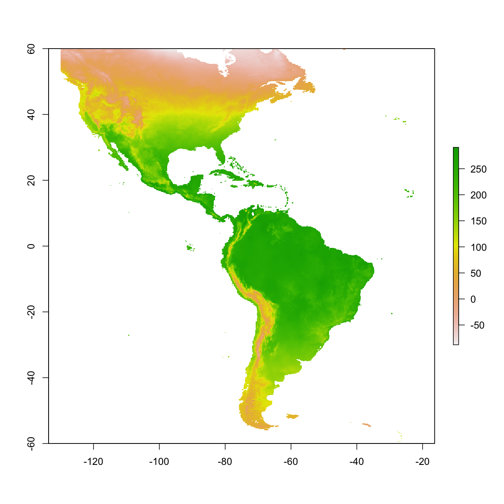

---
# Please do not edit this file directly; it is auto generated.
# Instead, please edit 06-maxent-manipulation.md in _episodes_rmd/
source: Rmd
title: "Maxent model - manipulations"
teaching: 10
exercises: 5
questions:
- "How to change parameters for Maxent?"
objectives:
- "format data input for Maxent"
- "simple run"
keypoints:
- "111111"
- "22222"
---

##  Maxent model - test run  

#### 5.0 prepare occ & raster 

~~~
library("raster")

if(!file.exists("data/occ_raw.rdata")){
  occ_raw <- gbif(genus="Dasypus",species="novemcinctus",download=TRUE) 
  save(occ_raw,file = "data/occ_raw.rdata")
}else{
  load("data/occ_raw.rdata")
}
occ_clean <- subset(occ_raw,(!is.na(lat))&(!is.na(lon))) 
occ_unique <- occ_clean[!duplicated( occ_clean[c("lat","lon")]  ),]
occ_unique_specimen <- subset(occ_unique, basisOfRecord=="PRESERVED_SPECIMEN")
occ_final <- subset(occ_unique_specimen, year>=1950 & year <=2000)
coordinates(occ_final) <- ~ lon + lat
myCRS1 <- CRS("+init=epsg:4326") # WGS 84
crs(occ_final) <- myCRS1

if( !file.exists( paste0("data/bioclim/bio_10m_bil.zip")   )){
  utils::download.file(url="http://biogeo.ucdavis.edu/data/climate/worldclim/1_4/grid/cur/bio_10m_bil.zip",
                       destfile="data/bioclim/bio_10m_bil.zip"   ) 
  utils::unzip("data/bioclim/bio_10m_bil.zip",exdir="data/bioclim") 
}

bio1 <- raster("data/bioclim/bio1.bil")
~~~
{: .language-r}

##4 Maxent parameters
###4.1 Select features

To run the model without using the default setting, we must define Maxent parameters. To do this we will load a function that will allow us to change model parameters. 

#####Thread 21

~~~
# load the function that prepares parameters for maxent
source("Appendix2_prepPara.R")
~~~
{: .language-r}

~~~
Warning in file(filename, "r", encoding = encoding): cannot open file
'Appendix2_prepPara.R': No such file or directory
~~~
{: .error}

~~~
Error in file(filename, "r", encoding = encoding): cannot open the connection
~~~
{: .error}

~~~
# The defalut setting for features in Maxent is autofeature:
mod1_autofeature <- maxent(x=pder[c("bio1","bio4","bio11")], 
                           ## env conditions, here we selected only 3 predictors
                           p=pa, ## 1:presence or 0:absence
                           path=paste0(getwd(),"/output/maxent_outputs"),
                           #path=,this is the folder you will find manxent output
                           #note, for Mac user, the short cut (e.g. "~/Desktop") for home directory may lead to errors.
                           args=prepPara(userfeatures=NULL) 
                           # use preppara to prepare the path
                           ) 
~~~
{: .language-r}

~~~
Error in maxent(x = pder[c("bio1", "bio4", "bio11")], p = pa, path = paste0(getwd(), : could not find function "maxent"
~~~
{: .error}

~~~
                           ## default is autofeature
              
# To move away from the default, autofeatures, and instead select Linear & Quadratic features

mod1_lq <- maxent(x=pder[c("bio1","bio4","bio11")],
                  p=pa,
                  path=paste0(getwd(),"/output/maxent_outputs1_lq"),
                  args=prepPara(userfeatures="LQ") ) 
~~~
{: .language-r}

~~~
Error in maxent(x = pder[c("bio1", "bio4", "bio11")], p = pa, path = paste0(getwd(), : could not find function "maxent"
~~~
{: .error}

~~~
                  ## default is autofeature, here LQ represents Linear& Quadratic
                  ## (L-linear, Q-Quadratic, H-Hinge, P-Product, T-Threshold)
~~~
{: .language-r}

###4.2 Change beta-multiplier

The beta-multiplier can be used to restrict or constrain the data to prevent model over-fitting; the default setting in Maxent is 1. Smaller values will constrain the model more, whereas larger numbers will relax the model, making it "smoother".

#####Thread 22

~~~
# change beta-multiplier for all features to 0.5, the default beta-multiplier is 1
mod2_fix <- maxent(x=pder[c("bio1","bio4","bio11")], 
               p=pa, 
              path=paste0(getwd(),"/output/maxent_outputs2_0.1"), 
              args=prepPara(userfeatures="LQH",
                            betamultiplier=0.1) ) 
~~~
{: .language-r}

~~~
Error in maxent(x = pder[c("bio1", "bio4", "bio11")], p = pa, path = paste0(getwd(), : could not find function "maxent"
~~~
{: .error}

~~~
mod2_relax <- maxent(x=pder[c("bio1","bio4","bio11")], 
               p=pa, 
              path=paste0(getwd(),"/output/maxent_outputs2_10"), 
              args=prepPara(userfeatures="LQH",
                            betamultiplier=10) ) 
~~~
{: .language-r}

~~~
Error in maxent(x = pder[c("bio1", "bio4", "bio11")], p = pa, path = paste0(getwd(), : could not find function "maxent"
~~~
{: .error}

~~~
# Show response curves
# first, silumate some data, build a gradient of conditions for one variable, and keep others constant
fake_data <- data.frame(bio1=seq(-300,300,1),  
                        bio4=100,
                        bio11=100)
head(fake_data)
~~~
{: .language-r}

~~~
  bio1 bio4 bio11
1 -300  100   100
2 -299  100   100
3 -298  100   100
4 -297  100   100
5 -296  100   100
6 -295  100   100
~~~
{: .output}

~~~
ped_fix <- predict(mod2_fix,fake_data)
~~~
{: .language-r}

~~~
Error in predict(mod2_fix, fake_data): object 'mod2_fix' not found
~~~
{: .error}

~~~
ped_relax <- predict(mod2_relax,fake_data)
~~~
{: .language-r}

~~~
Error in predict(mod2_relax, fake_data): object 'mod2_relax' not found
~~~
{: .error}

~~~
plot(fake_data$bio1,ped_fix)
~~~
{: .language-r}

~~~
Error in plot(fake_data$bio1, ped_fix): object 'ped_fix' not found
~~~
{: .error}

~~~
points(fake_data$bio1,ped_relax,col="red")
~~~
{: .language-r}

~~~
Error in xy.coords(x, y): object 'ped_relax' not found
~~~
{: .error}

~~~
# A more complex model, which has three features; linear & quadratic, and hinge. Where a different beta-multipler is used for each feature
mod2 <- maxent(x=pder[c("bio1","bio4","bio11")], 
               p=pa, 
              path=paste0(getwd(),"/output/maxent_outputs2_complex"), 
              args=prepPara(userfeatures="LQH",
                            ## include L, Q, H features
                            beta_lqp=1.5, 
                            ## use different beta-multiplier for different features
                            beta_hinge=0.5 ) ) 
~~~
{: .language-r}

~~~
Error in maxent(x = pder[c("bio1", "bio4", "bio11")], p = pa, path = paste0(getwd(), : could not find function "maxent"
~~~
{: .error}

~~~
# you can also change others
                    # beta_threshold= 1
                    # beta_categorical=1
                    # beta_lqp=1
                    # beta_hinge=1
~~~
{: .language-r}

###4.3 Specify projection layers

Earlier we created a model, and then created a prediction from that model, but here we want to train the model and create a prediction simultaneously (like what happens in Maxent user interface). 

#####Thread 23

~~~
# note: 
# (1) the projection layers must exist in the hard disk (as relative to computer RAM); 
# (2) the names of the layers (excluding the name extension) must match the names of the predictor variables. 

# Create Model
mod3 <- maxent(x=pder[c("bio1","bio11")], 
               p=pa, 
              path=paste0(getwd(),"/output/maxent_outputs3_prj1"), 
              args=prepPara(userfeatures="LQ",
                            betamultiplier=1,
                            projectionlayers="/data/studyarea") ) 
~~~
{: .language-r}

~~~
Error in maxent(x = pder[c("bio1", "bio11")], p = pa, path = paste0(getwd(), : could not find function "maxent"
~~~
{: .error}

~~~
              # here we specify the relative path to the layer used in the projection

# load the projected map
ped <- raster(paste0("output/maxent_outputs3_prj1/species_studyarea.asc"))
~~~
{: .language-r}

~~~
Error in .rasterObjectFromFile(x, band = band, objecttype = "RasterLayer", : Cannot create a RasterLayer object from this file. (file does not exist)
~~~
{: .error}

~~~
plot(ped)
~~~
{: .language-r}

~~~
Error in plot(ped): object 'ped' not found
~~~
{: .error}

~~~
# we can also project on a broader map, but please use with caution as there is inaccuracy associated with model extrapolation.
mod3 <- maxent(x=pder[c("bio1","bio11")], 
               p=pa, 
              path=paste0(getwd(),"/output/maxent_outputs3_prj2"), 
              args=prepPara(userfeatures="LQ",
                            betamultiplier=1,
                            projectionlayers="/data/studyarea") ) 
~~~
{: .language-r}

~~~
Error in maxent(x = pder[c("bio1", "bio11")], p = pa, path = paste0(getwd(), : could not find function "maxent"
~~~
{: .error}

~~~
# plot the map
ped <- raster(paste0("output/maxent_outputs3_prj2/species_studyarea.asc"))
~~~
{: .language-r}

~~~
Error in .rasterObjectFromFile(x, band = band, objecttype = "RasterLayer", : Cannot create a RasterLayer object from this file. (file does not exist)
~~~
{: .error}

~~~
plot(ped)
~~~
{: .language-r}

~~~
Error in plot(ped): object 'ped' not found
~~~
{: .error}

~~~
# Check for differences if we used a different betamultiplier
mod3_beta1 <- maxent(x=pder[c("bio1","bio11")], 
               p=pa, 
              path=paste0(getwd(),"/output/maxent_outputs3_prj3"), 
              args=prepPara(userfeatures="LQ",
                            betamultiplier=100, 
                            ## for an extreme example, set beta as 100
                            projectionlayers="/data/bioclim") ) 
~~~
{: .language-r}

~~~
Error in maxent(x = pder[c("bio1", "bio11")], p = pa, path = paste0(getwd(), : could not find function "maxent"
~~~
{: .error}

~~~
ped3 <- raster(paste0("output/maxent_outputs3_prj3/species_bioclim.asc"))
~~~
{: .language-r}

~~~
Error in .rasterObjectFromFile(x, band = band, objecttype = "RasterLayer", : Cannot create a RasterLayer object from this file. (file does not exist)
~~~
{: .error}

~~~
# Here we crop the extent of the larger prediction to the extent of the smaller prediction to look at differences between the two
ped3 <- crop(ped3,extent(ped)) # "ped3"" is larger in extent, so crop it to the same extent of "ped""
~~~
{: .language-r}

~~~
Error in crop(ped3, extent(ped)): object 'ped3' not found
~~~
{: .error}

~~~
plot(ped-ped3)
~~~
{: .language-r}

~~~
Error in plot(ped - ped3): object 'ped' not found
~~~
{: .error}

###4.4 Clamping function

When we project across space and time, we can come across conditions that are outside the range represented by the training data. Thus, we can clamp the response so that the model does not try to extapolate to these "extreme" conditions.

#####Thread 24

~~~
# enable or disable clamping function; note that clamping function is involved when projecting. Turning the clamping function on, gives the response value associated with the marginal value at the edge of the data
mod4_clamp <- maxent(x=pder[c("bio1","bio11")],
                     p=pa,
                     path=paste0(getwd(),"/output/maxent_outputs4_clamp"), 
                     args=prepPara(userfeatures="LQ",
                                   betamultiplier=1,
                                   doclamp = TRUE,
                                   projectionlayers="/data/bioclim")) 
~~~
{: .language-r}

~~~
Error in maxent(x = pder[c("bio1", "bio11")], p = pa, path = paste0(getwd(), : could not find function "maxent"
~~~
{: .error}

~~~
mod4_noclamp <- maxent(x=pder[c("bio1","bio11")], 
                       p=pa, 
                       path=paste0(getwd(),"/output/maxent_outputs4_noclamp"),
                       args=prepPara(userfeatures="LQ",
                                      betamultiplier=1,
                                      doclamp = FALSE,
                                      projectionlayers="/data/bioclim") ) 
~~~
{: .language-r}

~~~
Error in maxent(x = pder[c("bio1", "bio11")], p = pa, path = paste0(getwd(), : could not find function "maxent"
~~~
{: .error}

~~~
# Load the the two preditions and compare
ped_clamp <- raster(paste0("output/maxent_outputs4_clamp/species_bioclim.asc") )
~~~
{: .language-r}

~~~
Error in .rasterObjectFromFile(x, band = band, objecttype = "RasterLayer", : Cannot create a RasterLayer object from this file. (file does not exist)
~~~
{: .error}

~~~
ped_noclamp <- raster(paste0("output/maxent_outputs4_noclamp/species_bioclim.asc") )
~~~
{: .language-r}

~~~
Error in .rasterObjectFromFile(x, band = band, objecttype = "RasterLayer", : Cannot create a RasterLayer object from this file. (file does not exist)
~~~
{: .error}

~~~
plot(stack(ped_clamp,ped_noclamp))
~~~
{: .language-r}

~~~
Error in stack(ped_clamp, ped_noclamp): object 'ped_clamp' not found
~~~
{: .error}

~~~
plot(ped_clamp - ped_noclamp) 
~~~
{: .language-r}

~~~
Error in plot(ped_clamp - ped_noclamp): object 'ped_clamp' not found
~~~
{: .error}

~~~
## we may notice small differences, especially clamp shows higher predictions in most areas.
~~~
{: .language-r}

###4.5 Cross validation

To test the robustness of the model settings, we can resample the training and testing data to replicate the model. How the data is resampled, can be specified by the user. Maxent can replicate using crossvalidation, bootstrapping, and subsampling.

#####Thread 25

~~~
mod4_cross <- maxent(x=pder[c("bio1","bio11")], p=pa, 
                            path=paste0(getwd(),"/output/maxent_outputs4_cross"), 
                            args=prepPara(userfeatures="LQ",
                                          betamultiplier=1,
                                          doclamp = TRUE,
                                          projectionlayers="/data/bioclim",
                                          replicates=5, ## 5 replicates
                                          replicatetype="crossvalidate") )
                                          ##possible values are: crossvalidate,bootstrap,subsample
~~~
{: .language-r}

AUC can be highly influenced by model parameters, specifically training area size. Here we compare two models using the same parameters and setting except we have manipulated the training area size.

##5 experiment of "high AUC" model

~~~
# experiment 1: smaller training area vs. whole continent

# Ruturn the path to the climate layers
clim_list <- list.files("data/bioclim/",pattern=".bil$",full.names = T) 

# stacking the bioclim variables to process them at one go 
clim <- raster::stack(clim_list) 

# model for smaller training area 
small_extent <- buffer(occ_final,width=100000) #unit is meter 
~~~
{: .language-r}

~~~
Loading required namespace: rgeos
~~~
{: .output}

~~~
big_extent <- extent(c(-130,-20,-60,60))

small_area <- mask(clim,  small_extent)
big_area   <- crop(clim,  big_extent)
plot(small_area[[1]])
~~~
{: .language-r}

~~~
plot(big_area[[1]])
~~~
{: .language-r}

~~~
dir.create("data/big_extent")
dir.create("data/small_extent")

writeRaster(small_area,
            # a series of names for output files
            filename=paste0("data/small_extent/",names(small_area),".asc"), 
            format="ascii", ## the output format
            bylayer=TRUE, ## this will save a series of layers
            overwrite=T)
writeRaster(big_area,
            # a series of names for output files
            filename=paste0("data/big_extent/",names(big_area),".asc"), 
            format="ascii", ## the output format
            bylayer=TRUE, ## this will save a series of layers
            overwrite=T)

set.seed(1) 
small_bg <- sampleRandom(x=small_area,
                   size=10000,
                   na.rm=T, #removes the 'Not Applicable' points  
                   sp=T) # return spatial points 
set.seed(1) 
big_bg <- sampleRandom(x=big_area,
                   size=10000,
                   na.rm=T, #removes the 'Not Applicable' points  
                   sp=T) # return spatial points 

p <- extract(clim,occ_train) 
~~~
{: .language-r}

~~~
Error in extract(clim, occ_train): object 'occ_train' not found
~~~
{: .error}

~~~
a_small <- extract(clim,small_bg)  
a_big <- extract(clim,big_bg)  

pa_small <- c(rep(1,nrow(p)), rep(0,nrow(a_small))) 
~~~
{: .language-r}

~~~
Error in nrow(p): object 'p' not found
~~~
{: .error}

~~~
pa_big   <- c(rep(1,nrow(p)), rep(0,nrow(a_big))) 
~~~
{: .language-r}

~~~
Error in nrow(p): object 'p' not found
~~~
{: .error}

~~~
pder_small <- as.data.frame(rbind(p,a_small)) 
~~~
{: .language-r}

~~~
Error in rbind(p, a_small): object 'p' not found
~~~
{: .error}

~~~
pder_big   <- as.data.frame(rbind(p,a_big)) 
~~~
{: .language-r}

~~~
Error in rbind(p, a_big): object 'p' not found
~~~
{: .error}

~~~
small_mod <- maxent(x=pder_small,#[c("bio1","bio11")], 
                    p=pa_small, 
              path=paste0(getwd(),"/output/experiment_small"), 
              args=prepPara(projectionlayers="/data/big_extent") 
              )
~~~
{: .language-r}

~~~
Error in maxent(x = pder_small, p = pa_small, path = paste0(getwd(), "/output/experiment_small"), : could not find function "maxent"
~~~
{: .error}

~~~
big_mod <- maxent(x=pder_big,#[c("bio1","bio11")], 
                  p=pa_big, 
                  path=paste0(getwd(),"/output/experiment_big"), 
                  args=prepPara(projectionlayers="/data/big_extent") )
~~~
{: .language-r}

~~~
Error in maxent(x = pder_big, p = pa_big, path = paste0(getwd(), "/output/experiment_big"), : could not find function "maxent"
~~~
{: .error}

~~~
# show the diff of small/big model
ped_small <- raster("output/experiment_small/species_big_extent.asc")
~~~
{: .language-r}

~~~
Error in .rasterObjectFromFile(x, band = band, objecttype = "RasterLayer", : Cannot create a RasterLayer object from this file. (file does not exist)
~~~
{: .error}

~~~
ped_big   <- raster("output/experiment_big/species_big_extent.asc")
~~~
{: .language-r}

~~~
Error in .rasterObjectFromFile(x, band = band, objecttype = "RasterLayer", : Cannot create a RasterLayer object from this file. (file does not exist)
~~~
{: .error}

~~~
ped_combined <- stack(ped_small,ped_big)
~~~
{: .language-r}

~~~
Error in stack(ped_small, ped_big): object 'ped_small' not found
~~~
{: .error}

~~~
names(ped_combined) <- c("small_trainingArea","big_trainArea")
~~~
{: .language-r}

~~~
Error in names(ped_combined) <- c("small_trainingArea", "big_trainArea"): object 'ped_combined' not found
~~~
{: .error}

~~~
plot( ped_combined )
~~~
{: .language-r}

~~~
Error in plot(ped_combined): object 'ped_combined' not found
~~~
{: .error}

~~~
# compare the AUC , extract test occ data, 
p_test <- extract(clim,occ_test) 
~~~
{: .language-r}

~~~
Error in extract(clim, occ_test): object 'occ_test' not found
~~~
{: .error}

~~~
mod_eval_small <- dismo::evaluate(p=p_test,a=a_small,model=small_mod) 
~~~
{: .language-r}

~~~
Error in dismo::evaluate(p = p_test, a = a_small, model = small_mod): object 'p_test' not found
~~~
{: .error}

~~~
print(mod_eval_small)
~~~
{: .language-r}

~~~
Error in print(mod_eval_small): object 'mod_eval_small' not found
~~~
{: .error}

~~~
mod_eval_big   <- dismo::evaluate(p=p_test,a=a_big,  model=big_mod) 
~~~
{: .language-r}

~~~
Error in dismo::evaluate(p = p_test, a = a_big, model = big_mod): object 'p_test' not found
~~~
{: .error}

~~~
print(mod_eval_big)
~~~
{: .language-r}

~~~
Error in print(mod_eval_big): object 'mod_eval_big' not found
~~~
{: .error}

> ## Challenge: use your occurrences to cut raster layers 
> load occurrences & raster layers   
> build a `600,000 meter` buffer around occurrences    
> `mask` raster by the buffer of occurrences  
> plot the masked raster  
> > ## Solution
> > 
> > ~~~
> > library("raster")
> > 
> > if(!file.exists("data/occ_raw.rdata")){
> >   occ_raw <- gbif(genus="Dasypus",species="novemcinctus",download=TRUE) 
> >   save(occ_raw,file = "data/occ_raw.rdata")
> > }else{
> >   load("data/occ_raw.rdata")
> > }
> > occ_clean <- subset(occ_raw,(!is.na(lat))&(!is.na(lon))) 
> > occ_unique <- occ_clean[!duplicated( occ_clean[c("lat","lon")]  ),]
> > occ_unique_specimen <- subset(occ_unique, basisOfRecord=="PRESERVED_SPECIMEN")
> > occ_final <- subset(occ_unique_specimen, year>=1950 & year <=2000)
> > coordinates(occ_final) <- ~ lon + lat
> > myCRS1 <- CRS("+init=epsg:4326") # WGS 84
> > crs(occ_final) <- myCRS1
> > 
> > if( !file.exists( paste0("data/bioclim/bio_10m_bil.zip")   )){
> >   utils::download.file(url="http://biogeo.ucdavis.edu/data/climate/worldclim/1_4/grid/cur/bio_10m_bil.zip",
> >                        destfile="data/bioclim/bio_10m_bil.zip"   ) 
> >   utils::unzip("data/bioclim/bio_10m_bil.zip",exdir="data/bioclim") 
> > }
> > 
> > bio1 <- raster("data/bioclim/bio1.bil")
> > 
> > occ_buffer <- buffer(occ_final,width=6*10^5) #unit is meter
> > bio1_mask <- mask(bio1, occ_buffer)
> > 
> > plot(bio1_mask)
> > plot(occ_buffer,add=T)
> > plot(occ_final,add=T,col="blue")
> > ~~~
> > {: .language-r}
> {: .solution}
{: .challenge}

