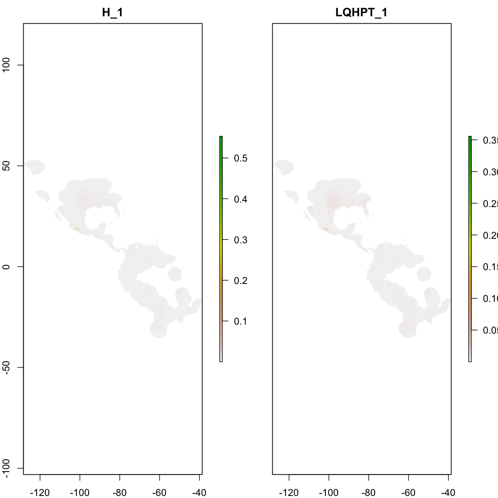
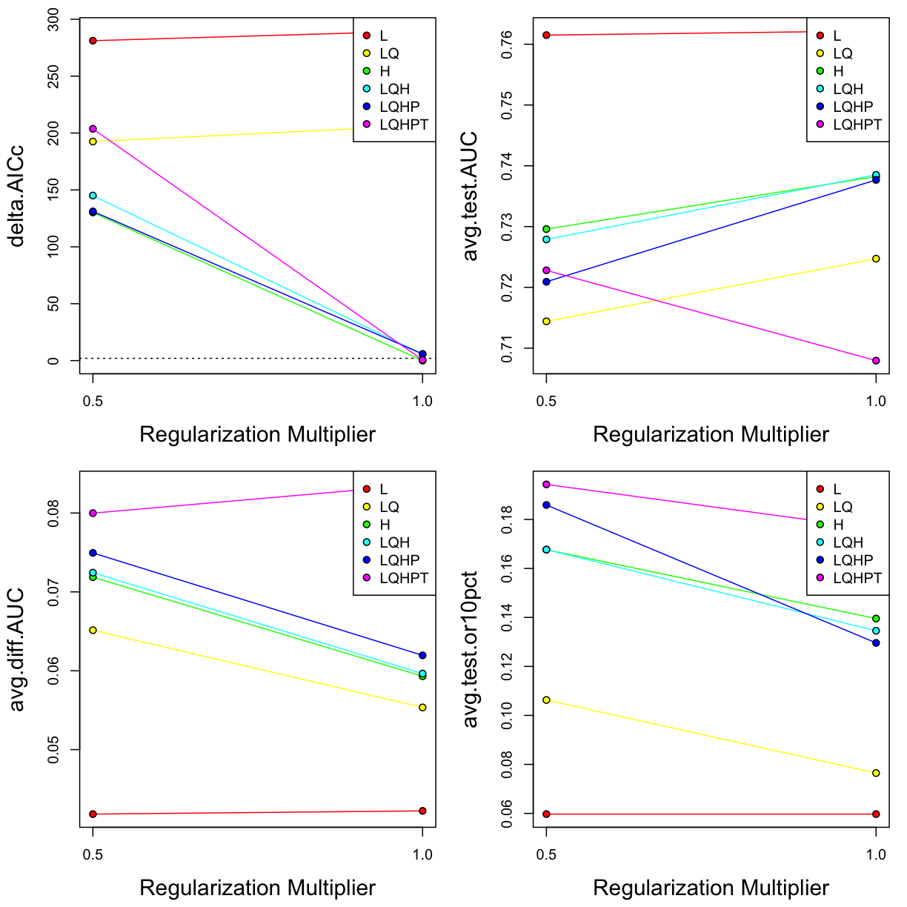
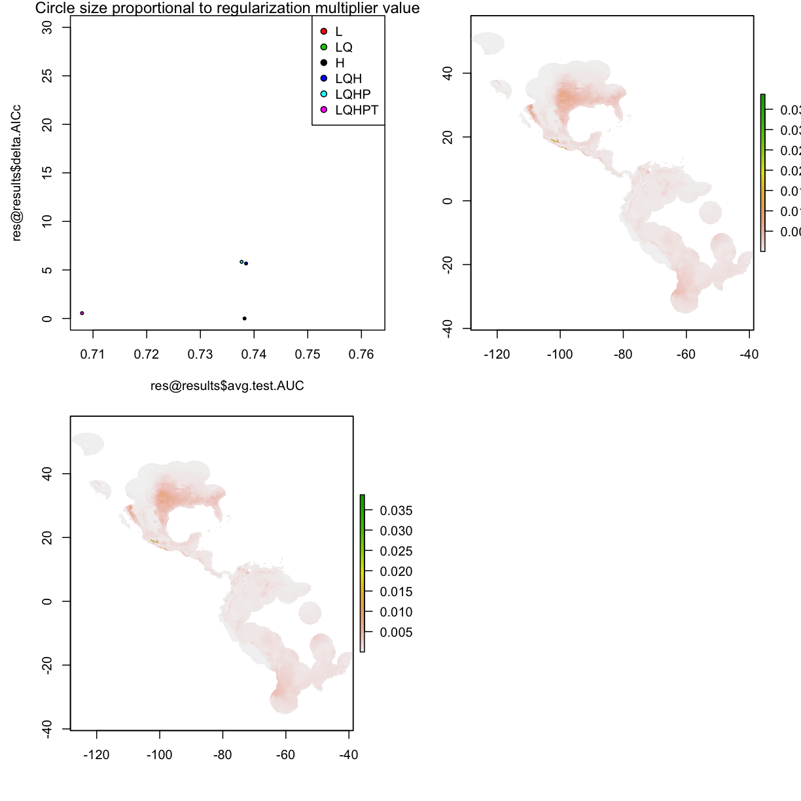

---
# Please do not edit this file directly; it is auto generated.
# Instead, please edit 07-model-competitation.md in _episodes_rmd/
source: Rmd
title: "Maxent model - ENMeval"
teaching: 10
exercises: 5
questions:
- "How to change parameters for Maxent?"
objectives:
- "format data input for Maxent"
- "simple run"
keypoints:
- "111111"
- "22222"
---

~~~
###############################################################
library("raster")
~~~
{: .language-r}

~~~
Loading required package: sp
~~~
{: .output}

~~~
library("dismo")

# prepare spatial occ data
if(!file.exists("data/occ_raw.rdata")){
  occ_raw <- gbif(genus="Dasypus",species="novemcinctus",download=TRUE) 
  save(occ_raw,file = "data/occ_raw.rdata")
}else{
  load("data/occ_raw.rdata")
}
occ_clean <- subset(occ_raw,(!is.na(lat))&(!is.na(lon))) 
occ_unique <- occ_clean[!duplicated( occ_clean[c("lat","lon")]  ),]
occ_unique_specimen <- subset(occ_unique, basisOfRecord=="PRESERVED_SPECIMEN")
occ_final <- subset(occ_unique_specimen, year>=1950 & year <=2000)
coordinates(occ_final) <- ~ lon + lat
myCRS1 <- CRS("+init=epsg:4326") # WGS 84
crs(occ_final) <- myCRS1

# prepare raster data
if( !file.exists( paste0("data/bioclim/bio_10m_bil.zip")   )){
  utils::download.file(url="http://biogeo.ucdavis.edu/data/climate/worldclim/1_4/grid/cur/bio_10m_bil.zip",
                       destfile="data/bioclim/bio_10m_bil.zip"   ) 
  utils::unzip("data/bioclim/bio_10m_bil.zip",exdir="data/bioclim") 
}

# load rasters
clim_list <- list.files("data/bioclim/",pattern=".bil$",full.names = T)
clim <- raster::stack(clim_list) 

occ_buffer <- buffer(occ_final,width=4*10^5) #unit is meter
~~~
{: .language-r}

~~~
Loading required namespace: rgeos
~~~
{: .output}

~~~
clim_mask <- mask(clim, occ_buffer)

set.seed(1) 
bg <- sampleRandom(x=clim_mask,
                   size=10000,
                   na.rm=T, #removes the 'Not Applicable' points  
                   sp=T) # return spatial points 

temp1 <- extract(clim_mask[[1]],occ_final)
occ_final <- occ_final[!is.na(temp1),]
#############################################################################################################################################################################################
###########################################################
#### ENMeval practice, there are several approaches available for fine-turning Maxent model, ENMeval is just one of them############
###########################################################

library(ENMeval)

###loading occurrence and climate data, make sure that occurrence and background data only have two columns (i.e., long and lat), these are present-only data; For background data, you can use R or GIS software to generate these background data(e.g. random sampling 5000,10000),these background data should be within the accessible area (i.e. M in BAM diagram) of species in question#######

env <- clim_mask[[c("bio1","bio5","bio6","bio12")]]
#env <- stack("bio1.tif","bio5.tif","bio6.tif")

occ <- occ_final@coords
#occ <- read.csv("occ.csv", head=TRUE)

bg <- bg@coords
#bg<- read.csv("bc.csv", head=TRUE)

######start ENMeval; "RMvalues" is used to set a range of RM values, here we set RM ranged from 0.5 to 4 at at the interval of 0.5; "method" is used to spatial parting occurrence data, there are mainly two approaches available in ENM eval, i.e. block and checkerboard methods, the former method is used when your model in a transferred manner/need to be transferred (i.e. in the application of biological invasions, climate change), the latter is used in a none transfer manner (i.e. setting priority area for conservation); "fc" is used to set feature combination (for example, fc = c('L', 'LQ', 'H')), here we use default, which has six feature combinations; "overlap" is asking whether you are going to perform overlap measurements of Maxent prediction during the iterative running; "bin.output" is asking whether you are going to reserved the iterative prediction##### 

#In Maxent, the default setting are RM = 1, and fc = c("L", "LQ", "H", "LQH", "LQHP", "LQHPT")####

coc.results <- ENMevaluate(occ = occ,          ### set the occurrence data for ENMeval
                           env = env,          ### set the environmental data
                           bg.coords = bg,     ### set the background data
                           RMvalues=seq(0.5,1,0.5),   ### set the RM values, here set RM valuse from 0.5 to 5, at an interval of 0.5
                           fc = c("L", "LQ", "H", "LQH", "LQHP", "LQHPT"), # the feature combinations that will be used for iterative running。
                           method='block',            ### the method used to spatial parting occurrence records.
                           overlap=FALSE,            ### whether to perform overlap measurement of Maxent predictions among iterative running. 
                           bin.output=FALSE)       ### whether we reserve the iterative prediction of Maxent running
~~~
{: .language-r}

~~~
*** Running ENMevaluate using maxnet v.0.1.2 ***
~~~
{: .output}

~~~
Doing evaluations using spatial blocks...
~~~
{: .output}

~~~

  |                                                                       
  |                                                                 |   0%
  |                                                                       
  |=====                                                            |   8%
  |                                                                       
  |===========                                                      |  17%
  |                                                                       
  |================                                                 |  25%
  |                                                                       
  |======================                                           |  33%
  |                                                                       
  |===========================                                      |  42%
  |                                                                       
  |================================                                 |  50%
  |                                                                       
  |======================================                           |  58%
  |                                                                       
  |===========================================                      |  67%
  |                                                                       
  |=================================================                |  75%
  |                                                                       
  |======================================================           |  83%
  |                                                                       
  |============================================================     |  92%
  |                                                                       
  |=================================================================| 100%
~~~
{: .output}

~~~
ENMeval completed in 1 minutes 19.1 seconds.
~~~
{: .output}

~~~
##################################################
#### Exploration the results ####
##################################################

# View ENMevaluation:
res <- coc.results

# Look at results table AND save it in working directory for later checking.
res@results
~~~
{: .language-r}

~~~
    settings features  rm train.AUC avg.test.AUC var.test.AUC avg.diff.AUC
1      L_0.5        L 0.5 0.7179545    0.7614996   0.07815936   0.04182335
2     LQ_0.5       LQ 0.5 0.7223189    0.7144163   0.08167354   0.06514501
3      H_0.5        H 0.5 0.8045481    0.7295905   0.05257028   0.07186473
4    LQH_0.5      LQH 0.5 0.8041092    0.7278898   0.05251187   0.07244100
5   LQHP_0.5     LQHP 0.5 0.8034122    0.7209274   0.05279010   0.07494555
6  LQHPT_0.5    LQHPT 0.5 0.8262484    0.7228096   0.03811553   0.07998736
7        L_1        L 1.0 0.7175704    0.7621929   0.07678967   0.04223372
8       LQ_1       LQ 1.0 0.7208700    0.7247204   0.07368597   0.05534941
9        H_1        H 1.0 0.7979237    0.7382261   0.04243602   0.05930534
10     LQH_1      LQH 1.0 0.7972163    0.7385115   0.04248638   0.05964288
11    LQHP_1     LQHP 1.0 0.7965460    0.7376793   0.04474966   0.06195426
12   LQHPT_1    LQHPT 1.0 0.8106876    0.7079542   0.04067766   0.08362963
   var.diff.AUC avg.test.orMTP var.test.orMTP avg.test.or10pct
1    0.01574273    0.000000000   0.000000e+00       0.05971302
2    0.03819485    0.001666667   1.111111e-05       0.10630243
3    0.04648085    0.013311258   3.555575e-04       0.16768212
4    0.04722929    0.013311258   3.555575e-04       0.16768212
5    0.05055151    0.013311258   3.555575e-04       0.18590508
6    0.04263645    0.015000000   4.851852e-04       0.19430464
7    0.01605319    0.000000000   0.000000e+00       0.05971302
8    0.02757202    0.001666667   1.111111e-05       0.07646799
9    0.03165411    0.011644592   2.480520e-04       0.13953642
10   0.03201546    0.008333333   2.777778e-04       0.13455850
11   0.03454497    0.009988962   2.519505e-04       0.12960265
12   0.03889321    0.016633554   4.885989e-04       0.17614790
   var.test.or10pct     AICc  delta.AICc        w.AIC parameters
1       0.006135821 12777.52 281.1392781 4.772744e-62          4
2       0.007979339 12688.91 192.5286621 8.323748e-43          8
3       0.026762820 12626.57 130.1885459 2.866178e-29         38
4       0.026466523 12641.46 145.0757758 1.677190e-32         40
5       0.036721280 12627.51 131.1320877 1.788198e-29         43
6       0.026469901 12700.09 203.7049585 3.114706e-45         83
7       0.006135821 12786.15 289.7633001 6.398609e-64          4
8       0.002747570 12703.04 206.6617770 7.101532e-46          6
9       0.013012976 12496.38   0.0000000 5.338100e-01         28
10      0.011708727 12502.05   5.6654546 3.141586e-02         29
11      0.009647038 12502.22   5.8350266 2.886203e-02         29
12      0.014286090 12496.93   0.5478068 4.059121e-01         53
~~~
{: .output}

~~~
write.csv (res@results, file = "MyResult.csv")

# Which settings gave delta.AICc < 2?
aicmods <- which(res@results$delta.AICc < 2)
res@results[aicmods,]
~~~
{: .language-r}

~~~
   settings features rm train.AUC avg.test.AUC var.test.AUC avg.diff.AUC
9       H_1        H  1 0.7979237    0.7382261   0.04243602   0.05930534
12  LQHPT_1    LQHPT  1 0.8106876    0.7079542   0.04067766   0.08362963
   var.diff.AUC avg.test.orMTP var.test.orMTP avg.test.or10pct
9    0.03165411     0.01164459   0.0002480520        0.1395364
12   0.03889321     0.01663355   0.0004885989        0.1761479
   var.test.or10pct     AICc delta.AICc     w.AIC parameters
9        0.01301298 12496.38  0.0000000 0.5338100         28
12       0.01428609 12496.93  0.5478068 0.4059121         53
~~~
{: .output}

~~~
# # Visualize how data were partitioned
# #1 Background points (error !!!!):
# r <- raster("bio1.tif")
# plot(r, xlim=c(-180,-20))
# points(res@bg.pts, col= res@bg.grp, cex=.75)
# 
# #2 Occurrence localities:
# plot(res@predictions[[which(res@results$delta.AICc == 0)]], xlim=c(-180,-20))
# points(res@occ.pts, pch=16, col= res@occ.grp, cex=.75)
# dev.print(tiff, "OCC_partition.tiff", res=600, units="in")

#### View predictions in geographic space for these models
plot(res@predictions[[aicmods]])
~~~
{: .language-r}

~~~
### Plot delta.AICc for different settings that we selected in ENMeval####

par(mfrow=c(2,2))
eval.plot(res@results)
eval.plot(res@results,      'avg.test.AUC')
eval.plot(res@results,      'avg.diff.AUC')
eval.plot(res@results,   'avg.test.or10pct')
~~~
{: .language-r}

~~~
eval.plot(res@resultDifs, 'avg.test.orMTP')
~~~
{: .language-r}

~~~
Error in eval.plot(res@resultDifs, "avg.test.orMTP"): no slot of name "resultDifs" for this object of class "ENMevaluation"
~~~
{: .error}

~~~
#####There are many fancy approaches to explore the original output of ENMeval(i.e. Myresults.csv), here deltAIC was plotted against meanAUC across diverse model setting, both these metrics can be used to measure model complexity, in this figure, the more down left of "point" position, the more less complex model setting represents#####

plot(res@results$avg.test.AUC, 
     res@results$delta.AICc, 
     bg=res@results$features, pch=21, cex= res@results$rm/2, ylim=c(0,30))
legend("topright", legend=unique(res@results$features), pt.bg=res@results$features, pch=21)
mtext("Circle size proportional to regularization multiplier value")

##################################################
#### Home work: use "block" and "checkerboard" methods to spatial parting occurrence records in ENMeval to find the best Maxent setting, and run Maxent model to compare their predictions based these setting, here are the codes####
##################################################

##preparing data, loading the occurrence, background, and environmental variables###
# 
# env <- stack("bio1.tif","bio5.tif","bio6.tif")
# 
# occ <- read.csv("occ.csv", head=TRUE)
# 
# bg<- read.csv("bc.csv", head=TRUE)

###run ENMeval using two method to spatial parting occurrence records#######
results_bl <- ENMevaluate(occ, env, bg, RMvalues=seq(0.5,4,2),method='block', overlap=FALSE, bin.output=FALSE)
~~~
{: .language-r}

~~~
*** Running ENMevaluate using maxnet v.0.1.2 ***
Doing evaluations using spatial blocks...
~~~
{: .output}

~~~

  |                                                                       
  |                                                                 |   0%
  |                                                                       
  |=====                                                            |   8%
  |                                                                       
  |===========                                                      |  17%
  |                                                                       
  |================                                                 |  25%
  |                                                                       
  |======================                                           |  33%
  |                                                                       
  |===========================                                      |  42%
  |                                                                       
  |================================                                 |  50%
  |                                                                       
  |======================================                           |  58%
  |                                                                       
  |===========================================                      |  67%
  |                                                                       
  |=================================================                |  75%
  |                                                                       
  |======================================================           |  83%
  |                                                                       
  |============================================================     |  92%
  |                                                                       
  |=================================================================| 100%
~~~
{: .output}

~~~
ENMeval completed in 1 minutes 14.3 seconds.
~~~
{: .output}

~~~
results_ch <- ENMevaluate(occ, env, bg, RMvalues=seq(0.5,4,2),method='checkerboard1', overlap=FALSE, bin.output=FALSE)
~~~
{: .language-r}

~~~
*** Running ENMevaluate using maxnet v.0.1.2 ***
~~~
{: .output}

~~~
Doing evaluations using checkerboard 1...
~~~
{: .output}

~~~

  |                                                                       
  |                                                                 |   0%
  |                                                                       
  |=====                                                            |   8%
  |                                                                       
  |===========                                                      |  17%
  |                                                                       
  |================                                                 |  25%
  |                                                                       
  |======================                                           |  33%
  |                                                                       
  |===========================                                      |  42%
  |                                                                       
  |================================                                 |  50%
  |                                                                       
  |======================================                           |  58%
  |                                                                       
  |===========================================                      |  67%
  |                                                                       
  |=================================================                |  75%
  |                                                                       
  |======================================================           |  83%
  |                                                                       
  |============================================================     |  92%
  |                                                                       
  |=================================================================| 100%
~~~
{: .output}

~~~
ENMeval completed in 1 minutes 15.5 seconds.
~~~
{: .output}

~~~
###Writing the results of block method#####

res_bl <- results_bl
res_bl@results
~~~
{: .language-r}

~~~
    settings features  rm train.AUC avg.test.AUC var.test.AUC avg.diff.AUC
1      L_0.5        L 0.5 0.7179545    0.7614996   0.07815936   0.04182335
2     LQ_0.5       LQ 0.5 0.7223189    0.7144163   0.08167354   0.06514501
3      H_0.5        H 0.5 0.8045481    0.7295905   0.05257028   0.07186473
4    LQH_0.5      LQH 0.5 0.8041092    0.7278898   0.05251187   0.07244100
5   LQHP_0.5     LQHP 0.5 0.8034122    0.7209274   0.05279010   0.07494555
6  LQHPT_0.5    LQHPT 0.5 0.8262484    0.7228096   0.03811553   0.07998736
7      L_2.5        L 2.5 0.7154082    0.7669623   0.07382526   0.04254999
8     LQ_2.5       LQ 2.5 0.7185195    0.7411857   0.05918017   0.03947089
9      H_2.5        H 2.5 0.7823629    0.7208285   0.03735544   0.08705398
10   LQH_2.5      LQH 2.5 0.7779481    0.7285634   0.03952433   0.07658914
11  LQHP_2.5     LQHP 2.5 0.7791322    0.7330832   0.04347689   0.07298884
12 LQHPT_2.5    LQHPT 2.5 0.7833987    0.7329707   0.03877502   0.07239755
   var.diff.AUC avg.test.orMTP var.test.orMTP avg.test.or10pct
1    0.01574273    0.000000000   0.000000e+00       0.05971302
2    0.03819485    0.001666667   1.111111e-05       0.10630243
3    0.04648085    0.013311258   3.555575e-04       0.16768212
4    0.04722929    0.013311258   3.555575e-04       0.16768212
5    0.05055151    0.013311258   3.555575e-04       0.18590508
6    0.04263645    0.015000000   4.851852e-04       0.19430464
7    0.01629452    0.000000000   0.000000e+00       0.05971302
8    0.01402156    0.000000000   0.000000e+00       0.04986755
9    0.01751733    0.010000000   4.000000e-04       0.08981236
10   0.01408091    0.015000000   9.000000e-04       0.09316777
11   0.01944575    0.013333333   7.111111e-04       0.09311258
12   0.02037429    0.015000000   9.000000e-04       0.10476821
   var.test.or10pct     AICc delta.AICc        w.AIC parameters
1       0.006135821 12777.52  299.48064 9.299946e-66          4
2       0.007979339 12688.91  210.87003 1.621927e-46          8
3       0.026762820 12626.57  148.52991 5.584900e-33         38
4       0.026466523 12641.46  163.41714 3.268094e-36         40
5       0.036721280 12627.51  149.47345 3.484399e-33         43
6       0.026469901 12700.09  222.04632 6.069169e-49         83
7       0.006135821 12798.01  319.96756 3.309801e-70          3
8       0.001189474 12727.87  249.83334 5.613771e-55          5
9       0.006284762 12496.35   18.30934 1.056945e-04         18
10      0.005419389 12506.15   28.11182 7.860903e-07         17
11      0.004361833 12495.29   17.24972 1.795339e-04         16
12      0.003397100 12478.04    0.00000 9.997140e-01         17
~~~
{: .output}

~~~
write.csv (res_bl@results, file = "MyResult_bl.csv")

###Writing the results of checkerboard method#####
res_ch <- results_ch
res_ch@results
~~~
{: .language-r}

~~~
    settings features  rm train.AUC avg.test.AUC var.test.AUC avg.diff.AUC
1      L_0.5        L 0.5 0.7179545    0.7161048 2.231256e-04   0.01326797
2     LQ_0.5       LQ 0.5 0.7223189    0.7190510 6.890336e-05   0.01345488
3      H_0.5        H 0.5 0.8045481    0.7854711 1.607926e-04   0.02109217
4    LQH_0.5      LQH 0.5 0.8041092    0.7842202 1.894760e-04   0.02224251
5   LQHP_0.5     LQHP 0.5 0.8034122    0.7829133 1.994730e-04   0.02223138
6  LQHPT_0.5    LQHPT 0.5 0.8262484    0.7874465 6.380154e-05   0.03862499
7      L_2.5        L 2.5 0.7154082    0.7142414 2.906637e-04   0.01459039
8     LQ_2.5       LQ 2.5 0.7185195    0.7153427 1.210126e-04   0.01287986
9      H_2.5        H 2.5 0.7823629    0.7638269 1.426474e-04   0.01794524
10   LQH_2.5      LQH 2.5 0.7779481    0.7604086 1.418433e-04   0.01726421
11  LQHP_2.5     LQHP 2.5 0.7791322    0.7611566 1.250138e-04   0.01768011
12 LQHPT_2.5    LQHPT 2.5 0.7833987    0.7651423 2.102449e-04   0.01741075
   var.diff.AUC avg.test.orMTP var.test.orMTP avg.test.or10pct
1  0.0001760390    0.003649635   2.663967e-05       0.10155361
2  0.0001810339    0.003649635   2.663967e-05       0.10604031
3  0.0004080268    0.005474453   5.993926e-05       0.12798835
4  0.0004493030    0.005474453   5.993926e-05       0.13528762
5  0.0004296625    0.005474453   5.993926e-05       0.13775419
6  0.0001634688    0.008828322   6.659083e-05       0.15176120
7  0.0002128794    0.001824818   6.659918e-06       0.09696645
8  0.0001658909    0.003649635   2.663967e-05       0.09479564
9  0.0003220317    0.005474453   5.993926e-05       0.11151477
10 0.0002980529    0.005474453   5.993926e-05       0.11215652
11 0.0003125862    0.007299270   1.065587e-04       0.10332820
12 0.0003031341    0.009124088   1.664979e-04       0.10974017
   var.test.or10pct     AICc delta.AICc        w.AIC parameters
1      8.094370e-07 12777.52  299.48064 9.299946e-66          4
2      2.131499e-03 12688.91  210.87003 1.621927e-46          8
3      2.627433e-03 12626.57  148.52991 5.584900e-33         38
4      3.792247e-03 12641.46  163.41714 3.268094e-36         40
5      2.281995e-03 12627.51  149.47345 3.484399e-33         43
6      3.472687e-03 12700.09  222.04632 6.069169e-49         83
7      5.456637e-05 12798.01  319.96756 3.309801e-70          3
8      6.729345e-04 12727.87  249.83334 5.613771e-55          5
9      2.906310e-03 12496.35   18.30934 1.056945e-04         18
10     1.407640e-03 12506.15   28.11182 7.860903e-07         17
11     8.619047e-04 12495.29   17.24972 1.795339e-04         16
12     6.477879e-04 12478.04    0.00000 9.997140e-01         17
~~~
{: .output}

~~~
write.csv(res_ch@results, file = "MyResult_ch.csv")

### Selecting settings gave delta.AICc < 2 in block method####
aicmods <- which(res_bl@results$delta.AICc < 2)
res_bl@results[aicmods,]
~~~
{: .language-r}

~~~
    settings features  rm train.AUC avg.test.AUC var.test.AUC avg.diff.AUC
12 LQHPT_2.5    LQHPT 2.5 0.7833987    0.7329707   0.03877502   0.07239755
   var.diff.AUC avg.test.orMTP var.test.orMTP avg.test.or10pct
12   0.02037429          0.015          9e-04        0.1047682
   var.test.or10pct     AICc delta.AICc    w.AIC parameters
12        0.0033971 12478.04          0 0.999714         17
~~~
{: .output}

~~~
### Selecting settings gave delta.AICc < 2 in checkerboard####
aicmods <- which(res_ch@results$delta.AICc < 2)
res_ch@results[aicmods,]
~~~
{: .language-r}

~~~
    settings features  rm train.AUC avg.test.AUC var.test.AUC avg.diff.AUC
12 LQHPT_2.5    LQHPT 2.5 0.7833987    0.7651423 0.0002102449   0.01741075
   var.diff.AUC avg.test.orMTP var.test.orMTP avg.test.or10pct
12 0.0003031341    0.009124088   0.0001664979        0.1097402
   var.test.or10pct     AICc delta.AICc    w.AIC parameters
12     0.0006477879 12478.04          0 0.999714         17
~~~
{: .output}

~~~
### View prediction of the best model in block and checkerboard methods#####
plot(res_bl@predictions[[aicmods]])

plot(res_ch@predictions[[aicmods]])
~~~
{: .language-r}

> ## Challenge: train two maxent models with different parameters, and compare the predictions     
> load occurrences & raster layers   
> build a `xxx meter` buffer around occurrences    
> `mask` raster by the buffer of occurrences   
> generate random samples from the masked raster using `sampleRandom()`  
> `extract()` environmental conditions from raster by points  
> re-format the environmental conditions as input for maxent  
> train a `maxent` model  with different paremeters
> use `devtools::source_url()` to load `prepPara()` function
> use `prepPara()` function to set different features or beta-multiplier
> use `prepPara()` function to set projection layers
> `evaluate()` the model with testing environmental conditions  
> > ## Solution
> > 
> > ~~~
> > library("raster")
> > library("dismo")
> > 
> > # prepare spatial occ data
> > if(!file.exists("data/occ_raw.rdata")){
> >   occ_raw <- gbif(genus="Dasypus",species="novemcinctus",download=TRUE) 
> >   save(occ_raw,file = "data/occ_raw.rdata")
> > }else{
> >   load("data/occ_raw.rdata")
> > }
> > occ_clean <- subset(occ_raw,(!is.na(lat))&(!is.na(lon))) 
> > occ_unique <- occ_clean[!duplicated( occ_clean[c("lat","lon")]  ),]
> > occ_unique_specimen <- subset(occ_unique, basisOfRecord=="PRESERVED_SPECIMEN")
> > occ_final <- subset(occ_unique_specimen, year>=1950 & year <=2000)
> > coordinates(occ_final) <- ~ lon + lat
> > myCRS1 <- CRS("+init=epsg:4326") # WGS 84
> > crs(occ_final) <- myCRS1
> > 
> > # prepare raster data
> > if( !file.exists( paste0("data/bioclim/bio_10m_bil.zip")   )){
> >   utils::download.file(url="http://biogeo.ucdavis.edu/data/climate/worldclim/1_4/grid/cur/bio_10m_bil.zip",
> >                        destfile="data/bioclim/bio_10m_bil.zip"   ) 
> >   utils::unzip("data/bioclim/bio_10m_bil.zip",exdir="data/bioclim") 
> > }
> > 
> > # load rasters
> > clim_list <- list.files("data/bioclim/",pattern=".bil$",full.names = T)
> > clim <- raster::stack(clim_list) 
> > 
> > occ_buffer <- buffer(occ_final,width=4*10^5) #unit is meter
> > clim_mask <- mask(clim, occ_buffer)
> > 
> > # extract environmental conditions
> > set.seed(1) 
> > bg <- sampleRandom(x=clim_mask,
> >                    size=10000,
> >                    na.rm=T, #removes the 'Not Applicable' points  
> >                    sp=T) # return spatial points 
> > 
> > set.seed(1) 
> > 
> > # randomly select 50% for training
> > selected <- sample(  1:nrow(occ_final),  nrow(occ_final)*0.5)
> > 
> > occ_train <- occ_final[selected,] # this is the selection to be used for model training
> > occ_test <- occ_final[-selected,] # this is the opposite of the selection which will be used for model testing
> > 
> > # extracting env conditions
> > env_occ_train <- extract(clim,occ_train)
> > env_occ_test <- extract(clim,occ_test)
> > 
> > # extracting env conditions for background
> > env_bg <- extract(clim,bg)  
> > 
> > #combine the conditions by row
> > myPredictors <- rbind(env_occ_train,env_bg)
> > 
> > # change matrix to dataframe
> > myPredictors <- as.data.frame(myPredictors)
> > 
> > # repeat the number 1 as many times as the number of rows in p, and repeat 0 for the rows of background points
> > myResponse <- c(rep(1,nrow(env_occ_train)),
> >                 rep(0,nrow(env_bg))) 
> > 
> > # training a maxent model with parameters
> > myparameters1 <- prepPara(userfeatures="LQ",  
> >                           betamultiplier=0.01,
> >                           projectionlayers=paste0(getwd(),"/data/bioclim") )
> > mymodel1 <- maxent(x=myPredictors[c("bio1","bio4","bio11")],
> >                    p=myResponse,
> >                    path=paste0(getwd(),"/output/maxent_homework1"), 
> >                    args=myparameters1  ) 
> > 
> > myparameters2 <- prepPara(userfeatures="LQ",  
> >                           betamultiplier=1000)
> > mymodel2 <- maxent(x=myPredictors[c("bio1","bio4","bio11")],
> >                      p=myResponse,
> >                      path=paste0(getwd(),"/output/maxent_homework2"), 
> >                      args=myparameters2  ) 
> > 
> > # evaluate model based on testing data
> > mod_eval1 <- dismo::evaluate(p=env_occ_test,
> >                                  a=env_bg,
> >                                  model=mymodel1) 
> > mod_eval2 <- dismo::evaluate(p=env_occ_test,
> >                                  a=env_bg,
> >                                  model=mymodel2) 
> > 
> > mod_eval1@auc
> > mod_eval2@auc
> > ~~~
> > {: .language-r}
> {: .solution}
{: .challenge}


