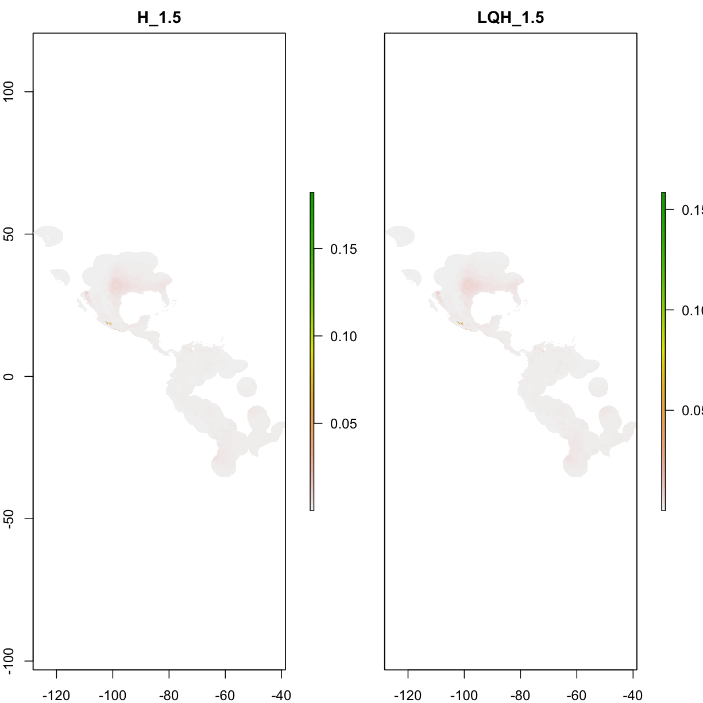
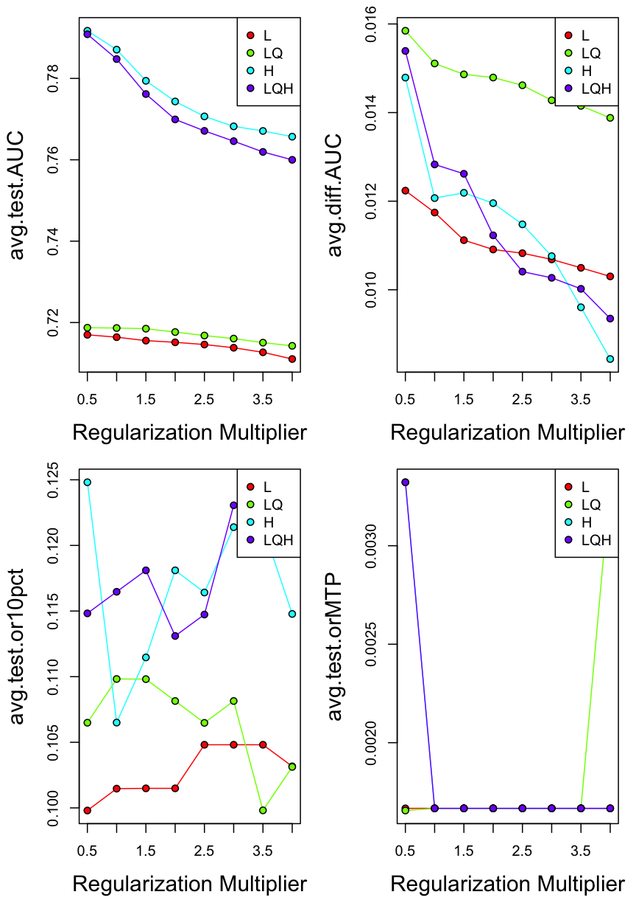
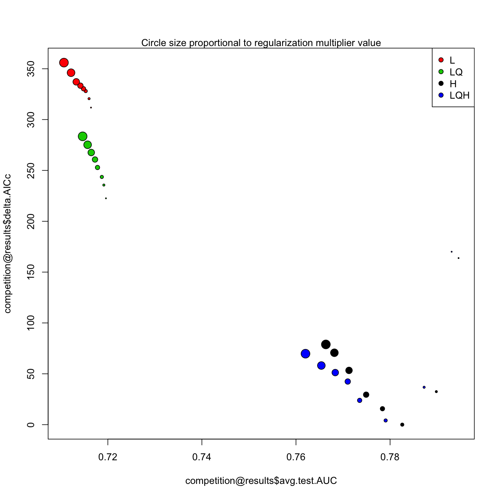

---
# Please do not edit this file directly; it is auto generated.
# Instead, please edit 07-model-competitation.md in _episodes_rmd/
source: Rmd
title: "Model competitation"
teaching: 20
exercises: 20
questions:
- "runnnnnnnn models"
objectives:
- "prepare data input for ENMeval"
- "parameter manipulations in ENMeval"  
- "exploration of the results"  
- "view model predictions"   
- "overview of model performances" 
- "model complexicility vs. model performances"  
- "different ways of data seperation"  

keypoints:
- "111111"
- "22222"
---

## 7.0 Prepare data

~~~
###############################################################
library("raster")
library("dismo")
library("ENMeval")

# prepare spatial occ data
if(!file.exists("data/occ_raw.rdata")){
  occ_raw <- gbif(genus="Dasypus",species="novemcinctus",download=TRUE) 
  save(occ_raw,file = "data/occ_raw.rdata")
}else{
  load("data/occ_raw.rdata")
}
occ_clean <- subset(occ_raw,(!is.na(lat))&(!is.na(lon))) 
occ_unique <- occ_clean[!duplicated( occ_clean[c("lat","lon")]  ),]
occ_unique_specimen <- subset(occ_unique, basisOfRecord=="PRESERVED_SPECIMEN")
occ_final <- subset(occ_unique_specimen, year>=1950 & year <=2000)
coordinates(occ_final) <- ~ lon + lat
myCRS1 <- CRS("+init=epsg:4326") # WGS 84
crs(occ_final) <- myCRS1

# prepare raster data
if( !file.exists( paste0("data/bioclim/bio_10m_bil.zip")   )){
  utils::download.file(url="http://biogeo.ucdavis.edu/data/climate/worldclim/1_4/grid/cur/bio_10m_bil.zip",
                       destfile="data/bioclim/bio_10m_bil.zip"   ) 
  utils::unzip("data/bioclim/bio_10m_bil.zip",exdir="data/bioclim") 
}

# load rasters
clim_list <- list.files("data/bioclim/",pattern=".bil$",full.names = T)
clim <- raster::stack(clim_list) 

occ_buffer <- buffer(occ_final,width=4*10^5) #unit is meter
clim_mask <- mask(clim, occ_buffer)

set.seed(1) 
bg <- sampleRandom(x=clim_mask,
                   size=10000,
                   na.rm=T, #removes the 'Not Applicable' points  
                   sp=T) # return spatial points 

temp1 <- extract(clim_mask[[1]],occ_final)
occ_final <- occ_final[!is.na(temp1),]
~~~
{: .language-r}

## 7.1 Prepare data input for **ENMeval**  
Before we start, we could increase the RAM allocated to the Java virtual machine.  
`options(java.parameters = "-Xmx1g" )`  

There are several approaches available for fine-turning Maxent model, ENMeval is just one of them. 

We will feed three datasets to ENMeval: coordinates of occurrences, coordinates of background points, raster layers.  

~~~
library(ENMeval)
env <- clim_mask[[c("bio1","bio5","bio6","bio12")]]

occ_coord <- occ_final@coords

bg_coord <- bg@coords
~~~
{: .language-r}

## 7.2 Parameter manipulations in ENMeval  
We use `RMvalues()` to set a range of *RM values* (beta-multiplier). Here we set RM ranged from *0.5* to *4* at at the interval of *0.5*.  
We can set feature using *fc* (for example, fc = c('L', 'LQ', 'H')).    

"method" is used to spatial parting occurrence data, there are mainly two approaches available in ENM eval, i.e. block and checkerboard methods, the former method is used when your model in a transferred manner/need to be transferred (i.e. in the application of biological invasions, climate change), the latter is used in a none transfer manner (i.e. setting priority area for conservation);  "overlap" is asking whether you are going to perform overlap measurements of Maxent prediction during the iterative running; "bin.output" is asking whether you are going to reserved the iterative prediction##### 

~~~
competition <- ENMevaluate(occ = occ_coord,          # set the occurrence data for ENMeval
                           env = env,          # set the environmental data
                           bg.coords = bg_coord,     # set the background data
                           method = "randomkfold", kfolds=4,
                           RMvalues=seq(0.5,4,0.5),   # set the RM values, here set RM valuse from 0.5 to 5, at an interval of 0.5
                           fc = c("L", "LQ", "H", "LQH") # the feature combinations that will be used for iterative running
                           )
~~~
{: .language-r}

~~~

  |                                                                       
  |                                                                 |   0%
  |                                                                       
  |==                                                               |   3%
  |                                                                       
  |====                                                             |   6%
  |                                                                       
  |======                                                           |   9%
  |                                                                       
  |========                                                         |  12%
  |                                                                       
  |==========                                                       |  16%
  |                                                                       
  |============                                                     |  19%
  |                                                                       
  |==============                                                   |  22%
  |                                                                       
  |================                                                 |  25%
  |                                                                       
  |==================                                               |  28%
  |                                                                       
  |====================                                             |  31%
  |                                                                       
  |======================                                           |  34%
  |                                                                       
  |========================                                         |  38%
  |                                                                       
  |==========================                                       |  41%
  |                                                                       
  |============================                                     |  44%
  |                                                                       
  |==============================                                   |  47%
  |                                                                       
  |================================                                 |  50%
  |                                                                       
  |===================================                              |  53%
  |                                                                       
  |=====================================                            |  56%
  |                                                                       
  |=======================================                          |  59%
  |                                                                       
  |=========================================                        |  62%
  |                                                                       
  |===========================================                      |  66%
  |                                                                       
  |=============================================                    |  69%
  |                                                                       
  |===============================================                  |  72%
  |                                                                       
  |=================================================                |  75%
  |                                                                       
  |===================================================              |  78%
  |                                                                       
  |=====================================================            |  81%
  |                                                                       
  |=======================================================          |  84%
  |                                                                       
  |=========================================================        |  88%
  |                                                                       
  |===========================================================      |  91%
  |                                                                       
  |=============================================================    |  94%
  |                                                                       
  |===============================================================  |  97%
  |                                                                       
  |=================================================================| 100%
~~~
{: .output}

## 7.3 Exploration of the results  

~~~
dir.create("temp")
# Look at results table AND save it in working directory for later checking.
head(competition@results)
~~~
{: .language-r}

~~~
  settings features  rm train.AUC avg.test.AUC var.test.AUC avg.diff.AUC
1    L_0.5        L 0.5 0.7176736    0.7164199 0.0004959591  0.009101831
2   LQ_0.5       LQ 0.5 0.7221402    0.7195985 0.0007194480  0.010379322
3    H_0.5        H 0.5 0.8043173    0.7945624 0.0002980599  0.014048066
4  LQH_0.5      LQH 0.5 0.8038430    0.7930922 0.0003641465  0.014940935
5      L_1        L 1.0 0.7172698    0.7160090 0.0004504821  0.008787279
6     LQ_1       LQ 1.0 0.7207776    0.7191507 0.0007726933  0.010347187
  var.diff.AUC avg.test.orMTP var.test.orMTP avg.test.or10pct
1 0.0003374436    0.001644737   1.082064e-05        0.1022351
2 0.0003245208    0.003300366   1.452354e-05        0.1038145
3 0.0002008447    0.001644737   1.082064e-05        0.1137047
4 0.0002399429    0.001644737   1.082064e-05        0.1120491
5 0.0003113700    0.001644737   1.082064e-05        0.0972791
6 0.0003332907    0.001644737   1.082064e-05        0.1021589
  var.test.or10pct     AICc delta.AICc        w.AIC parameters
1     0.0017849858 12906.00   311.8079 1.733586e-68          4
2     0.0004803942 12816.76   222.5685 4.140294e-49          8
3     0.0017239675 12757.99   163.7992 2.391223e-36         40
4     0.0016521697 12764.23   170.0395 1.055742e-37         38
5     0.0013111511 12914.76   320.5661 2.173275e-70          4
6     0.0003079879 12829.80   235.6108 6.094174e-52          6
~~~
{: .output}

~~~
write.csv (competition@results, file = "temp/competition_result.csv")
View(competition@results)
~~~
{: .language-r}

~~~
Error in check_for_XQuartz(): X11 library is missing: install XQuartz from xquartz.macosforge.org
~~~
{: .error}

Which settings gave delta.AICc < 2?

~~~
aicmods <- which(competition@results$delta.AICc < 10)
competition@results[aicmods,]
~~~
{: .language-r}

~~~
   settings features  rm train.AUC avg.test.AUC var.test.AUC avg.diff.AUC
11    H_1.5        H 1.5 0.7927558    0.7825938 0.0002965939   0.01070425
12  LQH_1.5      LQH 1.5 0.7897443    0.7790621 0.0002724927   0.01174281
   var.diff.AUC avg.test.orMTP var.test.orMTP avg.test.or10pct
11 0.0001434748    0.001644737   1.082064e-05        0.1070713
12 0.0001454831    0.001644737   1.082064e-05        0.1169833
   var.test.or10pct     AICc delta.AICc     w.AIC parameters
11      0.001680936 12594.19   0.000000 0.8854411         24
12      0.001227442 12598.29   4.096223 0.1142026         25
~~~
{: .output}

## 7.4 View model predictions   

~~~
plot(competition@predictions[[aicmods]])
~~~
{: .language-r}

## 7.5 Overview of model performances  
Plot delta.AICc for different settings that we selected in ENMeval   

~~~
par(mfrow=c(2,2))
eval.plot(competition@results,      'avg.test.AUC')
eval.plot(competition@results,      'avg.diff.AUC')
eval.plot(competition@results,   'avg.test.or10pct')
eval.plot(competition@results, 'avg.test.orMTP')
~~~
{: .language-r}

## 7.6 Model complexicility vs. model performances  
There are many fancy approaches to explore the original output of ENMeval(i.e. Myresults.csv), here deltAIC was plotted against meanAUC across diverse model setting, both these metrics can be used to measure model complexity, in this figure, the more down left of "point" position, the more less complex model setting represents.  

~~~
plot(competition@results$avg.test.AUC, 
     competition@results$delta.AICc, 
     bg=competition@results$features, pch=21, 
     cex= competition@results$rm/2)
legend("topright", legend=unique(competition@results$features), pt.bg=competition@results$features, pch=21)
mtext("Circle size proportional to regularization multiplier value")
~~~
{: .language-r}

## 7.7 Different ways of data seperation  
~    

~~~
#T Viscualize a data parition with the Checkerboard1 method
check1 <- get.checkerboard1(occurrences.ok, environments, bg, aggregation.factor=5)

#T Checkboar parition with differnt aggregation value
check1.large <- get.checkerboard1(occurrences.ok, environments, bg, aggregation.factor=30)

#T Checkerboard2
check2 <- get.checkerboard2(occurrences.ok, environments, bg, aggregation.factor=c(5,5))

#T k-1 Jackknife
jack <- get.jackknife(occurrences.ok, bg)

#T Random k-fold
random <- get.randomkfold(occurrences.ok, bg, k=5)# example generating 5 bins randomply
~~~
{: .language-r}

We can directly use those methods in model competitation, using ` methods="block" `

~~~
competition <- ENMevaluate(occ = occ_coord,          # set the occurrence data for ENMeval
                           env = env,          # set the environmental data
                           bg.coords = bg_coord,     # set the background data
                           method = "block",
                           RMvalues=1,
                           fc = c("L", "LQ")
                           )

competition <- ENMevaluate(occ = occ_coord,          # set the occurrence data for ENMeval
                           env = env,          # set the environmental data
                           bg.coords = bg_coord,     # set the background data
                           method = "checkerboard1",
                           RMvalues=1,
                           fc = c("L", "LQ")
                           )
~~~
{: .language-r}

> ## Challenge: use "block" and "checkerboard1" methods to spatial parting occurrence records, manipulate the RMvalues () parameter, and compare the models  
> --load occurrences & raster layers   
> --build a `xxx meter` buffer around occurrences    
> --`mask` raster by the buffer of occurrences   
> --generate random samples from the masked raster using `sampleRandom()`  
> --prepare the **coordinates** of occurrences and background points  
> --revise the parameters of `ENMevaluate()`: **RMvalues**, **method**.
> --look at **results** and **predictions**   
> > ## Solution
> > 
> > ~~~
> > library("raster")
> > library("dismo")
> > library("ENMeval")
> > 
> > # prepare spatial occ data
> > dir.create("data")
> > if(!file.exists("data/occ_raw.rdata")){
> >   occ_raw <- gbif(genus="Dasypus",species="novemcinctus",download=TRUE) 
> >   save(occ_raw,file = "data/occ_raw.rdata")
> > }else{
> >   load("data/occ_raw.rdata")
> > }
> > occ_clean <- subset(occ_raw,(!is.na(lat))&(!is.na(lon))) 
> > occ_unique <- occ_clean[!duplicated( occ_clean[c("lat","lon")]  ),]
> > occ_unique_specimen <- subset(occ_unique, basisOfRecord=="PRESERVED_SPECIMEN")
> > occ_final <- subset(occ_unique_specimen, year>=1950 & year <=2000)
> > coordinates(occ_final) <- ~ lon + lat
> > myCRS1 <- CRS("+init=epsg:4326") # WGS 84
> > crs(occ_final) <- myCRS1
> > 
> > # prepare raster data
> > dir.create("data/bioclim")
> > if( !file.exists( paste0("data/bioclim/bio_10m_bil.zip")   )){
> >   utils::download.file(url="http://biogeo.ucdavis.edu/data/climate/worldclim/1_4/grid/cur/bio_10m_bil.zip",
> >                        destfile="data/bioclim/bio_10m_bil.zip"   ) 
> >   utils::unzip("data/bioclim/bio_10m_bil.zip",exdir="data/bioclim") 
> > }
> > 
> > # load rasters
> > clim_list <- list.files("data/bioclim/",pattern=".bil$",full.names = T)
> > clim <- raster::stack(clim_list) 
> > 
> > occ_buffer <- buffer(occ_final,width=4*10^5) #unit is meter
> > clim_mask <- mask(clim, occ_buffer)
> > 
> > set.seed(1) 
> > bg <- sampleRandom(x=clim_mask,
> >                    size=10000,
> >                    na.rm=T, #removes the 'Not Applicable' points  
> >                    sp=T) # return spatial points 
> > 
> > # select your input data (coordinates, raster)
> > env <- clim_mask[[c("bio1","bio5","bio6","bio12")]]
> > occ_coord <- occ_final@coords
> > bg_coord <- bg@coords
> > 
> > # run ENMeval using two method to spatial parting occurrence records#######
> > res_bl <- ENMevaluate(occ_coord, env, bg_coord, RMvalues=seq(0.5,4,0.5),method='block')
> > res_ch <- ENMevaluate(occ_coord, env, bg_coord, RMvalues=seq(0.5,4,0.5),method='checkerboard1')
> > 
> > # Selecting settings gave delta.AICc < 2 in block method####
> > aicmods1 <- which(res_bl@results$delta.AICc < 2)
> > res_bl@results[aicmods1,]
> > 
> > # Selecting settings gave delta.AICc < 2 in checkerboard####
> > aicmods2 <- which(res_ch@results$delta.AICc < 2)
> > res_ch@results[aicmods2,]
> > 
> > # View prediction of the best model in block and checkerboard methods#####
> > plot(stack( res_bl@predictions[[aicmods1]],
> >             res_ch@predictions[[aicmods2]]) )
> > ~~~
> > {: .language-r}
> {: .solution}
{: .challenge}


